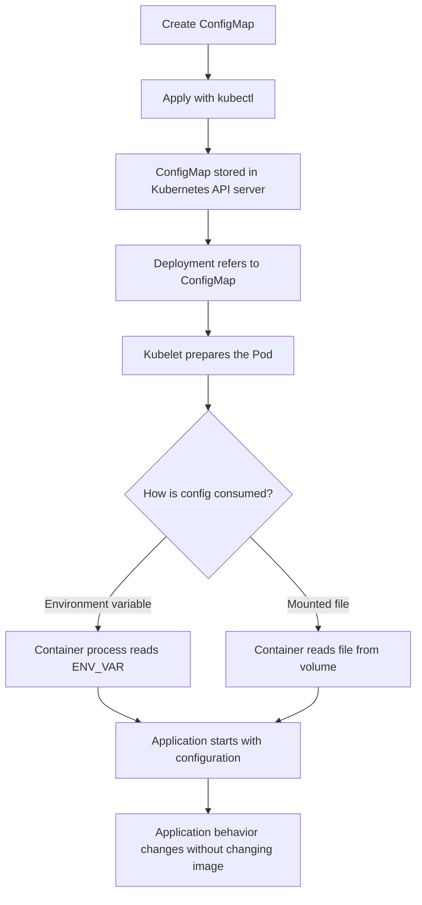
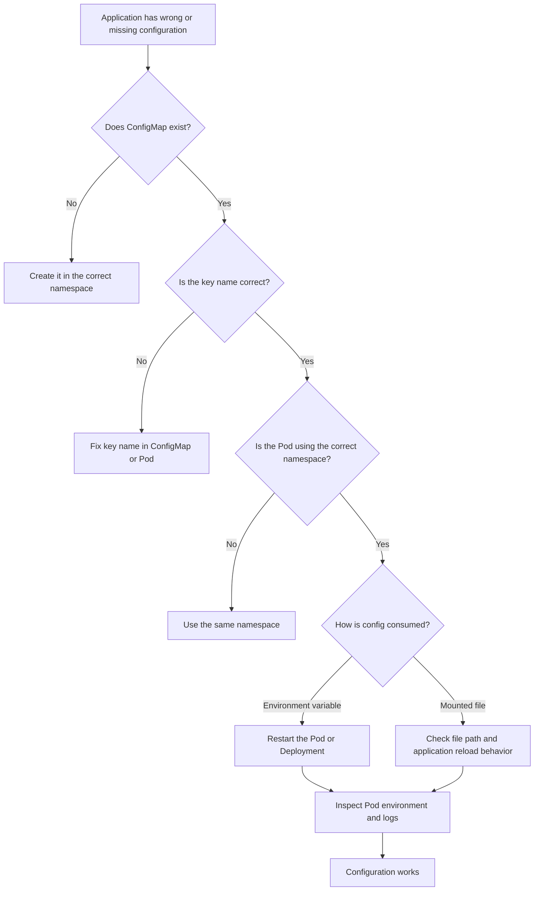

# Kubernetes ConfigMap: Easy Explanation

## 1. What is a ConfigMap?

A **ConfigMap** stores non-sensitive configuration data separately from your application code and container image.

Examples of configuration:

- Application mode: `development` or `production`
- Log level: `info` or `debug`
- API hostnames and ports
- Feature flags
- Configuration files

A ConfigMap is like a **settings card** for an application. The application image contains the code, while the ConfigMap contains environment-specific settings.

> Do not store passwords, API keys, tokens, or certificates in a ConfigMap. Use a Kubernetes **Secret** for sensitive data.

---

## 2. Real-world example

Imagine an online shopping application:

- The same application image is deployed in development, staging, and production.
- Each environment uses a different database host.
- Each environment has a different log level.
- The application code should not be rebuilt for every environment.

Instead, keep the code in one container image and change only the ConfigMap.

```text
Same application image
        |
        +--> Development ConfigMap: DB_HOST=dev-db
        |
        +--> Staging ConfigMap:     DB_HOST=stage-db
        |
        +--> Production ConfigMap:  DB_HOST=prod-db
```

---

## 3. Basic ConfigMap example

```yaml
apiVersion: v1
kind: ConfigMap
metadata:
  name: shop-config
data:
  APP_ENV: "production"
  LOG_LEVEL: "info"
  DB_HOST: "postgres.database.svc.cluster.local"
  DB_PORT: "5432"
```

Apply it:

```bash
kubectl apply -f configmap.yaml
```

View it:

```bash
kubectl get configmap shop-config
kubectl describe configmap shop-config
kubectl get configmap shop-config -o yaml
```

---

## 4. How a Pod uses a ConfigMap

### Option A: Use individual values as environment variables

```yaml
apiVersion: apps/v1
kind: Deployment
metadata:
  name: shop-api
spec:
  replicas: 2
  selector:
    matchLabels:
      app: shop-api
  template:
    metadata:
      labels:
        app: shop-api
    spec:
      containers:
        - name: shop-api
          image: example/shop-api:1.0
          env:
            - name: APP_ENV
              valueFrom:
                configMapKeyRef:
                  name: shop-config
                  key: APP_ENV
            - name: LOG_LEVEL
              valueFrom:
                configMapKeyRef:
                  name: shop-config
                  key: LOG_LEVEL
```

Inside the container:

```text
APP_ENV=production
LOG_LEVEL=info
```

### Option B: Import all keys as environment variables

```yaml
envFrom:
  - configMapRef:
      name: shop-config
```

This imports every key from `shop-config` into the container environment.

### Option C: Mount the ConfigMap as files

ConfigMap:

```yaml
apiVersion: v1
kind: ConfigMap
metadata:
  name: app-config-file
data:
  application.properties: |
    app.name=Online Shop
    app.timeout=30
    feature.recommendations=true
```

Pod:

```yaml
volumes:
  - name: config-volume
    configMap:
      name: app-config-file

containers:
  - name: shop-api
    image: example/shop-api:1.0
    volumeMounts:
      - name: config-volume
        mountPath: /etc/shop
        readOnly: true
```

The container can read:

```text
/etc/shop/application.properties
```

---

## 5. Main flow



---

## 6. What happens under the hood?

1. You submit the ConfigMap YAML using `kubectl apply`.
2. `kubectl` sends the request to the Kubernetes API server.
3. The API server validates the object and stores it in the cluster data store, normally etcd.
4. A Deployment or Pod refers to the ConfigMap by name.
5. The scheduler places the Pod on a node.
6. The kubelet on that node obtains the referenced ConfigMap.
7. Kubernetes exposes the data either:
   - As environment variables, or
   - As files in a mounted volume.
8. The application reads the values during startup or while running.

```text
kubectl
  |
  v
API Server ---> etcd
  |
  v
Deployment/Pod references ConfigMap
  |
  v
Kubelet on node
  |
  +--> Environment variables
  |
  +--> Mounted files
  |
  v
Application process
```

### Important detail

A ConfigMap does not automatically change the command-line arguments or internal configuration logic of your application. The application must know how to read the environment variable or file.

---

## 7. When should you use a ConfigMap?

Use it when configuration is:

- Different between environments
- Safe to store as non-secret text
- Needed by one or more Pods
- Likely to change independently from application code
- Better managed by Kubernetes than baked into a container image

Common examples:

- Log levels
- Service URLs
- Port numbers
- Timeouts
- Feature flags
- Application configuration files
- Runtime options

---

## 8. Why use it instead of hard-coding configuration?

Without a ConfigMap:

```text
Change database host
      |
      v
Change application source code
      |
      v
Build a new image
      |
      v
Test and push the image
      |
      v
Deploy again
```

With a ConfigMap:

```text
Change database host in ConfigMap
      |
      v
Apply the ConfigMap
      |
      v
Restart or reload the application if required
```

Benefits:

- One image can be used in many environments.
- Configuration is separated from code.
- Deployments become easier and more repeatable.
- Operations teams can update settings without rebuilding images.
- Kubernetes can manage shared configuration consistently.

---

## 9. ConfigMap versus Secret

| Item | ConfigMap | Secret |
|---|---|---|
| Intended content | Non-sensitive configuration | Sensitive configuration |
| Examples | Log level, host, feature flag | Password, token, private key |
| Base64 encoded by default | No | Yes, but Base64 is not encryption |
| Security expectation | Not for confidential data | Requires proper access control and encryption practices |
| Typical use | Application settings | Credentials and certificates |

A Secret is not automatically safe just because its value is Base64 encoded. Access control, encryption at rest, and secure handling are still important.

---

## 10. Creating ConfigMaps with kubectl

From literal values:

```bash
kubectl create configmap shop-config \
  --from-literal=APP_ENV=production \
  --from-literal=LOG_LEVEL=info
```

From a file:

```bash
kubectl create configmap app-config \
  --from-file=application.properties
```

From an environment file:

```text
APP_ENV=production
LOG_LEVEL=info
```

```bash
kubectl create configmap shop-config --from-env-file=.env
```

> For production, store the YAML in version control and use a controlled deployment process instead of making unmanaged manual changes.

---

## 11. Updating and rollout behavior

Update the object:

```bash
kubectl apply -f configmap.yaml
```

Check the value:

```bash
kubectl get configmap shop-config -o yaml
```

### If used as environment variables

Existing containers normally keep the old environment values. Restart the Pods to load the new values:

```bash
kubectl rollout restart deployment shop-api
kubectl rollout status deployment shop-api
```

### If mounted as files

Kubernetes can update the mounted files after the ConfigMap changes, usually after a short synchronization delay. However, the application must reread the file. Many applications read configuration only at startup, so a restart may still be needed.

### Production best practice

Use a checksum or version in the Pod template so a ConfigMap change automatically creates a new ReplicaSet. This is commonly implemented with Helm or Kustomize.

Conceptual example:

```yaml
spec:
  template:
    metadata:
      annotations:
        config-version: "2026-09-11-v2"
```

Changing the annotation changes the Pod template and triggers a rollout.

---

## 12. Namespaces and scope

ConfigMaps are **namespaced** resources.

A Pod in namespace `production` cannot directly use a ConfigMap in namespace `development`.

```bash
kubectl get configmaps -n production
kubectl get configmap shop-config -n production
```

Always confirm the namespace in both the ConfigMap and the workload.

---

## 13. Key rules and limitations

- ConfigMap data is stored as text.
- The total size is limited, commonly around 1 MiB per ConfigMap.
- ConfigMaps are not intended for large application assets.
- ConfigMaps are not secrets.
- A missing ConfigMap or missing key can prevent a Pod from starting, depending on how it is referenced.
- Environment variable names must follow valid naming rules for the container environment.
- A ConfigMap must exist in the same namespace as the consuming Pod.
- Changing a ConfigMap does not guarantee that every application immediately reloads it.
- Avoid putting sensitive information in command output, Git repositories, or logs.

---

## 14. Troubleshooting flow



Useful commands:

```bash
kubectl describe pod <pod-name>
kubectl logs <pod-name>
kubectl describe configmap <configmap-name>
kubectl get deployment <deployment-name> -o yaml
kubectl get events --sort-by=.lastTimestamp
```

For environment variables, run a temporary command in the container:

```bash
kubectl exec -it <pod-name> -- printenv | sort
```

For mounted files:

```bash
kubectl exec -it <pod-name> -- ls -l /etc/shop
kubectl exec -it <pod-name> -- cat /etc/shop/application.properties
```

---

## 15. Questions and answers

### Basic questions

**Q: Is a ConfigMap a file?**  
A: It is a Kubernetes API object. Kubernetes can expose its data to a container as environment variables or mounted files.

**Q: Can I store a password in a ConfigMap?**  
A: No. Use a Secret or an external secret manager.

**Q: Does every Pod automatically see every ConfigMap?**  
A: No. A Pod must explicitly reference a ConfigMap.

**Q: Can two Deployments use the same ConfigMap?**  
A: Yes, if they are in the same namespace and the configuration is appropriate for both.

**Q: Does a ConfigMap contain application code?**  
A: No. It contains configuration data only.

### Intermediate questions

**Q: What is the difference between `env`, `envFrom`, and a volume mount?**  
A: `env` imports selected keys, `envFrom` imports all keys, and a volume mount exposes keys as files.

**Q: What happens if a referenced ConfigMap does not exist?**  
A: A required reference can stop the container from starting. An optional reference can allow the Pod to start without the data.

Optional reference example:

```yaml
envFrom:
  - configMapRef:
      name: shop-config
      optional: true
```

**Q: Are ConfigMap values automatically refreshed inside a running application?**  
A: Mounted files can be updated by Kubernetes, but environment variables do not change inside an already-running process. The application must also support reloading files.

**Q: Can I use a ConfigMap across namespaces?**  
A: Not directly. Create a copy in the target namespace or use another configuration distribution approach.

**Q: Why does changing a ConfigMap not restart my Pods?**  
A: A ConfigMap update does not change the Deployment Pod template. Kubernetes therefore has no automatic reason to create new Pods unless you trigger a rollout or change the template.

### Advanced questions

**Q: Is a ConfigMap encrypted in etcd?**  
A: It is not a security mechanism for confidential data. Configure appropriate encryption at rest and access controls for the cluster, and use Secrets or an external secret manager for sensitive values.

**Q: How can I make ConfigMap changes trigger a rollout?**  
A: Add a changing checksum or version annotation to the Pod template. Helm commonly calculates a checksum from the ConfigMap content.

**Q: What happens if a ConfigMap is deleted?**  
A: A running Pod may continue using values it already loaded. New Pods or remount operations may fail if the required ConfigMap is missing.

**Q: Can a ConfigMap be immutable?**  
A: Yes. Setting `immutable: true` prevents updates and can reduce accidental changes and watch overhead.

```yaml
apiVersion: v1
kind: ConfigMap
metadata:
  name: fixed-config
immutable: true
data:
  LOG_LEVEL: "info"
```

**Q: How should ConfigMaps be managed in GitOps?**  
A: Keep declarative YAML or templates in version control, review changes, apply them through CI/CD or a GitOps controller, and use namespace and RBAC controls.

**Q: Can a ConfigMap be used for binary data?**  
A: ConfigMaps are intended for text. Kubernetes also has `binaryData`, but large or complex binary content generally belongs in object storage, a container image, or another dedicated system.

**Q: What is the security risk of ConfigMaps?**  
A: Anyone with permission to read ConfigMaps in the namespace may see their values. Use RBAC, avoid sensitive data, audit access, and follow least privilege.

---

## 16. Recommended production pattern

```text
Git repository
     |
     v
ConfigMap template with environment-specific values
     |
     v
CI/CD or GitOps validation
     |
     v
Kubernetes API server
     |
     v
Deployment with checksum/version annotation
     |
     v
New Pods receive the new configuration
```

Recommended checklist:

- Use ConfigMaps only for non-sensitive configuration.
- Use a Secret or external secret manager for credentials.
- Keep ConfigMaps in version control.
- Use namespaces carefully.
- Validate required keys before deployment.
- Trigger a controlled rollout when environment variables change.
- Make the application fail clearly when required configuration is missing.
- Use RBAC to restrict who can read or change ConfigMaps.
- Keep ConfigMaps small and focused.

## One-sentence summary

A Kubernetes ConfigMap lets you keep non-sensitive application settings outside the container image and provide them to Pods as environment variables or files, so the same application image can run safely in different environments.
