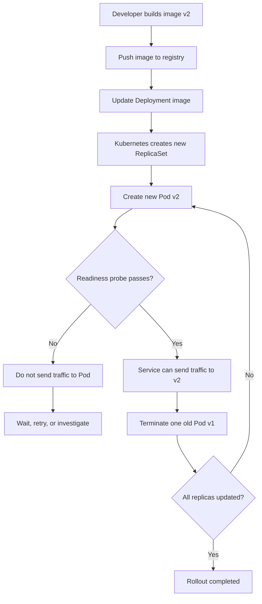
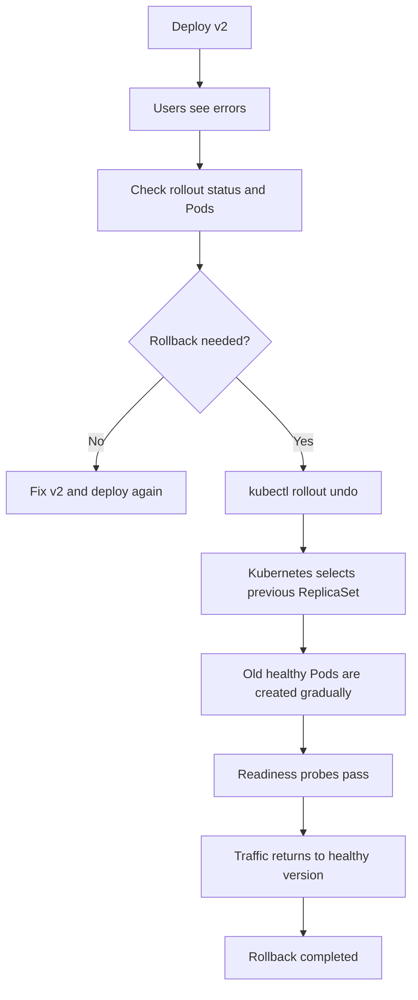

# Kubernetes Rolling Update and Rollback

A simple, practical guide with real-world examples, diagrams, and interview-style questions.

## 1. What is a rolling update?

A **rolling update** replaces old application Pods with new Pods gradually, instead of stopping the whole application at once.

### Real-world example

Imagine an online shopping website running 4 copies of its application:

```text
Before update:

Old version v1:  [Pod 1] [Pod 2] [Pod 3] [Pod 4]
```

You release version `v2`. Kubernetes may update them like this:

```text
Step 1: [v1] [v1] [v1] [v2]
Step 2: [v1] [v1] [v2] [v2]
Step 3: [v1] [v2] [v2] [v2]
Step 4: [v2] [v2] [v2] [v2]
```

Users can continue using the website during the update, provided the new Pods are healthy.

## 2. Basic architecture

A common Kubernetes deployment looks like this:

```text
User
  |
  v
Service
  |
  v
Deployment
  |
  v
ReplicaSet
  |
  +--> Pod v1
  +--> Pod v1
  +--> Pod v1
```

During an update, the Deployment creates a new ReplicaSet for the new version and gradually reduces the old ReplicaSet.

## 3. Minimal Deployment example

````yaml
apiVersion: apps/v1
kind: Deployment
metadata:
  name: web-app
spec:
  replicas: 4
  strategy:
    type: RollingUpdate
    rollingUpdate:
      maxSurge: 1
      maxUnavailable: 1
  selector:
    matchLabels:
      app: web-app
  template:
    metadata:
      labels:
        app: web-app
    spec:
      containers:
        - name: web-app
          image: nginx:1.25
          ports:
            - containerPort: 80
          readinessProbe:
            httpGet:
              path: /
              port: 80
            initialDelaySeconds: 5
            periodSeconds: 5
````

Important settings:

| Setting | Meaning |
|---|---|
| `replicas: 4` | Keep four Pods running. |
| `maxSurge: 1` | At most one extra Pod can be created during the update. |
| `maxUnavailable: 1` | At most one expected Pod can be unavailable during the update. |
| `readinessProbe` | Tells Kubernetes when a new Pod is ready to receive traffic. |

## 4. Rolling update flow



### Typical commands

````bash
# Check the current Deployment
kubectl get deployment web-app

# Start an update
kubectl set image deployment/web-app web-app=nginx:1.26

# Watch progress
kubectl rollout status deployment/web-app

# See Pods
kubectl get pods -l app=web-app

# See rollout history
kubectl rollout history deployment/web-app
````

## 5. What happens if the new version is broken?

Suppose version `v2` has a bug. New Pods may fail their readiness probe, crash, or return errors. Kubernetes normally stops progressing when the rollout cannot become healthy.

```text
Old v1 Pods: healthy
New v2 Pods: failing readiness or crashing

Service traffic ---> healthy Pods only
```

The update may not finish, but Kubernetes does not automatically return to v1 in every situation. An operator usually checks the problem and decides whether to fix forward or roll back.

## 6. Rollback

A **rollback** returns the Deployment to a previous working revision.



### Rollback commands

````bash
# Inspect rollout history
kubectl rollout history deployment/web-app

# Roll back to the previous revision
kubectl rollout undo deployment/web-app

# Watch the rollback
kubectl rollout status deployment/web-app

# Roll back to a specific revision
kubectl rollout undo deployment/web-app --to-revision=2

# Confirm the image currently used
kubectl get deployment web-app \\
  -o=jsonpath='{.spec.template.spec.containers[0].image}'
````

## 7. Rolling update versus rollback

| Operation | Purpose | Direction |
|---|---|---|
| Rolling update | Introduce a new version safely | v1 to v2 |
| Rollback | Return to a previous version | v2 to v1 |
| Fix forward | Repair the new version and deploy another version | v2 to v3 |

## 8. What happens under the hood?

1. You change the Pod template, usually the container image.
2. The Deployment notices that the Pod template changed.
3. It creates a new ReplicaSet with a new revision number.
4. The new ReplicaSet starts creating Pods.
5. Readiness probes determine whether new Pods can receive traffic.
6. The Deployment controller scales the new ReplicaSet up and the old ReplicaSet down.
7. The Service selects Pods using labels. It does not normally know whether they belong to the old or new ReplicaSet.
8. Once the desired number of new Pods is healthy, the rollout completes.
9. Kubernetes keeps old ReplicaSets according to `revisionHistoryLimit`, allowing rollback.

```text
Deployment
   |
   +--> ReplicaSet revision 1 --> Pods v1
   |
   +--> ReplicaSet revision 2 --> Pods v2

After a successful update:

Deployment
   |
   +--> ReplicaSet revision 2 --> Pods v2, active
   |
   +--> ReplicaSet revision 1 --> 0 Pods, retained for rollback
```

The Deployment controller, ReplicaSet controller, scheduler, kubelet, readiness probes, and Service endpoints all work together. The API server stores the desired state, and controllers continuously try to make the cluster match that state.

## 9. Basic questions and answers

### What is a Pod?

A Pod is the smallest deployable unit in Kubernetes. It usually contains one application container, although it can contain multiple closely related containers.

### What is a Deployment?

A Deployment manages application Pods and ReplicaSets. It supports scaling, rolling updates, and rollbacks.

### What is a ReplicaSet?

A ReplicaSet makes sure that the requested number of matching Pods exists.

### Does a Service perform the update?

No. The Deployment performs the update. The Service provides a stable network endpoint and sends traffic to matching ready Pods.

### Why not delete all old Pods first?

That could cause downtime. A rolling update replaces Pods gradually to maintain availability.

### What does `kubectl rollout undo` do?

It changes the Deployment back to a previous Pod template revision. Kubernetes then performs another rolling update in the reverse direction.

## 10. Intermediate questions and answers

### What is `maxSurge`?

It controls how many additional Pods can exist above the desired replica count during an update. With four replicas and `maxSurge: 1`, Kubernetes can temporarily run five Pods.

### What is `maxUnavailable`?

It controls how many Pods may be unavailable during an update. With four replicas and `maxUnavailable: 1`, Kubernetes should keep at least three available.

### What is the difference between readiness and liveness probes?

A readiness probe answers, “Can this Pod receive traffic?” A liveness probe answers, “Should this container be restarted?” Readiness is especially important during rolling updates.

### Why can a rollout be stuck?

Common causes include image pull errors, failing readiness probes, application crashes, insufficient cluster capacity, scheduling problems, or a PodDisruptionBudget that prevents enough Pods from being removed.

Useful commands:

````bash
kubectl describe deployment web-app
kubectl describe pod <pod-name>
kubectl get events --sort-by=.lastTimestamp
kubectl get rs
````

### How long are old revisions kept?

The Deployment keeps old ReplicaSets according to `revisionHistoryLimit`. For example:

````yaml
spec:
  revisionHistoryLimit: 5
````

Keeping more revisions uses more cluster metadata, but gives you more rollback history.

## 11. Advanced questions and answers

### Does Kubernetes automatically roll back a failed rollout?

A failed rollout can stop progressing, but automatic rollback is not guaranteed by the Deployment controller alone. Monitoring or a deployment tool may detect failure and run a rollback. Some platforms add their own automated rollback behavior.

### What does `progressDeadlineSeconds` do?

It defines how long Kubernetes waits for a rollout to make progress before marking it as failed or timed out.

````yaml
spec:
  progressDeadlineSeconds: 600
````

This does not itself repair the application. It provides a signal for operators and automation.

### Why can users still experience errors even when Pods are ready?

A readiness probe may be too simple. For example, checking only that an HTTP process responds does not prove that the database, migrations, cache, or downstream services are working. Good readiness checks should represent the ability to serve real traffic.

### How should database changes be handled?

Use backward-compatible migrations when possible:

```text
1. Add new database column, but keep old column working
2. Deploy application that can use both formats
3. Migrate or backfill data
4. Switch reads and writes to the new format
5. Remove old column in a later release
```

This is important because old and new Pods may run at the same time during a rolling update.

### What is a canary deployment?

A canary sends a small amount of traffic to the new version first, such as 5 percent. It is more controlled than a normal rolling update and often requires an ingress controller, service mesh, or progressive delivery tool.

### What is the difference between rolling, blue-green, and canary deployment?

| Strategy | Main idea | Typical advantage |
|---|---|---|
| Rolling | Replace old Pods gradually | Simple and built into Deployments |
| Blue-green | Run two complete environments and switch traffic | Fast switch and rollback |
| Canary | Send a small percentage of traffic to new version | Limits impact while testing |

## 12. Practical safe deployment checklist

Before deployment:

- Build and scan the image.
- Use an immutable image tag, such as a version or Git commit, instead of relying only on `latest`.
- Configure readiness and liveness probes.
- Confirm enough cluster capacity for `maxSurge`.
- Make database changes backward-compatible.
- Define a clear rollback command.

During deployment:

- Run `kubectl rollout status`.
- Check application logs and metrics.
- Watch error rate, latency, CPU, and memory.
- Confirm that new Pods are ready before old Pods are removed.

After deployment:

- Verify the application through a real user or API test.
- Keep the previous revision available for a reasonable period.
- Record what changed and when.

## 13. Short memory trick

```text
Rolling update = Slowly replace old Pods with new Pods.
Readiness probe = Decide whether a Pod receives traffic.
Rollback = Return the Deployment to a previous revision.
Service = Send traffic to ready Pods selected by labels.
```
