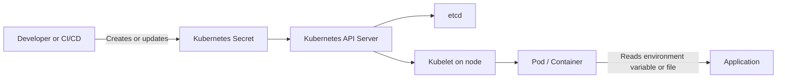
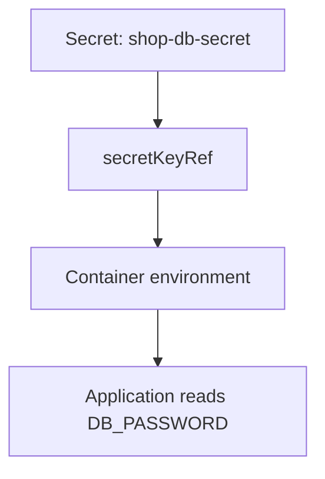
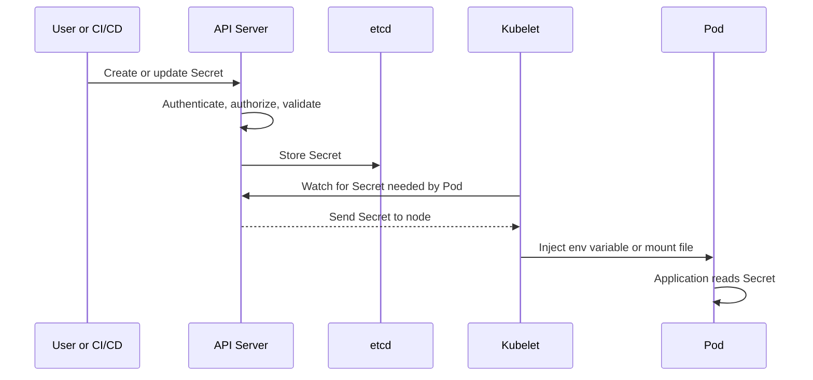
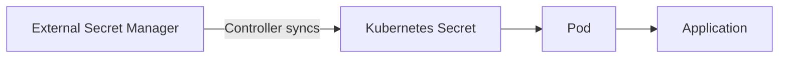
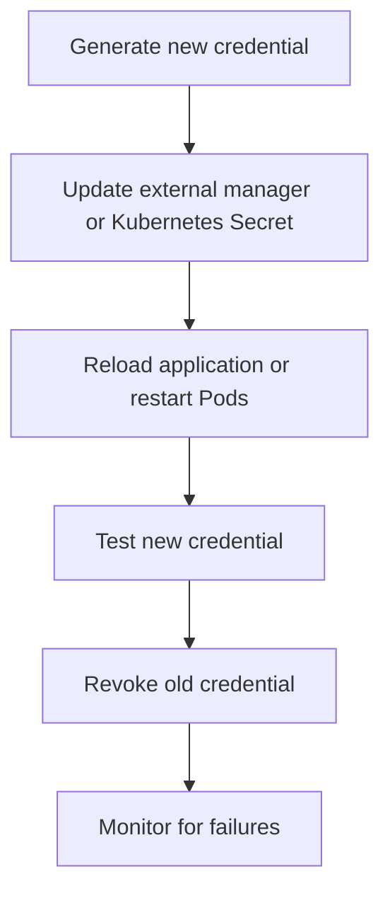

# Kubernetes Secrets, Explained Simply

## 1. What is a Secret?

A Kubernetes **Secret** stores sensitive values such as:

- Database passwords
- API keys
- TLS certificates
- Docker registry credentials
- Tokens
- SSH keys

Instead of writing a password directly inside a Deployment file, you store it in a Secret and let the application read it when it runs.

> Important: Kubernetes Secrets are not automatically "strongly encrypted" just because they are called Secrets. By default, Secret values are stored as Base64-encoded data in the Kubernetes API data store. Base64 is encoding, not encryption. Use encryption at rest, strict RBAC, and an external secret manager for stronger protection.

---

## 2. Real-World Example

Imagine an online shopping application:

```text
Online Shop Pod
    |
    | needs DB_PASSWORD
    v
Kubernetes Secret: shop-db-secret
    |
    | provides password securely to the Pod
    v
PostgreSQL Database
```

The application does not need the password hard-coded in its image or source code. Kubernetes injects the value into the running container as an environment variable or mounts it as a file.

---

## 3. Why and When Do We Use Secrets?

Use Secrets when an application needs sensitive information at runtime.

### Why use them?

1. **Avoid hard-coding credentials** in source code.
2. **Keep passwords out of normal configuration files.**
3. **Change credentials without rebuilding the application image.**
4. **Control access using Kubernetes RBAC.**
5. **Deliver credentials as environment variables or files.**
6. **Support integrations with external secret managers.**

### Common examples

| Use case | Secret example |
|---|---|
| Database connection | Username and password |
| Cloud access | AWS, Azure, or GCP credentials |
| HTTPS | TLS certificate and private key |
| Container registry | Docker registry login |
| Third-party service | Stripe, GitHub, or payment API key |
| Internal service | Service token or signing key |

Do not use a Secret for ordinary, non-sensitive settings such as `LOG_LEVEL=INFO`. Use a ConfigMap for that type of configuration.

---

## 4. The Basic Flow



### Simple explanation of the flow

1. A user or deployment system creates a Secret.
2. The Kubernetes API Server validates and stores it.
3. The Secret is stored in the cluster data store, normally `etcd`.
4. The Kubelet receives the Secret only when a Pod on its node needs it.
5. Kubernetes injects the value into the container.
6. The application reads the value from an environment variable or mounted file.

---

## 5. Create a Secret

### Option A: Create from the command line

```bash
kubectl create secret generic shop-db-secret \\
  --from-literal=username=shopuser \\
  --from-literal=password='ChangeMe-StrongPassword'
```

Check that it exists:

```bash
kubectl get secret shop-db-secret
```

List the keys without printing the values:

```bash
kubectl describe secret shop-db-secret
```

### Option B: Create using YAML

```yaml
apiVersion: v1
kind: Secret
metadata:
  name: shop-db-secret
type: Opaque
stringData:
  username: shopuser
  password: ChangeMe-StrongPassword
```

Apply it:

```bash
kubectl apply -f shop-db-secret.yaml
```

`stringData` is convenient because you write normal text. Kubernetes converts it into the encoded `data` field internally.

### The Base64 version

```bash
printf 'shopuser' | base64
printf 'ChangeMe-StrongPassword' | base64
```

Example YAML using `data`:

```yaml
apiVersion: v1
kind: Secret
metadata:
  name: shop-db-secret
type: Opaque
data:
  username: c2hvcHVzZXI=
  password: Q2hhbmdlTWUtU3Ryb25nUGFzc3dvcmQ=
```

Again, Base64 is not encryption. Anyone who can read the Secret can decode it.

---

## 6. Use a Secret as Environment Variables

```yaml
apiVersion: apps/v1
kind: Deployment
metadata:
  name: shop-api
spec:
  replicas: 2
  selector:
    matchLabels:
      app: shop-api
  template:
    metadata:
      labels:
        app: shop-api
    spec:
      containers:
        - name: shop-api
          image: example/shop-api:1.0
          env:
            - name: DB_USERNAME
              valueFrom:
                secretKeyRef:
                  name: shop-db-secret
                  key: username
            - name: DB_PASSWORD
              valueFrom:
                secretKeyRef:
                  name: shop-db-secret
                  key: password
```

The application can read:

```text
DB_USERNAME
DB_PASSWORD
```

### Environment variable flow



### Environment variable warning

Environment variables can appear in debugging output, crash reports, process inspection, or accidentally logged messages. For highly sensitive values, mounting the Secret as a file can be safer.

---

## 7. Use a Secret as a Mounted File

```yaml
apiVersion: v1
kind: Pod
metadata:
  name: shop-api
spec:
  containers:
    - name: shop-api
      image: example/shop-api:1.0
      volumeMounts:
        - name: db-secret-volume
          mountPath: /etc/shop-secrets
          readOnly: true
  volumes:
    - name: db-secret-volume
      secret:
        secretName: shop-db-secret
```

Inside the container, Kubernetes creates files such as:

```text
/etc/shop-secrets/username
/etc/shop-secrets/password
```

The application reads the password from:

```text
/etc/shop-secrets/password
```

### Mounted file flow


Kubernetes normally updates mounted Secret files when the Secret changes. The application must still reload the file if it needs the new value immediately. Environment variables do not update inside an already-running process, so a Pod restart is often required after a Secret update.

---

## 8. Common Secret Types

### Generic Secret

For passwords, tokens, and arbitrary key-value data:

```yaml
type: Opaque
```

### TLS Secret

For a certificate and private key:

```bash
kubectl create secret tls website-tls \\
  --cert=tls.crt \\
  --key=tls.key
```

### Docker registry Secret

For pulling a private container image:

```bash
kubectl create secret docker-registry registry-secret \\
  --docker-server=registry.example.com \\
  --docker-username=myuser \\
  --docker-password='mypassword'
```

Use it in a Pod or ServiceAccount with `imagePullSecrets`:

```yaml
spec:
  imagePullSecrets:
    - name: registry-secret
```

---

## 9. Namespaces and Access

Secrets are namespaced. A Pod in namespace `production` cannot directly use a Secret from namespace `development`.

```bash
kubectl -n production get secret shop-db-secret
kubectl -n production create secret generic shop-db-secret \\
  --from-literal=password='production-password'
```

Use RBAC to limit who can read Secrets:

```yaml
apiVersion: rbac.authorization.k8s.io/v1
kind: Role
metadata:
  namespace: production
  name: read-shop-secret
rules:
  - apiGroups: [""]
    resources: ["secrets"]
    resourceNames: ["shop-db-secret"]
    verbs: ["get"]
```

Principle of least privilege:

- Give access only to the required namespace.
- Give access only to the required Secret.
- Prefer `get` over broad permissions such as `list` or `*`.
- Avoid giving every developer or service account permission to read all Secrets.

---

## 10. What Happens Under the Hood?



### Important internal details

- The API Server is the main entry point for Kubernetes API requests.
- Authentication identifies the caller.
- Authorization, commonly RBAC, decides whether the caller may access the Secret.
- Admission controls can apply additional security policies.
- `etcd` stores the cluster state, including Secret objects.
- The Kubelet manages the Pod on its node and obtains the required Secret.
- A Secret is generally available only to Pods that reference it on a node.
- Secret values can remain in memory on the node while a Pod uses them.

### Storage protection

For production clusters, consider:

1. **Encryption at rest** for Secrets in `etcd`.
2. **TLS** for communication between Kubernetes components.
3. **RBAC** with least privilege.
4. **Audit logging** for access tracking.
5. **Network and node security.**
6. **External secret management** such as a cloud secret manager or Vault.

---

## 11. Kubernetes Secrets vs ConfigMaps

| Feature | Secret | ConfigMap |
|---|---|---|
| Intended for | Sensitive values | Non-sensitive configuration |
| Examples | Password, API key, certificate | Log level, feature flag, URL |
| Base64 commonly used | Yes | Yes, depending on field |
| Automatically encrypted | Not by default | Not by default |
| Access should be restricted | Strongly | Usually less restricted |

The difference is mainly intent and access control. Do not assume that a Secret is safe without additional security controls.

---

## 12. External Secret Managers

For important production credentials, many teams keep the source of truth outside Kubernetes.



Examples include:

- HashiCorp Vault
- AWS Secrets Manager
- Azure Key Vault
- Google Secret Manager
- External Secrets Operator
- Secrets Store CSI Driver

Benefits:

- Centralized secret storage
- Rotation support
- Better audit trails
- Reduced long-term storage of raw credentials in Git
- Integration with cloud identity systems

A common pattern is:

```text
External manager is the source of truth
        |
        v
External Secrets Operator or CSI driver
        |
        v
Pod receives the credential
```

---

## 13. Secret Rotation

A safe rotation process looks like this:



Recommended approach:

1. Create a new credential.
2. Add or update it in the secret store.
3. Make the application reload the new value.
4. Test the application.
5. Revoke the old credential.
6. Monitor logs, metrics, and authentication failures.

Do not delete the old credential before the application is confirmed to use the new one.

---

## 14. What Not To Do

### Do not commit Secret YAML to Git

Bad:

```yaml
password: Q2hhbmdlTWUtU3Ryb25nUGFzc3dvcmQ=
```

Base64 can be decoded easily. If a Secret was committed, assume it is exposed and rotate the credential.

### Do not print Secret values

Avoid commands such as:

```bash
kubectl get secret shop-db-secret -o yaml
```

This may print encoded values. Do not paste the output into tickets, chat, or logs.

### Do not use broad RBAC permissions

Avoid giving a service account:

```yaml
resources: ["secrets"]
verbs: ["*"]
```

### Do not put credentials in container images

Images can be copied, cached, scanned, and accessed by more people than expected.

### Do not use the same Secret everywhere

Use separate credentials for development, staging, and production.

---

# Basic Questions and Answers

## 1. Is a Kubernetes Secret encrypted?

Not automatically. The value is commonly Base64-encoded. Enable encryption at rest and restrict access with RBAC.

## 2. What is Base64?

Base64 is an encoding format that changes how data is represented. It is not a password protection mechanism.

## 3. Can a Pod use a Secret from another namespace?

No. Create or synchronize a Secret in the Pod's namespace.

## 4. How does a container read a Secret?

It can read the value from an environment variable or from a file mounted into the container.

## 5. When should I use a ConfigMap instead?

Use a ConfigMap for non-sensitive settings such as application mode, log level, or a service URL.

## 6. Can I update a Secret?

Yes:

```bash
kubectl -n production edit secret shop-db-secret
```

However, avoid editing sensitive production values manually. Prefer a controlled pipeline or external secret manager.

## 7. Do Pods restart automatically after a Secret changes?

Usually no. Mounted files can be refreshed, but the application must reload them. Environment variables in an existing process do not change, so restart or roll out the Pods when needed.

## 8. Can I delete a Secret while a Pod is using it?

The Pod may continue running with the value already delivered or mounted, but future Pod starts can fail. Plan deletion carefully.

---

# Intermediate Questions and Answers

## 1. Why are Secret values sometimes visible to cluster administrators?

A user with permission to read Secrets, or access to the cluster data store and nodes, may be able to recover them. Kubernetes Secrets are an access-control feature, not a complete secret-management system.

## 2. What is the difference between `stringData` and `data`?

`stringData` accepts plain text in a manifest. Kubernetes converts it into the encoded `data` representation. `data` expects Base64-encoded values.

## 3. What happens if a referenced Secret key does not exist?

The container may fail to start, depending on how the reference is configured. Use `optional: true` only when missing values are genuinely acceptable.

## 4. Can a Secret be shared by multiple Pods?

Yes. Multiple Pods in the same namespace can reference the same Secret if their identities and RBAC policies permit it.

## 5. Are Secret values visible in the Kubernetes API?

They are returned to identities authorized to read the Secret. Treat API access as sensitive and use audit logs.

## 6. Should application logs contain Secret values?

No. Redact passwords, tokens, keys, authorization headers, and connection strings from logs.

## 7. How can I verify who can read a Secret?

Use RBAC permission checks:

```bash
kubectl auth can-i get secret/shop-db-secret \\
  --namespace production \\
  --as system:serviceaccount:production:shop-api
```

## 8. How can I avoid exposing all keys to a container?

Reference only the required key with `secretKeyRef`, or mount the Secret and use a carefully selected file path or projected volume.

---

# Advanced Questions and Answers

## 1. How do I encrypt Secrets in `etcd`?

Configure Kubernetes encryption at rest using an encryption configuration and an appropriate provider, then re-save existing Secrets so they are rewritten using the new encryption setting. The exact configuration depends on the Kubernetes distribution and managed service.

## 2. What is the security risk of node access?

A highly privileged attacker on a node may inspect processes, mounted volumes, memory, or the Kubelet environment. Protect nodes, minimize privileges, use runtime security controls, and do not treat Kubernetes Secrets as a defense against a fully compromised node.

## 3. What is the risk of environment variables?

They may be exposed through debugging tools, process inspection, crash dumps, support bundles, or accidental logging. Files or an external secret manager can provide better operational control, although mounted files also require node and container protection.

## 4. How do external secret operators work?

A controller authenticates to an external secret manager, reads the requested value, and either synchronizes it into a Kubernetes Secret or exposes it through a CSI-mounted file. The controller must itself be secured with least-privilege cloud or Vault permissions.

## 5. How should Secret rotation work in a zero-downtime system?

Support overlapping credentials when possible. Add the new credential, deploy or reload applications, verify health, then revoke the old credential. This avoids breaking all replicas at the same time.

## 6. How can policies prevent unsafe Secrets?

Use admission policies and security tooling to detect or block:

- Secrets in unsafe namespaces
- Weak or duplicated credentials
- Workloads that can read all Secrets
- Secret values in labels or annotations
- Images or manifests containing hard-coded credentials

## 7. Should Secrets be stored in Helm values?

Avoid committing plaintext or merely Base64-encoded secrets in Helm values. Use a secure delivery approach such as an external secret manager, encrypted values workflow, or a deployment system with controlled secret injection.

## 8. Can Kubernetes Secrets be used for large files?

They are intended for small sensitive configuration values. Large files can create operational and performance problems. Use an appropriate secure storage system instead.

---

# Practical Checklist

Before using Secrets in production, check the following:

- [ ] Credentials are not hard-coded in source code or container images.
- [ ] Secret values are not committed to Git.
- [ ] Encryption at rest is enabled where appropriate.
- [ ] RBAC follows least privilege.
- [ ] Production, staging, and development use different credentials.
- [ ] Secret access is audited.
- [ ] Applications do not log Secret values.
- [ ] Rotation and revocation procedures are documented.
- [ ] External secret management is considered for important credentials.
- [ ] Secret updates are tested with the application's reload or restart behavior.

---

# One-Minute Summary

A Kubernetes Secret is a way to provide sensitive runtime data to an application without hard-coding it into the application or container image. Kubernetes can expose the data as environment variables or mounted files. Secrets are namespaced and protected by RBAC, but Base64 is not encryption. For production, combine Secrets with encryption at rest, least-privilege access, audit logging, secure nodes, and preferably an external secret manager.
