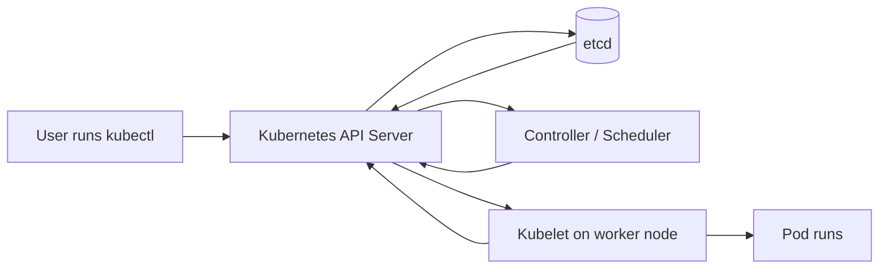

# etcd for Beginners

## What is etcd?

**etcd is a small, fast, and reliable key-value database.**

A key-value database stores information like this:

```text
Key                         Value
/app/config/port            8080
/company/employee/101/name  Baliram
```

Think of etcd as a **secure central notebook** that many computers can read and update. It is designed to keep the same information safely copied across multiple servers.

## Simple real-world example

Imagine a restaurant:

- The **order book** contains all current orders.
- The **waiters** need to read the order book.
- The **kitchen** updates order status.
- If one waiter loses their copy, another copy is available.

In this example, etcd is the shared, reliable order book.

## Why does Kubernetes use etcd?

Kubernetes needs to remember the desired and current state of a cluster, such as:

- Which Pods should run
- Which Deployments and Services exist
- The number of replicas requested
- ConfigMaps and Secrets
- Node information
- Labels, annotations, and other Kubernetes objects

Kubernetes stores this information in **etcd**.

> Important: etcd stores Kubernetes' cluster information. It does not normally store container images, application logs, or the actual files inside a container.

## Kubernetes flow chart



### What happens in this flow?

1. You run a command such as `kubectl apply -f app.yaml`.
2. The request goes to the **Kubernetes API Server**.
3. The API Server validates the request and saves the desired state in **etcd**.
4. Controllers and the scheduler watch the API Server for changes.
5. The scheduler chooses a worker node for the Pod.
6. The kubelet on that node starts the Pod.
7. The actual status is reported back through the API Server and stored in etcd.

## Example: creating a web application

Suppose you request three web Pods:

```yaml
replicas: 3
```

The sequence is:

```text
You
  |
  | kubectl apply
  v
API Server
  |
  | Save desired state: "run 3 replicas"
  v
etcd
  |
  | Controller notices the request
  v
Deployment Controller
  |
  | Creates a ReplicaSet and Pods
  v
Scheduler
  |
  | Selects worker nodes
  v
Kubelets
  |
  | Start the containers
  v
Three running Pods
```

If one Pod crashes, Kubernetes compares the desired state in etcd, three Pods, with the actual state, two Pods. It creates a replacement Pod.

## etcd in one sentence

**etcd is Kubernetes' source of truth for the cluster state.**

## Under the hood, kept simple

### 1. Key-value storage

Kubernetes objects are stored as data under keys. A simplified example might look like:

```text
/registry/deployments/default/web-app
/registry/pods/default/web-app-abc123
/registry/services/default/web-service
```

The exact internal format can vary, but the idea is that Kubernetes objects are stored as records in etcd.

### 2. The API Server is the gatekeeper

Kubernetes components normally do not write directly to etcd. They communicate with the **API Server**.

The API Server provides:

- Authentication
- Authorization
- Validation
- Version handling
- Admission controls
- A stable Kubernetes API

This protects the database and keeps access consistent.

### 3. Replication with Raft

Production etcd usually runs as a cluster, commonly with **3 or 5 members**.

It uses the **Raft consensus algorithm**:

- One member is the leader.
- Other members are followers.
- A write is accepted after a majority confirms it.
- With 3 members, at least 2 must be available.
- With 5 members, at least 3 must be available.

This majority is called a **quorum**.

```text
3-member etcd cluster

        Leader
       /       \
   Follower  Follower

A write is safe when 2 of 3 members confirm it.
```

### 4. Watches

Kubernetes components do not repeatedly ask, "Has anything changed?" Instead, they can create a **watch**.

For example:

```text
Controller watches for Deployment changes
        |
        | New Deployment appears
        v
Controller receives an event
        |
        v
Controller creates or updates Pods
```

Watches make Kubernetes react quickly to changes.

### 5. Transactions and revisions

Each change creates a newer revision. This helps etcd provide consistent reads and support reliable updates.

For example:

```text
Revision 10: replicas = 2
Revision 11: replicas = 3
Revision 12: replicas = 4
```

## Another real-world example: a traffic signal system

Imagine a city traffic system:

- The **API Server** is the control center.
- etcd is the official record of signal settings.
- Controllers are automatic operators.
- Traffic lights are worker nodes and Pods.

If the desired setting says, "Green light for 30 seconds," the control system keeps checking whether the real signal matches that setting. If a signal fails, the system tries to correct it.

This is similar to Kubernetes continuously comparing:

```text
Desired state in etcd  <->  Actual state in the cluster
```

## What if etcd fails?

If etcd loses quorum:

- Existing containers may continue running for some time.
- Kubernetes cannot reliably save new cluster changes.
- Creating, deleting, or scaling resources may fail.
- Controllers and the scheduler may not work correctly.
- Recovery depends on restoring etcd or regaining quorum.

This is why etcd is critical and must be backed up.

## Basic operational rules

### Do

- Run an odd number of members, usually 3 or 5.
- Take regular snapshots.
- Encrypt sensitive data at rest.
- Monitor disk space, latency, health, and leader changes.
- Keep etcd members on reliable disks and networks.
- Test restoring backups.

### Do not

- Delete etcd data manually.
- Run many etcd members without a good reason.
- Put etcd on slow or unstable storage.
- Treat an etcd snapshot as useful until restoration has been tested.
- Expose etcd directly to untrusted networks.

## Easy comparison

| Component | Simple comparison | Main job |
|---|---|---|
| API Server | Reception desk and gatekeeper | Accepts and validates Kubernetes requests |
| etcd | Official notebook | Stores the cluster's state |
| Scheduler | Dispatcher | Selects a worker node for new Pods |
| Controller | Supervisor | Makes actual state match desired state |
| Kubelet | Worker manager | Runs Pods on a node |
| Pod | Running workload | Runs one or more containers |

## Final picture

```text
                 Desired state
                       |
                       v
User ---> API Server ---> etcd
  ^          |             |
  |          |             | Watch events
  |          v             v
  |     Controllers ----> Scheduler
  |          |                |
  |          v                v
  +----- Actual status <--- Kubelet
                         |
                         v
                        Pod
```

The most important idea is:

> You tell Kubernetes what you want. Kubernetes stores that intention in etcd and continuously works to make the real cluster match it.
