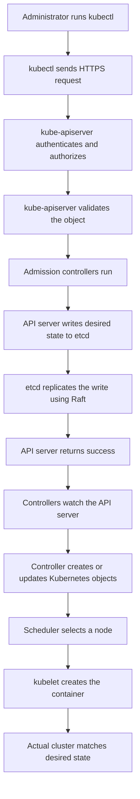
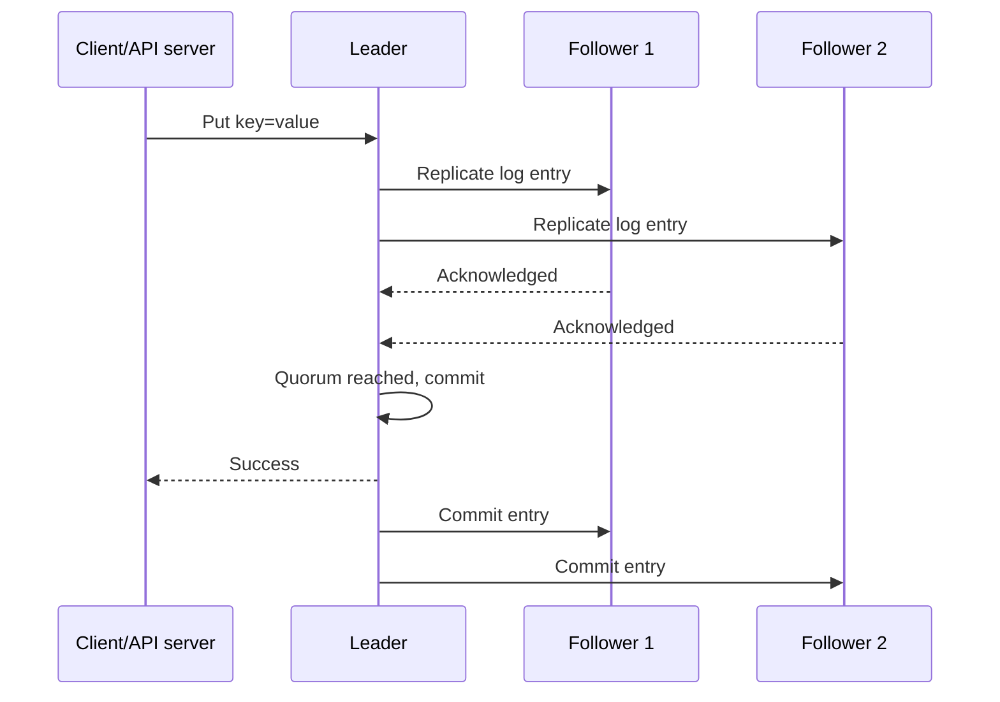
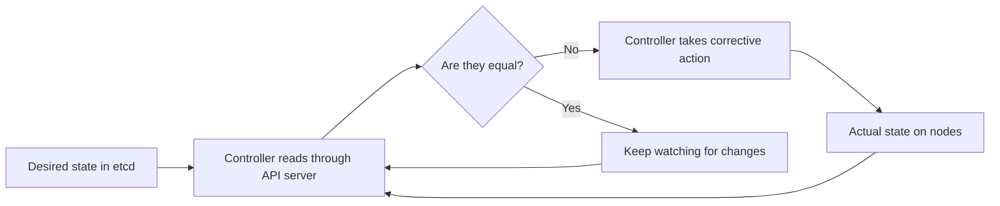
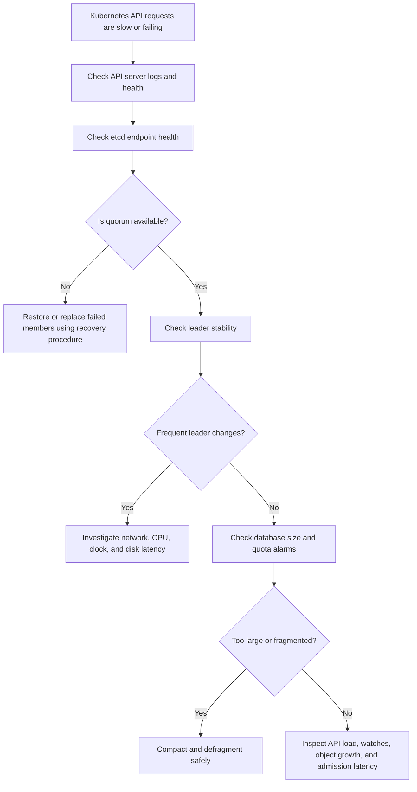

# etcd for Beginners, Kubernetes, and the Under the Hood

## 1. What is etcd?

**etcd is a distributed key-value database.** It stores small pieces of important configuration and state, such as:

```text
Key:   /company/app/database-url
Value: postgres://db.example.com:5432/app
```

Think of etcd as a highly reliable shared notebook for a cluster. Multiple computers can read and write to it, and etcd keeps the copies synchronized.

### Why is it called a key-value database?

It stores data as a key and a value:

```text
Key                         Value
/app/feature/payment        enabled
/app/replicas               3
/users/1001/role            admin
```

etcd is not normally used for large files, images, logs, or analytics. It is best for **small, critical, frequently read configuration and coordination data**.

## 2. Real-world analogy

Imagine a company has three reception desks. Each desk needs the same emergency contact list.

- One desk changes the list.
- The change must reach all desks.
- If one desk fails, the other desks must still have the latest list.
- Two desks should not make conflicting updates at the same time.

etcd acts as the reliable shared list. It replicates the list and uses a consensus algorithm to agree on the correct version.

## 3. Why Kubernetes uses etcd

Kubernetes has many objects:

- Pods
- Deployments
- Services
- ConfigMaps
- Secrets
- Namespaces
- Roles and permissions
- Nodes
- Custom resources

Kubernetes stores the **desired state and cluster metadata** in etcd.

For example, when you run:

```bash
kubectl create deployment web --image=nginx --replicas=3
```

Kubernetes eventually stores information equivalent to:

```text
The deployment named web should run nginx with 3 replicas.
```

Important distinction:

- **etcd stores the desired state and metadata.**
- **Kubernetes controllers make the real cluster match that desired state.**
- **Container images and application data are not stored in etcd.**

## 4. Kubernetes request flow



### Example: creating a Deployment

1. You run `kubectl apply -f deployment.yaml`.
2. `kubectl` sends the YAML to the Kubernetes API server.
3. The API server checks identity, permissions, validation, and admission rules.
4. The API server stores the Deployment object in etcd.
5. A controller notices the Deployment.
6. The controller creates a ReplicaSet and Pods.
7. The scheduler assigns Pods to nodes.
8. Kubelets start the containers.
9. Status updates are written back through the API server and stored in etcd.

The API server is the normal gateway. Kubernetes components should not directly edit etcd in ordinary operation.

## 5. What is stored in Kubernetes etcd?

Typical stored data includes:

```text
/registry/deployments/default/web
/registry/pods/default/web-abc123
/registry/services/default/web
/registry/secrets/default/database-password
/registry/nodes/worker-1
```

The exact internal paths and encoding can vary by Kubernetes version and configuration. The important idea is that Kubernetes objects are persisted under an internal registry namespace.

### What is not stored there?

- Container image layers
- Container stdout logs
- Persistent application databases
- Large media files
- The full contents of a mounted volume
- Most metrics and traces

## 6. etcd architecture

A production etcd cluster usually has an odd number of members:

```text
                 +----------------+
                 |  etcd member 1 |
                 |    leader       |
                 +--------+-------+
                          |
             Raft replication and heartbeats
                  +-------+-------+
                  |               |
        +---------v------+ +------v---------+
        | etcd member 2  | | etcd member 3  |
        | follower       | | follower       |
        +----------------+ +----------------+
```

### Leader and followers

- The **leader** coordinates writes.
- **Followers** replicate the data.
- If the leader fails, the remaining members can elect a new leader.
- A write is normally considered committed after a quorum confirms it.

### Quorum

For a cluster of `N` members, quorum is:

```text
quorum = floor(N / 2) + 1
```

| Members | Quorum | Can tolerate failures |
|---:|---:|---:|
| 1 | 1 | 0 |
| 3 | 2 | 1 |
| 5 | 3 | 2 |
| 7 | 4 | 3 |

Adding more members is not automatically better. More members can increase network and disk overhead. Three members are common for a small production control plane, while five may be used for stronger failure tolerance.

## 7. Raft, explained simply

etcd uses **Raft** to reach agreement between members.

A simple write flow is:



The leader does not need every member to respond. It needs a quorum. This is why a three-member cluster can continue after one member fails.

## 8. Consistency and revisions

Every change creates a new revision. Revisions help etcd and Kubernetes understand ordering and changes.

Example:

```text
Revision 101: replicas = 2
Revision 102: replicas = 3
Revision 103: image = nginx:1.27
```

Kubernetes controllers use **watch** operations to receive changes rather than repeatedly downloading the entire database.

A watch is similar to subscribing to a notification channel:

```text
Controller: Tell me when Deployments change.
etcd/API server: Deployment web changed, revision 103.
Controller: Reconcile the new state.
```

## 9. Kubernetes reconciliation loop

Kubernetes is built around a repeated comparison:



### Real-world example: a failed Pod

- Desired state says: three replicas must exist.
- One Pod crashes.
- The controller observes that only two are running.
- The controller creates a replacement Pod.
- The scheduler places it on a node.
- The kubelet starts it.
- Status is reported through the API server.

etcd does not restart the Pod itself. It stores the state that allows Kubernetes controllers to know what should exist.

## 10. Basic etcd operations

The command-line client is commonly called `etcdctl`.

The exact command version and TLS options depend on the installation.

```bash
# Check the endpoint health
etcdctl endpoint health

# Store a value
etcdctl put greeting "hello"

# Read a value
etcdctl get greeting

# Delete a key
etcdctl del greeting

# List keys under a prefix
etcdctl get /app/ --prefix
```

In Kubernetes, use `kubectl` for normal operations:

```bash
kubectl get pods
kubectl get deployment web -o yaml
kubectl get secret database -o yaml
```

Direct access to Kubernetes etcd should be reserved for controlled administration, backup, recovery, and diagnosis.

## 11. Kubernetes etcd safety rules

### Back up etcd

A backup should be taken from a healthy member and stored outside the control-plane machine. Protect it because it may contain Secrets.

A simplified example is:

```bash
ETCDCTL_API=3 etcdctl snapshot save /backup/etcd-snapshot.db
ETCDCTL_API=3 etcdctl snapshot status /backup/etcd-snapshot.db
```

Real clusters require the correct endpoint, certificate, key, and CA options.

### Protect access

- Use TLS for client and peer traffic.
- Restrict network access to control-plane components.
- Use strong file permissions for certificates and snapshots.
- Treat snapshots as sensitive data.
- Monitor disk latency, database size, leader changes, and failed proposals.

### Avoid manual edits

Do not manually change Kubernetes objects inside etcd unless you fully understand the consequences. The API server performs validation, authorization, defaulting, and admission processing. Bypassing it can create invalid or inconsistent state.

## 12. Compaction and defragmentation

### Why the database grows

etcd keeps historical revisions so that watches and versioned reads can work. Old revisions eventually become unnecessary.

- **Compaction** removes old historical revisions.
- **Defragmentation** reclaims unused space in the backend database file.

They solve different problems:

```text
Compaction: remove old logical history
Defragmentation: reclaim old physical space
```

A cluster can have free space internally but still have a large database file until defragmentation is performed.

Kubernetes distributions often manage compaction and maintenance automatically, but operators should still monitor database size and health.

## 13. Common failure scenarios

### One member fails

A three-member cluster still has two members, so it can continue operating. Replace or repair the failed member promptly because another failure would remove quorum.

### Two members of a three-member cluster fail

Only one member remains, so there is no quorum. New writes cannot be safely committed. The control plane may become unavailable until quorum is restored or a recovery procedure is performed.

### Slow disk

etcd is sensitive to disk latency because writes are persisted to disk. Slow disks can cause:

- High API server latency
- Raft heartbeat delays
- Leader changes
- Failed proposals
- Controller delays

### Network partition

If members cannot communicate, they may form separate groups. Only the side with quorum can commit writes. This protects consistency, though availability may be reduced.

### Database is too large

A large etcd database can slow operations and cause space alarms. Investigate object growth, events, custom resources, compaction, and defragmentation. Do not simply delete data from the backend without understanding what created it.

## 14. Important terms

| Term | Easy meaning |
|---|---|
| Key-value store | Database made of key and value pairs |
| Cluster | Multiple etcd members working together |
| Member | One etcd server/process |
| Leader | Member coordinating writes |
| Follower | Member replicating the leader's log |
| Quorum | Minimum members needed to agree safely |
| Raft | Consensus algorithm used by etcd |
| Revision | Version number of the data state |
| Watch | Notification when data changes |
| Lease | Time-limited attachment used for locks or temporary data |
| TTL | Time after which a leased key can expire |
| Compaction | Removal of old revisions |
| Defragmentation | Reclaiming unused database file space |
| Snapshot | Point-in-time backup of etcd data |
| MVCC | Multi-version concurrency control |

## 15. Basic questions and answers

### Q1. Is etcd a cache?

No. It is a persistent, strongly consistent database. It may be read frequently, but it is not merely a temporary cache.

### Q2. Is etcd the Kubernetes API server?

No. The API server is the front door and policy layer. etcd is the persistent backend used by the API server.

### Q3. Does etcd run containers?

No. Kubelet and the container runtime run containers. Controllers and the scheduler coordinate the process.

### Q4. Why use 3 members instead of 2?

With 2 members, quorum is 2. One failure stops quorum. With 3 members, quorum is 2, so one failure can be tolerated.

### Q5. What happens if the leader fails?

Followers start an election. A member that receives votes from a quorum becomes the new leader.

### Q6. Why are odd numbers preferred?

An odd number gives better failure tolerance for the same approximate cluster size. Four members still need three for quorum, so they tolerate only one failure, just like three members.

### Q7. Can I store application data in etcd?

You can store small configuration values, but etcd is not a replacement for PostgreSQL, MySQL, object storage, or a data warehouse.

### Q8. Why does Kubernetes use an API server instead of talking directly to etcd?

The API server centralizes authentication, authorization, validation, admission, versioning, watches, and audit behavior.

## 16. Intermediate questions and answers

### Q9. What is the difference between a write being received and committed?

A leader may receive a write before it is safely replicated. It is committed after the required quorum has persisted and acknowledged the log entry.

### Q10. What is a watch compaction error?

A watcher may ask for a revision that has already been compacted. It must perform a fresh read from a current revision and then start a new watch.

### Q11. What are leases used for?

Leases attach an expiry time to keys. They are useful for temporary registrations, leader-election records, locks, and liveness information.

### Q12. What is MVCC in etcd?

MVCC means etcd can maintain multiple versions of a key and associate changes with revisions. This enables consistent reads and watches.

### Q13. Why can a healthy-looking etcd cluster still make Kubernetes slow?

The process may be running while disk latency, network latency, database size, CPU pressure, certificate problems, or leader instability cause slow requests.

### Q14. Why should etcd members be placed carefully?

If all members are on one physical host, rack, or failure domain, one infrastructure failure can remove quorum. Spread them across independent failure domains when possible.

## 17. Advanced questions and answers

### Q15. What does linearizable read mean?

A linearizable read reflects the latest committed state according to a single real-time order. It is stronger than reading from a possibly stale local copy.

### Q16. What is the write-ahead log?

Before applying a change to the database state, etcd records the operation in a durable log. The log is replicated through Raft and supports recovery and ordering.

### Q17. Why is clock synchronization important?

Raft primarily relies on message ordering and timeouts, not perfectly synchronized clocks. However, badly skewed or unstable clocks can affect certificates, monitoring, leases, and operational behavior. Reliable time synchronization is still important.

### Q18. What is split brain, and how does Raft reduce the risk?

Split brain occurs when two groups believe they can independently accept conflicting writes. Raft requires a quorum for committed writes, so a minority partition cannot safely commit changes.

### Q19. What is the danger of restoring an old snapshot?

Restoring an old snapshot rolls the control-plane state backward. Objects created after the snapshot may disappear from the restored state, and external systems may temporarily disagree with Kubernetes. Recovery must be planned and coordinated.

### Q20. Why can restoring one member be unsafe?

All members must agree on the cluster identity and history. A member restored incorrectly can have an incompatible state. Follow the documented recovery process for the Kubernetes distribution and etcd version.

### Q21. Why are Kubernetes Secrets a concern in etcd?

Secrets are Kubernetes objects and are commonly persisted in etcd. Anyone who can read the etcd data or an unprotected snapshot may obtain sensitive values. Use encryption at rest and strict access controls.

### Q22. What metrics should an operator watch?

Useful signals include request latency, backend commit duration, database size, fragmentation, leader changes, failed proposals, peer round-trip time, WAL or disk sync latency, and quota alarms.

## 18. A practical troubleshooting flow



## 19. The shortest mental model

```text
kubectl
  -> API server: identity, permission, validation, policy
  -> etcd: durable desired state
  -> controllers: compare desired and actual state
  -> scheduler: choose a node
  -> kubelet: run containers
  -> API server and etcd: record status
```

Remember these three points:

1. **etcd is Kubernetes' durable source of truth for cluster state.**
2. **Raft and quorum keep replicated members consistent.**
3. **Kubernetes controllers use the state in etcd to continuously repair the cluster.**

## 20. Suggested learning order

Start by understanding key-value storage and the Kubernetes API server. Then learn quorum and Raft, followed by watches, revisions, leases, snapshots, compaction, and recovery. Finally, practice diagnosing disk latency, quorum loss, certificate problems, and database growth in a disposable lab cluster.
