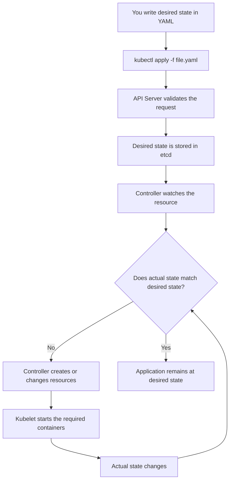
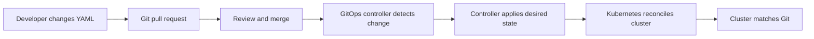

# Imperative vs Declarative in Kubernetes

## 1. The easiest explanation

### Imperative means: **tell Kubernetes how to do something**

You give Kubernetes a series of commands, one action at a time.

```bash
kubectl create deployment web --image=nginx
kubectl scale deployment web --replicas=3
kubectl expose deployment web --port=80
```

You are saying:

> Create this, then scale it, then expose it.

### Declarative means: **tell Kubernetes what the final state should be**

You write the desired state in a YAML file and ask Kubernetes to make reality match it.

```yaml
apiVersion: apps/v1
kind: Deployment
metadata:
  name: web
spec:
  replicas: 3
  selector:
    matchLabels:
      app: web
  template:
    metadata:
      labels:
        app: web
    spec:
      containers:
        - name: web
          image: nginx:1.27
          ports:
            - containerPort: 80
```

Then run:

```bash
kubectl apply -f web-deployment.yaml
```

You are saying:

> I want three web Pods running with this configuration. Kubernetes, make it so.

## 2. Real-world example

Imagine a hotel.

### Imperative approach

You tell the hotel manager:

1. Put three beds in room 101.
2. Add towels.
3. Turn on the air conditioner.
4. Replace a broken bed if one appears.

You must describe every action and handle problems yourself.

### Declarative approach

You give the manager a requirement:

> Room 101 must always have three clean beds, towels, and a working air conditioner.

The manager checks the room and continuously corrects anything that is different from the requirement.

Kubernetes works much more like the second approach. You describe the desired state, and Kubernetes controllers continuously try to maintain it.

## 3. Main difference

| Topic | Imperative | Declarative |
|---|---|---|
| You describe | The steps to perform | The desired final state |
| Common form | `kubectl` commands | YAML manifests |
| Best for | Quick tests and one-time actions | Production and repeatable deployments |
| History | Often exists only in shell history | Stored in files and Git |
| Recovery | You usually fix problems manually | Controllers continuously reconcile |
| Repeatability | More difficult | Easier |
| Typical command | `kubectl scale ...` | `kubectl apply -f ...` |

## 4. Kubernetes flow chart



## 5. What happens under the hood?

When you run:

```bash
kubectl apply -f web-deployment.yaml
```

The simplified flow is:

1. **kubectl** reads the YAML and sends an API request.
2. The **Kubernetes API Server** authenticates, authorizes, and validates the request.
3. The desired configuration is stored in **etcd**, Kubernetes' key-value database.
4. A **Deployment Controller** notices the desired Deployment.
5. The controller creates or updates a **ReplicaSet**.
6. The ReplicaSet creates the required number of **Pods**.
7. The **Scheduler** chooses a suitable node for each unscheduled Pod.
8. The node's **Kubelet** asks the container runtime to start the containers.
9. Kubernetes continuously compares the desired state with the actual state.
10. If a Pod crashes, the controllers create a replacement automatically.

This repeated comparison and correction is called the **reconciliation loop**.

## 6. Imperative and declarative examples for the same application

### Imperative

```bash
kubectl create deployment shop --image=nginx
kubectl scale deployment shop --replicas=3
kubectl set image deployment/shop nginx=nginx:1.27
```

### Declarative

```yaml
apiVersion: apps/v1
kind: Deployment
metadata:
  name: shop
spec:
  replicas: 3
  selector:
    matchLabels:
      app: shop
  template:
    metadata:
      labels:
        app: shop
    spec:
      containers:
        - name: nginx
          image: nginx:1.27
```

```bash
kubectl apply -f shop.yaml
```

The declarative file becomes the source of truth. If the desired state changes from three replicas to five, edit the YAML and apply it again.

## 7. When should you use each approach?

Use **imperative commands** for learning, troubleshooting, experiments, and quick temporary resources.

Use **declarative YAML** for production, CI/CD, GitOps, team collaboration, audits, disaster recovery, and repeatable environments.

A common practical pattern is:

> Use imperative commands to explore or test. Use declarative YAML to manage real workloads.

You can also generate YAML from an imperative command:

```bash
kubectl create deployment web --image=nginx --dry-run=client -o yaml > web.yaml
```

Review the file, improve it, store it in Git, and then use:

```bash
kubectl apply -f web.yaml
```

## 8. Important limitations and details

- Declarative does not mean Kubernetes never performs steps. Kubernetes still performs many actions internally, but you do not need to specify each step.
- `kubectl apply` is declarative because it manages the resource toward the configuration in the file.
- `kubectl create`, `kubectl delete`, and `kubectl scale` are generally imperative commands.
- Declarative management works best when YAML is complete, reviewed, and stored in version control.
- YAML describes Kubernetes objects, not necessarily every operational decision made by controllers and the scheduler.
- Kubernetes is not a one-time executor. It is a control system that keeps trying to reach the desired state.

# Questions and answers

## Basic questions

### 1. What is imperative management?

It is command-based management. You tell Kubernetes the exact action to perform.

### 2. What is declarative management?

It is configuration-based management. You describe what the final state should be.

### 3. Which approach is Kubernetes mainly designed for?

Kubernetes is mainly designed around the declarative approach and reconciliation loops.

### 4. Is `kubectl run` imperative?

Yes. It directly asks Kubernetes to create a resource or run a workload.

### 5. Is `kubectl apply -f app.yaml` declarative?

Yes. It applies the desired configuration from the YAML file.

### 6. What is the best approach for production?

Declarative YAML, usually stored in Git and applied through a controlled deployment process.

## Intermediate questions

### 7. What does “desired state” mean?

It is the condition you want, such as three replicas, a specific image version, or a Service listening on a port.

### 8. What is “actual state”?

It is what currently exists in the cluster, such as the number of running Pods and their current configuration.

### 9. What happens if one of three Pods crashes?

The controller notices that only two Pods are running and creates another Pod to return to three.

### 10. Why is declarative better for teams?

The configuration is visible, reviewable, versioned, repeatable, and easier to restore.

### 11. What is reconciliation?

It is the continuous process of comparing actual state with desired state and correcting differences.

### 12. Can imperative and declarative approaches be used together?

Yes. Teams often use imperative commands for investigation and declarative files for normal application management.

### 13. Why can manual imperative changes be risky?

They may not be recorded in Git and can later be overwritten by the next declarative deployment.

## Advanced questions

### 14. What role does the API Server play?

It is the central entry point for Kubernetes operations. It validates requests, applies access control, and exposes the Kubernetes API.

### 15. What is stored in etcd?

Kubernetes cluster state, including the desired configuration and metadata for Kubernetes objects, is stored in etcd.

### 16. What is a controller?

A controller is a control-loop process that watches resources and takes action to move the cluster toward the desired state.

### 17. What is the difference between a Deployment and a ReplicaSet?

A Deployment describes application rollout and update behavior. A ReplicaSet maintains a requested number of matching Pods. The Deployment usually manages the ReplicaSet.

### 18. What does `kubectl apply` compare?

It compares the configuration being applied with the existing object and calculates the changes needed to move the object toward the new desired state. Modern Kubernetes also supports server-side apply, where field ownership is tracked by the API Server.

### 19. What is server-side apply?

It is an apply mechanism where the API Server calculates changes and tracks which manager owns particular fields. This helps multiple tools manage different parts of the same object.

### 20. What is GitOps?

GitOps stores the desired Kubernetes state in Git. An agent such as Argo CD or Flux watches Git and reconciles the cluster to match it.



### 21. What happens if someone changes the cluster manually in a GitOps model?

The GitOps controller may restore the Git-defined state, depending on its configuration. This is called drift correction.

## One-line summary

> Imperative says, “Run these steps.” Declarative says, “Make the system look like this.” Kubernetes prefers declarative configuration because its controllers continuously make the actual state match the desired state.
