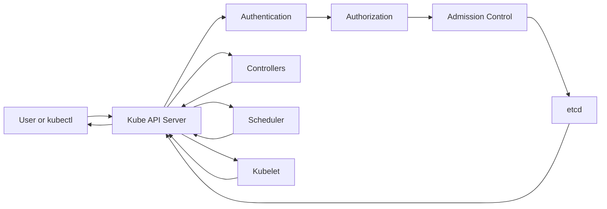

# Kubernetes API Server, Easy but Under the Hood

## 1. What is the kube-apiserver?

The **kube-apiserver** is the front door and central communication point of a Kubernetes cluster.

Every request to Kubernetes normally goes through it:

- `kubectl` commands
- Kubernetes Dashboard requests
- Controllers and operators
- The scheduler
- Kubelets on worker nodes
- CI/CD systems and automation

It validates requests, checks permissions, stores cluster state, and tells other Kubernetes components what should happen.

### Simple real-world example

Think of a hotel:

- **You** are the customer using `kubectl`.
- **Reception** is the API server.
- **Hotel database** is `etcd`.
- **Housekeeping manager** is a controller.
- **Room assignment manager** is the scheduler.
- **Housekeeping staff** are kubelets running on worker nodes.

You do not directly change the hotel database or enter staff-only areas. You make a request at reception. Reception verifies it, records it, and routes the work.

## 2. Basic request flow



### What happens when you run `kubectl create -f app.yaml`?

1. `kubectl` sends an HTTPS request to the API server.
2. The API server authenticates the caller.
3. It checks authorization, for example RBAC permissions.
4. Admission plugins validate or modify the request.
5. The API server validates the object schema.
6. The desired object is stored in `etcd`.
7. Controllers notice the new desired state.
8. The scheduler selects a suitable node for a Pod.
9. The kubelet creates the containers.
10. Status updates are sent back through the API server and stored in `etcd`.

## 3. Desired state and actual state

Kubernetes is mainly a **desired-state system**.

Example:

```yaml
replicas: 3
```

This means: “I want three running replicas.” The API server stores this request. A controller continuously compares:

- **Desired state:** three replicas
- **Actual state:** perhaps two replicas

If one Pod crashes, the controller asks the API server to create a replacement. The API server does not usually create the Pod itself. It coordinates the information and exposes the Kubernetes API.

## 4. Main responsibilities

### API endpoint

It exposes resources such as:

- Pods
- Deployments
- Services
- ConfigMaps
- Secrets
- Nodes
- Namespaces
- Custom Resources

Examples:

```text
GET    /api/v1/namespaces/default/pods
POST   /api/v1/namespaces/default/pods
GET    /apis/apps/v1/namespaces/default/deployments
DELETE /api/v1/namespaces/default/pods/my-pod
```

### Authentication

It answers: **Who are you?**

Common methods include:

- Client certificates
- Bearer tokens
- OIDC tokens
- Service account tokens
- Webhook authentication

### Authorization

It answers: **Are you allowed to do this?**

Common authorization modes include:

- RBAC
- Node authorization
- Webhook authorization
- ABAC, less common in modern clusters

Example: a developer may be allowed to read Pods in the `dev` namespace but not delete them in `prod`.

### Admission control

Admission happens after authentication and authorization, but before the object is persisted.

Admission controllers can:

- Reject unsafe requests
- Add default values
- Inject sidecars
- Enforce security policies
- Require labels
- Validate resource limits

There are two important webhook types:

- **Mutating admission webhook:** changes the request
- **Validating admission webhook:** accepts or rejects the request

### Persistence through etcd

The API server is the main Kubernetes client of `etcd`. It does not normally let users access `etcd` directly.

`etcd` stores cluster state, including object specifications and status. Losing `etcd` or its backups can mean losing the cluster's control-plane state.

### Watches and event notifications

Kubernetes components use the API server's **watch** mechanism instead of constantly asking, “Did anything change?”

A controller can watch Deployments. When a Deployment changes, the API server sends an event. This enables the reconciliation loop.

## 5. What the API server does not do

The API server usually does not:

- Run containers
- Schedule Pods directly
- Pull images
- Attach volumes itself
- Load-balance application traffic
- Continuously repair workloads by itself

Those responsibilities belong mainly to kubelets, the scheduler, controllers, the container runtime, and Services or Ingress components.

## 6. Important components around it

| Component | Role |
|---|---|
| `kube-apiserver` | Validates and exposes the Kubernetes API |
| `etcd` | Stores cluster state |
| `kube-scheduler` | Chooses a node for unscheduled Pods |
| `kube-controller-manager` | Reconciles desired and actual state |
| `kubelet` | Makes a node match its assigned Pod state |
| `kube-proxy` or CNI components | Help implement network behavior |
| `kubectl` | Command-line API client |

## 7. Under the hood

### HTTPS and certificates

The API server normally listens on HTTPS, commonly on port `6443`. TLS provides encryption and server identity. Client certificates or tokens can also identify clients.

### Resource versions

Kubernetes objects have metadata such as:

```yaml
metadata:
  resourceVersion: "12345"
```

Resource versions help clients detect changes and avoid overwriting newer data accidentally.

### Optimistic concurrency

Suppose two users edit the same Deployment. Kubernetes compares the object version. If the version is old, the update may fail with a conflict instead of silently overwriting newer changes.

### Object lifecycle

A typical write path is:

```text
Client request
  -> TLS termination
  -> Authentication
  -> Authorization
  -> Admission
  -> API/schema validation
  -> Conversion/defaulting
  -> etcd transaction
  -> Response to client
```

### Informers and caches

Controllers commonly use client libraries with informers. Informers maintain local caches and receive watch events. This reduces unnecessary API server traffic while still reacting quickly to changes.

### API groups and versions

Kubernetes APIs are organized into groups and versions:

```text
/api/v1                 Core API group
/apis/apps/v1           Apps API group
/apis/networking.k8s.io/v1
```

Different versions may use conversion logic. For example, a client may use one supported API version while storage uses another internal representation.

### Custom Resources

A CRD extends Kubernetes with a new resource type. The API server then exposes that resource like a native Kubernetes object.

Example:

```text
Database.example.com
```

An operator watches that custom resource and performs the real work, such as creating a database instance.

## 8. Read and write examples

### Read a Pod

```bash
kubectl get pod my-pod -n default -o yaml
```

Conceptually:

```text
kubectl -> GET request -> API server -> etcd -> Pod object -> kubectl
```

### Create a Deployment

```bash
kubectl apply -f deployment.yaml
```

`apply` calculates or submits the desired configuration. The API server stores it, then controllers and the scheduler act on it.

### Check the API server

```bash
kubectl cluster-info
kubectl get --raw='/readyz?verbose'
kubectl get --raw='/livez?verbose'
```

Useful local inspection:

```bash
kubectl get --raw='/version'
kubectl api-resources
kubectl api-versions
```

## 9. Common failure examples

### The API server is unavailable

Symptoms:

```text
The connection to the server was refused
Unable to connect to the server
```

Possible causes:

- API server process or Pod is down
- Network or firewall problem
- Load balancer failure
- Expired certificate
- Control-plane resource exhaustion
- `etcd` is unavailable

### Authentication failure

```text
You must be logged in to the server
```

The identity could not be verified or the kubeconfig credentials are invalid.

### Authorization failure

```text
Error from server (Forbidden)
```

The user is known, but RBAC or another authorizer denied the action.

### Admission rejection

```text
admission webhook denied the request
```

A policy or webhook rejected the object before it was stored.

### Object exists but Pod is not running

The API server may be healthy. The issue may be in scheduling, node capacity, image pulling, networking, storage, or the controller.

## 10. Basic questions and answers

### What is the kube-apiserver?

The central HTTPS API endpoint for Kubernetes operations and cluster state coordination.

### Why is it important?

Most control-plane and cluster interactions depend on it. If it is unavailable, new changes and many status operations stop working.

### Does it run containers?

No. The kubelet and container runtime run containers.

### Where does it store data?

In `etcd`, through the API server storage layer.

### What is the difference between authentication and authorization?

Authentication identifies you. Authorization decides what you may do.

### What is RBAC?

Role-Based Access Control. It grants permissions using Roles, ClusterRoles, RoleBindings, and ClusterRoleBindings.

### What is a namespace?

A logical boundary used to organize and often limit access to resources.

## 11. Intermediate questions and answers

### Why do controllers watch the API server?

To detect changes and reconcile actual state toward desired state.

### What is a watch?

A long-lived API request that streams object changes to a client.

### What happens before an object is written to `etcd`?

Authentication, authorization, admission processing, schema validation, defaulting, and version conversion may occur.

### Why should users not access `etcd` directly?

The API server provides validation, authorization, consistency, auditing, and a stable API abstraction.

### What is the difference between `kubectl create` and `kubectl apply`?

`create` requests creation and fails if the object already exists. `apply` manages a desired configuration and updates an existing object when needed.

### What is a mutating webhook?

A webhook that changes a request, for example injecting a security sidecar.

### What is a validating webhook?

A webhook that checks a request and either permits or rejects it.

### Why can the API server be healthy while an application is broken?

The API server only manages the control-plane API. Application runtime failures can occur on nodes, in images, storage, networking, or application code.

## 12. Advanced questions and answers

### How does high availability work?

Multiple API server instances can run behind a load balancer. They are generally stateless relative to the persisted cluster state, while all use the same highly available `etcd` cluster.

### Is the API server completely stateless?

The request-serving process is mostly stateless, but it depends on external state such as `etcd`, certificates, configuration, caches, and webhooks.

### How does optimistic concurrency protect objects?

Updates include a resource version. The API server rejects an update based on an outdated version, preventing accidental lost updates.

### What is API aggregation?

It allows additional API servers to provide APIs that appear as part of the Kubernetes API, often for metrics or specialized extensions.

### What is a CRD versus an operator?

A CRD adds an API resource. An operator adds behavior by watching that resource and reconciling it.

### What is request priority and fairness?

It classifies and queues API requests so that important traffic can receive fair treatment during overload.

### How can API server load be reduced?

Use efficient watches and informers, avoid tight polling loops, limit large list requests, use pagination where appropriate, and tune clients and controllers.

### What should be monitored?

Monitor request latency, request rate, error codes, inflight requests, webhook latency, `etcd` latency, audit events, CPU, memory, and readiness or liveness endpoints.

### What is the security risk of an exposed API server?

An attacker may attempt credential theft, unauthorized API actions, privilege escalation, workload deployment, secret access, or denial of service. Strong TLS, RBAC, network controls, audit logging, admission policies, and regular upgrades are essential.

## 13. One-minute summary

```text
A client sends an HTTPS request.
The API server identifies the client.
It checks permissions.
Admission policies validate or modify the request.
The API server validates and stores the object in etcd.
Controllers, scheduler, and kubelets watch the API.
They perform the work and report status back through the API server.
```

The key idea is:

> The kube-apiserver is Kubernetes' secure control-plane front door. It does not run the application itself. It accepts, validates, stores, and distributes the desired state that other components act upon.
