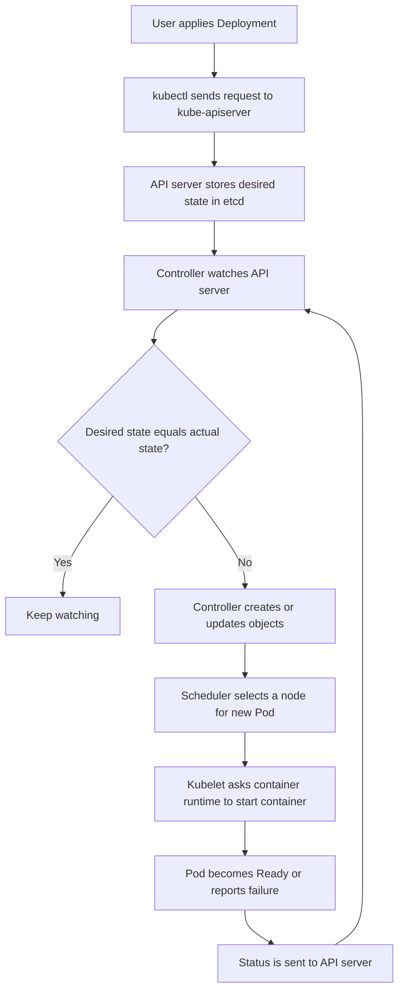

# Kubernetes kube-controller-manager, easy guide

## 1. What is it?

`kube-controller-manager` is a Kubernetes control-plane process that keeps checking whether the cluster is in the state you asked for.

You describe the **desired state** in Kubernetes objects, such as:

```yaml
replicas: 3
```

The controller manager compares that with the **actual state** and takes action until they match.

### Simple definition

> The kube-controller-manager is the cluster's automatic supervisor. It notices what is missing, broken, or different, and tries to fix it.

It contains several controllers. Each controller watches a specific kind of resource, for example Pods, Deployments, Nodes, Jobs, and ServiceAccounts.

---

## 2. Real-world example: restaurant manager

Imagine a restaurant where the owner wants:

> Keep 3 chefs working in the kitchen.

The restaurant manager repeatedly checks:

1. Are 3 chefs present?
2. If only 2 are present, hire or call another chef.
3. If 4 are present, send one away.
4. If a chef stops working, replace that chef.
5. Keep checking because the situation can change again.

Kubernetes works in a similar way:

- **You** are the owner.
- **Deployment YAML** is the instruction: “run 3 replicas.”
- **kube-controller-manager** is the restaurant manager.
- **Pods** are the chefs.
- **kubelet** starts and maintains containers on a node.
- **Scheduler** chooses which node should run a new Pod.

The controller manager does not directly run containers. It creates or updates Kubernetes objects. Other components perform the next steps.

---

## 3. Main flow



### Example with 3 replicas

```text
Deployment says: 3 replicas
        |
        v
ReplicaSet controller sees: only 2 Pods exist
        |
        v
Creates 1 new Pod object
        |
        v
Scheduler selects a node
        |
        v
Kubelet starts the Pod
        |
        v
Actual state becomes: 3 Pods
```

---

## 4. What happens under the hood?

### Step 1: A resource is stored

You run:

```bash
kubectl apply -f app.yaml
```

The request goes to the **kube-apiserver**, which validates it and stores the object in **etcd**.

### Step 2: A controller watches

A controller uses the API server's watch mechanism. It receives events such as:

- Added
- Updated
- Deleted

For example, the ReplicaSet controller sees that a Deployment needs 3 Pods, but only 2 exist.

### Step 3: The event enters a work queue

The controller normally does not process every event immediately in the network callback. It places a key, such as `namespace/name`, in a rate-limited work queue.

This helps with:

- Retry after errors
- Avoiding duplicate work
- Handling bursts of events
- Exponential backoff

### Step 4: Reconciliation runs

The controller reads the latest objects from the API server and calculates what should happen.

Conceptually:

```text
if actual_state != desired_state:
    make a small change
else:
    do nothing
```

The controller should be **idempotent**, meaning running the same reconciliation multiple times should not cause damage or duplicate resources.

### Step 5: The controller writes back

It creates, updates, or deletes objects through the API server. It also updates the object's status when appropriate.

Then the loop continues forever.

---

## 5. Important controllers inside it

| Controller | Main responsibility |
|---|---|
| Deployment / ReplicaSet controller | Maintains the requested number of Pod replicas |
| Node controller | Detects unhealthy or unreachable Nodes and manages their status |
| Job controller | Ensures a Job completes successfully |
| CronJob controller | Creates Jobs on a schedule |
| EndpointSlice controller | Tracks which Pods are available behind a Service |
| ServiceAccount controller | Creates default ServiceAccounts in namespaces |
| Namespace controller | Handles namespace lifecycle and cleanup |
| PersistentVolume controller | Binds PersistentVolumes to PersistentVolumeClaims |
| StatefulSet controller | Manages ordered, stable Pods and storage |
| DaemonSet controller | Runs a Pod on eligible Nodes |
| Garbage collector | Removes dependent objects whose owners no longer exist |
| Service controller | Coordinates external load balancers for supported services |

The exact controllers enabled depends on the Kubernetes version and configuration.

---

## 6. What it does not do

The kube-controller-manager is often confused with other components.

- **API server**: receives requests and exposes the Kubernetes API.
- **etcd**: stores Kubernetes state.
- **Scheduler**: chooses a Node for unscheduled Pods.
- **kubelet**: runs Pods on a Node and reports their status.
- **Container runtime**: actually starts containers, for example containerd or CRI-O.
- **kube-proxy or a networking plugin**: helps implement Service networking.
- **kube-controller-manager**: observes state and asks the API server for corrective changes.

A useful memory aid is:

```text
API server = front desk
etcd = database
controller manager = supervisors
scheduler = placement team
kubelet = worker on each machine
runtime = engine that runs containers
```

---

## 7. Basic questions and answers

### What is a controller?

A controller is a software loop that watches resources and reconciles actual state toward desired state.

### Why is it called a manager?

Because one process runs many Kubernetes controllers.

### Does it run on every worker Node?

Normally, no. It runs on control-plane Nodes.

### Does it create containers directly?

No. It creates or changes Kubernetes objects. The scheduler, kubelet, and container runtime complete the work.

### What if a Pod is deleted?

The relevant controller notices the replica count is too low and creates a replacement Pod.

### What if the controller manager stops?

Existing containers may continue running. However, automatic repairs, rescheduling decisions, and many lifecycle actions stop until the controller manager returns.

### What if it is restarted?

Controllers read the current state again and continue reconciling. They are designed to recover from restarts.

### Is it the same as `kubelet`?

No. The controller manager operates at cluster level. The kubelet operates at Node level.

---

## 8. Intermediate questions and answers

### How does a controller know that something changed?

It uses API server informers, which combine an initial list with a watch stream. Informers maintain a local cache and send events to the controller.

### Why use a local cache?

Reading every object directly from the API server would create unnecessary load. The cache is faster, while the controller still writes changes through the API server.

### What is reconciliation?

Reconciliation is the repeated process of comparing desired state with observed state and making corrective changes.

### What happens if reconciliation fails?

The item is retried. The queue usually applies backoff, so a failing resource is not retried continuously at maximum speed.

### Why can the same event be processed more than once?

Events can be duplicated, reordered, or missed temporarily. Controllers therefore use the latest state and idempotent logic rather than trusting one event as a complete instruction.

### What is an owner reference?

It links a dependent object to its owner, such as a ReplicaSet owning Pods. The garbage collector can then remove dependents when the owner is deleted.

### Why does a Deployment create a ReplicaSet instead of Pods directly?

Each resource has a focused responsibility. The Deployment manages rollout history and the ReplicaSet maintains the replica count.

### How are Node failures handled?

The Node controller watches Node heartbeats and status. If a Node becomes unreachable for long enough, Pods may be marked unhealthy and workloads can eventually be recreated elsewhere, depending on workload type and timing settings.

---

## 9. Advanced questions and answers

### How does leader election work?

In a highly available control plane, multiple controller-manager instances may run, but normally only one is active for a given controller-manager role. They compete for a leader-election record in the API server. The leader renews it. If it fails, another instance takes over.

### Can two controller managers modify the same object?

They can observe the same objects, but leader election is used to avoid multiple active instances making conflicting decisions. Kubernetes also uses resource versions and optimistic concurrency to detect stale updates.

### What is optimistic concurrency?

An update includes the object's resource version. If another writer changed the object first, the update can fail with a conflict. The controller reads the latest object and retries.

### Why are status and spec separate?

- `spec` describes what the user wants.
- `status` describes what Kubernetes currently observes.

This separation makes it possible to see progress, failures, and readiness without changing the desired configuration.

### What is a finalizer?

A finalizer prevents an object from disappearing until a controller performs required cleanup, such as deleting an external cloud resource.

### What is a level-triggered controller?

It reacts to the current state, not only to the event that caused the state. This is why it can recover after restarts and tolerate missed events.

### What happens if the API server is unavailable?

Controllers cannot read or write cluster state. They may retry and log errors. Once the API server returns, their caches and reconciliation loops recover.

### What happens if etcd is unavailable?

The API server cannot reliably persist or retrieve state. Controller-manager actions will fail because the API server cannot provide a healthy source of truth.

### How do custom controllers fit in?

A custom controller usually runs outside the built-in kube-controller-manager. It watches a Custom Resource and reconciles it, often using controller-runtime or client-go.

### How is a controller different from an operator?

An operator is usually a controller plus domain-specific knowledge and custom resources. For example, a database operator can create backups, users, replicas, and failover configuration.

---

## 10. Useful troubleshooting commands

Check whether the process or Pod is running:

```bash
kubectl get pods -n kube-system | grep controller-manager
```

View logs in a kubeadm-style cluster:

```bash
kubectl logs -n kube-system kube-controller-manager-<control-plane-node>
```

Check control-plane component health and events:

```bash
kubectl get --raw='/readyz?verbose'
kubectl get events -A --sort-by=.lastTimestamp
```

Inspect a workload and its related objects:

```bash
kubectl describe deployment <name>
kubectl get rs,pods -l app=<label>
```

Common symptoms of controller-manager problems include:

- Replica counts do not converge
- Failed Jobs are not retried
- Nodes remain in stale states
- Deleted objects are not cleaned up
- Pods remain pending for scheduling reasons, although the scheduler itself is a separate component

Always check API server, etcd, scheduler, controller-manager logs, and cluster events together. A symptom can be caused by another control-plane component.

---

## 11. Final mental model

```text
You declare: “I want this.”
        |
        v
API server stores the request.
        |
        v
Controller observes the request and current reality.
        |
        v
Controller calculates the difference.
        |
        v
Controller asks Kubernetes to make a small correction.
        |
        v
Other components execute the correction.
        |
        v
The controller checks again, forever.
```

The most important idea is **continuous reconciliation**. Kubernetes is not a script that runs once. It is a collection of controllers that continuously work to keep the cluster close to the desired state.
