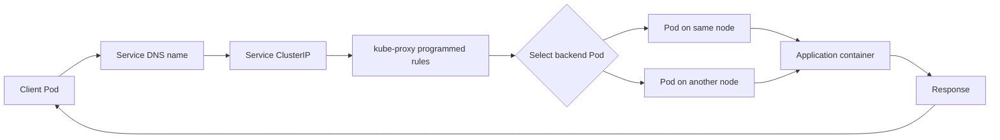
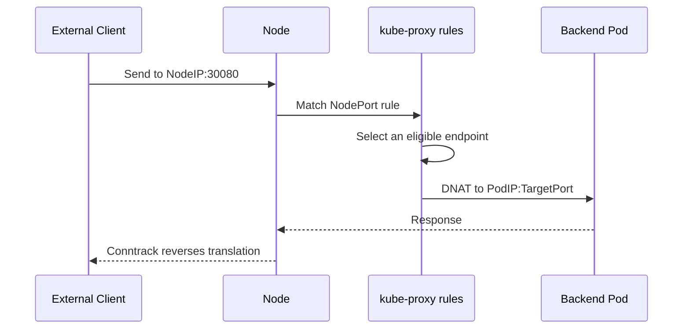

# kube-proxy, Explained Simply

## 1. What is kube-proxy?

`kube-proxy` is a Kubernetes component that makes a **Service** work.

A Kubernetes Service gives applications a stable address, for example:

```text
frontend-service.default.svc.cluster.local
ClusterIP: 10.96.20.10
```

Pods are temporary. They can be deleted and recreated with new IP addresses. `kube-proxy` watches the Kubernetes API for Services and their backend Pods, then programs networking rules on each node so traffic sent to the Service reaches one healthy Pod.

> Important: despite its name, kube-proxy usually does not handle every packet in user space. It normally configures Linux kernel networking rules, and the kernel forwards the packets.

---

## 2. Real-world example

Imagine a restaurant:

- **Service** = the restaurant phone number
- **Frontend Pods** = available chefs or kitchen workers
- **ClusterIP** = one stable phone number
- **kube-proxy** = the call-routing system
- **Linux kernel rules** = the actual telephone exchange

Customers call one number. The routing system sends each call to an available worker. If one worker leaves, the routing rules are updated so new calls go to the remaining workers.

Example:

```text
Service: payment-service
ClusterIP: 10.96.50.20
Port: 443
Backend Pods:
  10.244.1.15:8443
  10.244.2.21:8443
  10.244.3.10:8443
```

When a client sends traffic to `10.96.50.20:443`, kube-proxy has already installed rules that select one backend Pod and translate the destination to its Pod IP and port.

---

## 3. Main traffic flow



### What happens step by step?

1. A client resolves `payment-service` using cluster DNS.
2. DNS returns the Service ClusterIP.
3. The client sends a packet to the ClusterIP.
4. The node's kernel matches rules installed by kube-proxy.
5. A backend endpoint is selected.
6. Destination Network Address Translation, or DNAT, changes the destination to the Pod IP and target port.
7. The packet reaches the selected Pod.
8. Connection tracking, or conntrack, makes return traffic go back to the original client correctly.

---

## 4. What does kube-proxy watch?

`kube-proxy` watches the Kubernetes API for changes to:

- Services
- EndpointSlices, which contain the actual backend Pod IPs
- Related service information such as ports, protocols, and traffic policies

When a Service or EndpointSlice changes, kube-proxy reconciles the node's networking rules.

```text
API Server
    |
    | watches Services and EndpointSlices
    v
kube-proxy on every node
    |
    | programs rules
    v
iptables, IPVS, or nftables + conntrack
    |
    v
Linux kernel forwards Service traffic
```

`kube-proxy` does not normally create the Pod network itself. A CNI plugin, such as Calico, Cilium, or Flannel, is responsible for the Pod network. kube-proxy mainly implements Service virtual IP behavior.

---

## 5. Service types and kube-proxy

### ClusterIP

Used for internal cluster communication.

```text
Client Pod -> ClusterIP -> Backend Pod
```

### NodePort

Opens a port on every node, commonly in the range `30000-32767`.

```text
External client -> NodeIP:NodePort -> Service -> Backend Pod
```

### LoadBalancer

Usually depends on a cloud or external load balancer. The load balancer often sends traffic to a NodePort or directly to nodes, while kube-proxy routes it to the Service endpoints.

### ExternalName

Usually does DNS-level aliasing and does not use normal kube-proxy packet routing in the same way as ClusterIP.

---

## 6. kube-proxy modes

The exact available modes depend on the Kubernetes version and operating system.

### iptables mode

- Installs Linux `iptables` rules.
- Common and widely supported.
- Uses chains and probabilistic rules to select endpoints.
- Large endpoint counts can make rule updates slower.

### IPVS mode

- Uses the Linux IP Virtual Server subsystem.
- Historically useful for large Service and endpoint counts.
- Requires IPVS kernel support.
- It is not automatically faster for every workload.

### nftables mode

- Uses modern Linux `nftables` rules.
- Designed to improve rule management compared with very large iptables rule sets.
- Availability and maturity depend on the Kubernetes version.

### userspace mode

- An older mode in which kube-proxy itself handled more forwarding work.
- Generally not preferred for modern clusters.

> kube-proxy mode is different from the CNI plugin. Calico, Cilium, and Flannel provide Pod networking; kube-proxy implements Service routing unless another component replaces it.

---

## 7. Under the hood

For a Service with ClusterIP `10.96.50.20:443`, kube-proxy may create logic similar to:

```text
Traffic to 10.96.50.20:443
        |
        v
Choose one endpoint:
  10.244.1.15:8443
  10.244.2.21:8443
  10.244.3.10:8443
        |
        v
DNAT destination to selected Pod
        |
        v
Conntrack remembers the translation
        |
        v
Return packet is translated back to the client
```

Conceptually, the rule is:

```text
Service virtual address -> selected endpoint address
```

Kubernetes does not usually ask kube-proxy to choose a Pod for every packet through an API call. The choice is made by kernel rules, and connection tracking normally keeps packets in the same connection going to the same backend.

### Endpoint readiness

Only ready and eligible endpoints should receive normal Service traffic. Readiness probes therefore affect routing indirectly. If a Pod becomes unready, its EndpointSlice status changes, and kube-proxy removes or stops selecting it.

### Session affinity

With `sessionAffinity: ClientIP`, Kubernetes attempts to keep traffic from the same client IP going to the same endpoint for the configured timeout. This is not the same as application-level session storage.

### Internal traffic policy

`internalTrafficPolicy: Local` can restrict internal traffic to ready endpoints on the same node. If no suitable local endpoint exists, traffic may fail or be unavailable instead of crossing to another node.

### External traffic policy

`externalTrafficPolicy: Local` preserves the client source IP in common NodePort and LoadBalancer paths, but traffic is sent only to local endpoints. This can create uneven traffic or dropped traffic if some nodes have no local endpoint.

---

## 8. A more detailed flow for NodePort



With `externalTrafficPolicy: Cluster`, the node may forward the request to an endpoint on another node. With `externalTrafficPolicy: Local`, it should use only a local endpoint.

---

## 9. Basic questions and answers

### Q1. Why is kube-proxy needed?

A Service needs a stable virtual IP while Pods have changing IPs. kube-proxy installs the rules that connect the stable Service address to the current Pods.

### Q2. Does kube-proxy run once per cluster?

No. It normally runs as a DaemonSet, with one kube-proxy Pod on each node.

### Q3. Does kube-proxy route Pod-to-Pod traffic?

Usually no. Pod-to-Pod networking is mainly provided by the CNI plugin. kube-proxy primarily handles Service traffic.

### Q4. Does kube-proxy load balance traffic?

Yes, at the Service networking layer. It selects among eligible endpoints. It is not an application-aware load balancer.

### Q5. Can a Service work if kube-proxy is down?

Existing kernel rules may continue to work temporarily. However, new Service or endpoint changes will not be applied, so routing can become stale or fail.

### Q6. What is the difference between `port` and `targetPort`?

`port` is the Service port. `targetPort` is the port on the selected Pod.

```text
Service port 443 -> Pod targetPort 8443
```

### Q7. What is a ClusterIP?

It is the stable virtual IP assigned to a Service for internal access.

### Q8. Is the ClusterIP a real network interface?

Usually no. It is a virtual address implemented by networking rules on the nodes.

---

## 10. Intermediate questions and answers

### Q9. What are EndpointSlices?

EndpointSlices store the backend endpoint information for Services. They scale better than one large Endpoints object and include information such as readiness, zone, and node association.

### Q10. What happens when a Pod is deleted?

The controller updates the EndpointSlice. kube-proxy notices the change and removes or stops selecting the deleted Pod's IP.

### Q11. Why can a Service have no endpoints?

Common reasons include:

- The Service selector does not match Pod labels.
- Pods are not Ready.
- The Service is in a different namespace than the client expects.
- The port or protocol is incorrect.
- NetworkPolicy or firewall rules block the traffic.

### Q12. What is DNAT?

Destination Network Address Translation changes the destination address. For a Service, the destination changes from the ClusterIP to a selected Pod IP.

### Q13. What is conntrack?

Conntrack is Linux connection tracking. It remembers NAT and connection state so packets in both directions are translated consistently.

### Q14. Why does a request sometimes go to a remote node?

A Service may select any eligible endpoint in the cluster. The packet can cross the Pod network to reach a Pod on another node.

### Q15. What is hairpin traffic?

Hairpin traffic occurs when a Pod accesses a Service and the selected backend is the same Pod. The node must handle this path correctly so the connection does not fail.

### Q16. Why is source IP sometimes lost?

When traffic is forwarded through a node or NAT, the source may be translated. `externalTrafficPolicy: Local` is commonly used when preserving the original external client IP is important.

---

## 11. Advanced questions and answers

### Q17. What is the difference between kube-proxy and an Ingress controller?

`kube-proxy` provides low-level Service routing, usually by IP and port. An Ingress controller is an application-layer proxy that can route HTTP or HTTPS using hostnames, paths, TLS, and HTTP features.

### Q18. What is the difference between kube-proxy and a service mesh?

kube-proxy routes packets to Service endpoints. A service mesh adds application-level features such as retries, mutual TLS, telemetry, and traffic policies, usually through proxies or eBPF-based components.

### Q19. Can kube-proxy be replaced?

Yes. Some networking solutions, especially eBPF-based solutions, can provide Service load balancing themselves. In that design, kube-proxy may be disabled, but the replacement must correctly implement Kubernetes Service behavior.

### Q20. Why can large clusters have slow kube-proxy updates?

Large numbers of Services and endpoints can produce many rules and expensive reconciliation or rule replacement operations. The impact depends on the mode, kernel, rule size, endpoint churn, and implementation.

### Q21. What happens if two Services use the same port?

That is normally fine because each Service has a different virtual IP. The important tuple is generally destination IP, destination port, and protocol.

### Q22. How should kube-proxy issues be investigated?

Check the following in order:

```text
1. Service exists and has the expected ClusterIP
2. Service selector matches the intended Pods
3. EndpointSlices contain ready endpoints
4. Service port and targetPort are correct
5. kube-proxy Pod is Running and logs show no errors
6. Node has the expected iptables, IPVS, or nftables rules
7. Conntrack table is not exhausted
8. CNI, NetworkPolicy, firewall, and cloud security rules allow traffic
9. Test from the correct namespace and node
```

Useful commands include:

````bash
kubectl get svc payment-service -n default -o wide
kubectl get endpointslice -n default -l kubernetes.io/service-name=payment-service
kubectl describe svc payment-service -n default
kubectl get pods -n kube-system -l k8s-app=kube-proxy -o wide
kubectl logs -n kube-system -l k8s-app=kube-proxy
````

On a node, administrators may inspect the active mode with tools such as:

````bash
iptables-save
ipvsadm -Ln
nft list ruleset
conntrack -L
````

Use only the command that matches the cluster's configured mode, and remember that node-level inspection usually requires elevated privileges.

---

## 12. The complete mental model

```text
Service definition
       |
       v
Service controller and EndpointSlice controller
       |
       v
EndpointSlices contain eligible Pod IPs
       |
       v
kube-proxy watches the API server
       |
       v
kube-proxy programs node kernel rules
       |
       v
Client sends traffic to ClusterIP or NodePort
       |
       v
Kernel selects an endpoint and applies NAT
       |
       v
CNI network delivers traffic to the Pod
       |
       v
Application responds
       |
       v
Conntrack returns the response to the client
```

## One-sentence summary

**kube-proxy keeps Kubernetes Service addresses stable by watching Service endpoints and programming node-level networking rules that send traffic to the right ready Pod.**
