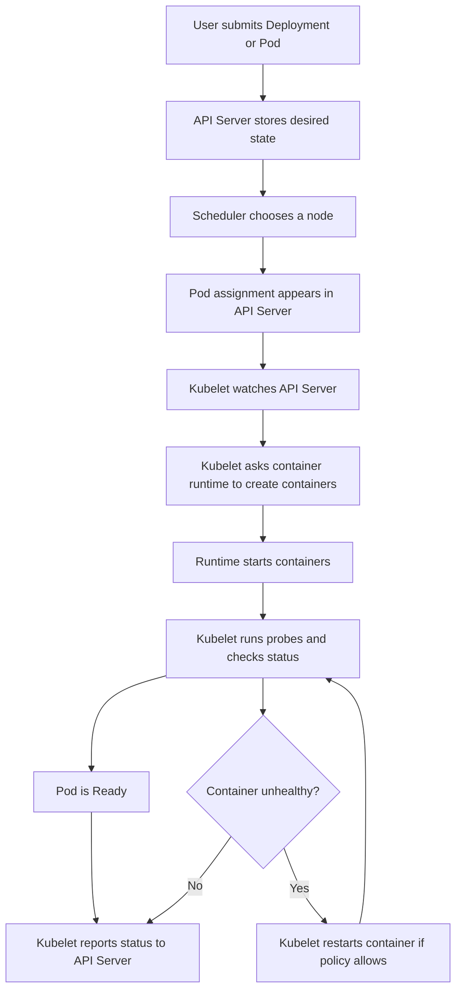

# Kubelet Explained: Easy to Advanced

## 1. What is kubelet?

**Kubelet is the worker-agent running on every Kubernetes node.**

Its main job is to make sure that the containers assigned to its node are running correctly.

A simple definition:

> The kubelet reads the desired state from Kubernetes and keeps the actual node state aligned with it.

Kubelet does not normally decide *which node* should run a Pod. The Kubernetes scheduler makes that decision. Kubelet receives the assignment and performs it.

## 2. Real-world example

Imagine a restaurant:

| Kubernetes | Restaurant |
|---|---|
| Cluster | Restaurant chain |
| Node | One restaurant kitchen |
| Pod | One food order |
| Container | One dish being prepared |
| API server | Central order system |
| Scheduler | Manager assigning orders to kitchens |
| Kubelet | Kitchen supervisor |
| Container runtime | Kitchen staff that actually prepares dishes |
| Readiness/liveness probes | Quality and health checks |
|

A customer orders a pizza. The central system records the order and assigns it to a kitchen. The kitchen supervisor, acting like kubelet, checks the order, asks the kitchen staff to prepare the pizza, checks whether it is healthy, and reports progress back to the central system.

If the pizza is dropped, the supervisor asks the staff to prepare it again. If the whole kitchen is unavailable, kubelet reports the problem, but another component must decide whether to move the order elsewhere.

## 3. Main responsibilities

Kubelet:

1. Watches for Pods assigned to its node.
2. Creates and starts containers through the container runtime.
3. Mounts volumes and prepares networking-related settings.
4. Runs startup, liveness, and readiness probes.
5. Restarts containers when their restart policy requires it.
6. Reports Pod and node status to the API server.
7. Executes lifecycle hooks such as `postStart` and `preStop`.
8. Performs basic resource and eviction management on the node.
9. Runs static Pods configured directly on the node.

Kubelet does **not**:

- Schedule Pods across nodes.
- Usually create Services or load balancers.
- Replace a failed node by itself.
- Build container images.
- Act as the Kubernetes control plane.

## 4. Basic flow chart



## 5. Detailed flow

### Step 1: Desired state is created

You apply a manifest, for example:

```yaml
apiVersion: v1
kind: Pod
metadata:
  name: web
spec:
  containers:
    - name: nginx
      image: nginx:1.27
      ports:
        - containerPort: 80
```

The API server validates and stores this object in the cluster data store.

### Step 2: A node is selected

The scheduler checks resource requests, taints, affinity rules, and other constraints. It assigns the Pod to a suitable node.

### Step 3: Kubelet notices the assignment

The kubelet on that node watches the API server. It sees that the `web` Pod should run locally.

### Step 4: Kubelet prepares the Pod

It works with Kubernetes components to prepare:

- Pod sandbox and network namespace.
- Container image download.
- Volume mounts.
- Secrets and ConfigMaps.
- Security settings.
- Resource limits and requests.

### Step 5: Containers start

Kubelet sends commands to the **container runtime** through the Container Runtime Interface, or CRI. Common runtimes include containerd and CRI-O.

The runtime creates the containers, while kubelet remains responsible for orchestration and monitoring on that node.

### Step 6: Health is checked

Kubelet runs configured probes:

- **Startup probe:** Has the application finished starting?
- **Liveness probe:** Is the application still alive, or should it be restarted?
- **Readiness probe:** Can the application receive traffic?

A failed readiness probe normally removes the Pod from Service endpoints. A failed liveness probe can cause a restart.

### Step 7: Status is reported

Kubelet sends conditions, container states, IP information, and other status to the API server. You see this through commands such as:

```bash
kubectl get pods -o wide
kubectl describe pod web
kubectl get nodes
```

## 6. Under the hood

### Control loop

Kubelet is a collection of control loops. It repeatedly compares:

```text
Desired state: The Pod should run nginx
Actual state: nginx is stopped or missing
Action: Create or restart nginx
```

This process repeats continuously. Kubernetes is therefore not a one-time script. It is a continuously correcting system.

### Pod lifecycle inside kubelet

A simplified internal sequence is:

```text
Pod assigned to node
  -> SyncPod begins
  -> Pod sandbox is created
  -> Network is configured
  -> Volumes are mounted
  -> Images are pulled
  -> Containers are created
  -> Containers are started
  -> Probes and status monitoring continue
```

### Important internal components

- **Pod workers:** Process Pod changes independently so one Pod does not block all others.
- **PLEG:** The Pod Lifecycle Event Generator detects changes reported by the runtime and helps kubelet react to them.
- **Status manager:** Sends Pod status to the API server.
- **Probe manager:** Runs health probes.
- **Volume manager:** Attaches, mounts, and unmounts volumes.
- **Runtime manager:** Talks to the container runtime through CRI.
- **Eviction manager:** Evicts Pods when the node is under resource pressure.
- **Image manager:** Helps manage image pulls and image garbage collection.
- **Certificate and credential managers:** Handle certificate rotation and image-pull credentials where configured.

### Kubelet and the container runtime

Kubelet does not directly start Linux processes in the usual Kubernetes architecture. It calls the runtime using CRI over a Unix socket, for example:

```text
kubelet -> CRI -> containerd or CRI-O -> runc or another OCI runtime -> Linux process
```

The runtime uses lower-level components such as `runc` to create namespaces, cgroups, mounts, and processes.

### Kubelet and networking

Kubelet asks the network plugin through the Container Network Interface, or CNI, to configure Pod networking. Kubelet itself is not the complete networking implementation.

A typical path is:

```text
kubelet -> runtime -> CNI plugin -> Pod network namespace and IP
```

### Kubelet and storage

For persistent storage, kubelet coordinates with volume plugins and the Container Storage Interface, or CSI. It makes the volume available inside the Pod according to the Pod specification.

### Node heartbeats

Kubelet periodically reports node health. If kubelet stops reporting, the control plane eventually marks the node as `NotReady`. Controllers may then reschedule workloads, depending on workload type and configured timeouts.

### Static Pods

A static Pod is managed directly by kubelet from a local manifest directory. It does not require a normal controller to create it. Control-plane components in some Kubernetes installations, such as the API server, scheduler, and controller manager, may run as static Pods.

## 7. Useful commands

```bash
# View node status
kubectl get nodes

# Inspect kubelet-related node conditions and events
kubectl describe node <node-name>

# See which node runs each Pod
kubectl get pods -A -o wide

# Inspect a Pod in detail
kubectl describe pod <pod-name> -n <namespace>

# View recent cluster events
kubectl get events -A --sort-by=.lastTimestamp

# On a systemd-based Linux node, view kubelet logs
sudo journalctl -u kubelet -f

# Check kubelet service status
sudo systemctl status kubelet
```

## 8. Basic questions and answers

### What is kubelet?

An agent on each node that ensures assigned Pods and containers are running as specified.

### Is kubelet a container runtime?

No. Kubelet asks a runtime such as containerd or CRI-O to create and run containers.

### Is kubelet the scheduler?

No. The scheduler selects a node. Kubelet runs the Pod after it is assigned to that node.

### Does every node need kubelet?

A Kubernetes worker node normally needs kubelet. Control-plane nodes also commonly run kubelet if control-plane components run there.

### What happens if kubelet stops?

Existing containers may continue running for some time, but the node stops receiving normal kubelet management and status updates. The node can become `NotReady`.

### How does kubelet know what to run?

It watches the API server for Pods assigned to its own node. It also reads local static-Pod manifests.

### Does kubelet run Deployments?

Not directly. A Deployment creates or manages ReplicaSets, ReplicaSets create Pods, and kubelet runs the assigned Pods.

### What is the difference between Pod and container?

A Pod is the smallest Kubernetes scheduling unit. It can contain one or more closely related containers sharing networking and storage context.

## 9. Intermediate questions and answers

### What is the difference between liveness and readiness?

Liveness answers, “Should this container be restarted?” Readiness answers, “Should this Pod receive traffic?” A Pod can be alive but not ready.

### What is a startup probe for?

It protects slow-starting applications. Until the startup probe succeeds, Kubernetes does not use liveness and readiness failures to make normal decisions.

### How does kubelet enforce CPU and memory limits?

It passes resource settings to the runtime, which uses Linux cgroups. CPU limits restrict CPU usage, while memory limits can result in an out-of-memory kill.

### What are requests and limits?

A request is the amount used for scheduling decisions. A limit is the maximum allowed amount, subject to Kubernetes and operating-system behavior.

### What is node eviction?

When memory, disk, or another resource becomes critically low, kubelet can evict Pods to protect node stability. The eviction manager uses thresholds and Pod priority-related signals.

### How does kubelet get images?

Kubelet asks the container runtime to pull an image. The runtime contacts the registry and stores the image locally.

### Why can a Pod be stuck in `ContainerCreating`?

Common causes include image-pull problems, volume-mount failures, CNI or networking errors, missing secrets, or runtime issues. `kubectl describe pod` and events are usually the first checks.

### What is the CRI?

The Container Runtime Interface is the API between kubelet and a container runtime.

### What is the CNI?

The Container Network Interface is the plugin standard used to configure Pod networking.

### What is CSI?

The Container Storage Interface is the plugin standard used to provide storage to Kubernetes workloads.

## 10. Advanced questions and answers

### How does kubelet reconcile state?

Kubelet receives Pod updates through its configuration sources, places work on Pod-specific workers, observes runtime state, and calls synchronization logic to make the runtime match the Pod specification. It repeats this process after events and during periodic reconciliation.

### What is PLEG?

PLEG, the Pod Lifecycle Event Generator, watches the container runtime and produces Pod lifecycle events. If PLEG becomes unhealthy or slow, kubelet may report runtime or node problems and Pod updates can be delayed.

### What is the difference between a Pod restart and a Pod replacement?

Kubelet can restart containers inside a Pod. If the entire Pod is deleted or needs replacement, a controller such as a ReplicaSet or Job creates a new Pod, potentially on another node.

### How does kubelet communicate with the API server?

It uses authenticated HTTPS with credentials and certificates configured for the node. It reads Pod assignments and writes node and Pod status.

### What is a node lease?

A node lease is a lightweight heartbeat object updated by kubelet. It reduces the need to update the larger Node object frequently and helps the control plane detect node health changes.

### What is graceful Pod termination?

When a Pod is deleted, kubelet gives containers a termination grace period. It sends the appropriate stop signal, runs lifecycle handling, and forcefully terminates the container if it does not exit before the deadline.

### What is a static Pod used for?

Static Pods are useful for node-local critical components. Kubelet watches a local manifest path and creates or updates those Pods without needing a controller to create them.

### What is the kubelet read-only port?

Older configurations sometimes exposed an unauthenticated read-only port. It is generally disabled because it can expose sensitive node information. Secure, authenticated endpoints should be used instead.

### How does kubelet handle resource pressure?

It monitors signals such as memory availability, filesystem space, inode availability, and image filesystem usage. It may reclaim images and evict Pods according to configured thresholds and priorities.

### What is a common kubelet failure path?

```text
Kubelet cannot reach API server
  -> Pod assignments and status updates may become stale
  -> Node heartbeat may stop
  -> Node becomes NotReady
  -> Controllers may eventually react
```

The exact behavior depends on network connectivity, runtime health, node controller timing, and workload configuration.

## 11. Troubleshooting checklist

When a Pod is not working:

```text
1. kubectl get pod <pod> -n <namespace>
2. kubectl describe pod <pod> -n <namespace>
3. Check Events for image, volume, scheduling, or probe errors
4. Check the assigned node with kubectl get pod -o wide
5. kubectl describe node <node>
6. Check kubelet logs on the node
7. Check container runtime health
8. Check CNI and CSI plugin logs if networking or storage is involved
```

Useful symptom mapping:

| Symptom | Likely area |
|---|---|
| `Pending` | Scheduler, resources, taints, affinity, or PVC |
| `ContainerCreating` | Runtime, image, volume, CNI, or secret |
| `ImagePullBackOff` | Registry, image name, tag, credentials, or network |
| `CrashLoopBackOff` | Application crash, configuration, probes, or limits |
| Pod is `Running` but not receiving traffic | Readiness probe, Service selector, or networking |
| Node is `NotReady` | Kubelet, runtime, network, disk, memory, or certificates |

## 12. One-minute summary

Kubelet is the **supervisor on each Kubernetes node**. The API server stores the desired state, the scheduler assigns Pods to nodes, and kubelet makes the assigned node match that state. It asks the container runtime to start containers, coordinates networking and storage, runs health checks, restarts failed containers when appropriate, handles node resource pressure, and reports status back to Kubernetes.

The key relationship is:

```text
API server: What should exist?
Scheduler: Which node should run it?
Kubelet: Make it run correctly on this node.
Runtime: Start the actual containers.
```
