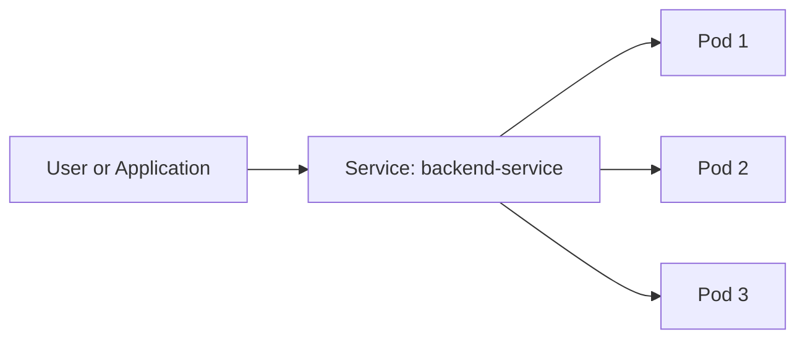
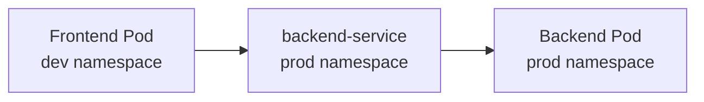
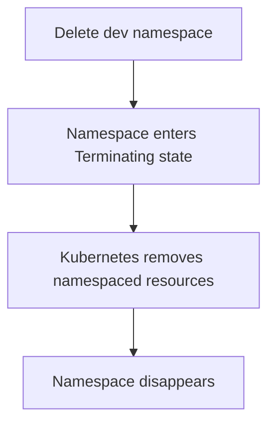
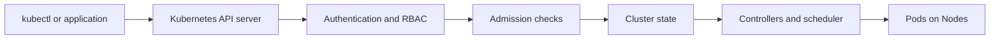

# Kubernetes Namespace, Easy Guide

## What is a namespace?

A Kubernetes **namespace** is like a separate room or workspace inside one Kubernetes cluster.

It helps organize and separate resources such as Pods, Services, Deployments, and Secrets.

```text
One Kubernetes cluster
│
├── development namespace
├── testing namespace
└── production namespace
```

A namespace is not a separate cluster. All namespaces still use the same Kubernetes cluster, but they can have different permissions, limits, and policies.

## Real-world example

Think of a company office building:

```text
Office building = Kubernetes cluster

Development room = dev namespace
Testing room      = test namespace
Production room   = prod namespace

Employee          = user or team
Application       = Deployment
Machine           = Pod
Reception desk    = Service
```

The development team can work in the `dev` room without disturbing production. A production application can still be reached by an approved person or application, if permissions and network policies allow it.

## Basic commands

```bash
kubectl get namespaces
kubectl create namespace dev
kubectl get pods -n dev
kubectl get services -n production
kubectl get all -n dev
kubectl delete namespace test
```

Be careful with `kubectl delete namespace`. It deletes the namespace and the namespaced resources inside it.

## Creating a namespace

```yaml
apiVersion: v1
kind: Namespace
metadata:
  name: dev
```

Apply it:

```bash
kubectl apply -f namespace.yaml
```

## Application flow inside a namespace

A Service finds Pods using labels. The namespace tells Kubernetes where the resource exists.



Example:

```text
frontend Pod in dev namespace
        │
        │ calls backend-service
        ▼
backend Service in dev namespace
        │
        │ selects Pods with app=backend
        ▼
backend Pods in dev namespace
```

Within the same namespace, use:

```text
http://backend-service:80
```

## Communication between namespaces

A Service in another namespace needs the namespace in its DNS name.



Use:

```text
http://backend-service.prod.svc.cluster.local
```

Short form:

```text
http://backend-service.prod
```

Communication can still be blocked by NetworkPolicy, firewall rules, or application authentication.

## Namespace versus label

```text
Namespace = Where the resource lives
Label     = What the resource belongs to
```

Example:

```yaml
metadata:
  namespace: dev
  labels:
    app: frontend
    team: security
```

The namespace is `dev`. The labels are `app=frontend` and `team=security`.

## Important resource scope

Most application resources are **namespaced**:

```text
Pod
Service
Deployment
ConfigMap
Secret
Job
```

Some resources are **cluster-scoped** and do not belong to a namespace:

```text
Node
PersistentVolume
Namespace
ClusterRole
ClusterRoleBinding
CustomResourceDefinition
```

## Intermediate concepts

### Resource quotas

A ResourceQuota limits how much a namespace can consume.

```yaml
apiVersion: v1
kind: ResourceQuota
metadata:
  name: dev-quota
  namespace: dev
spec:
  hard:
    pods: "10"
    requests.cpu: "2"
    requests.memory: 4Gi
```

This can prevent one team from consuming all cluster resources.

### Limit ranges

A LimitRange provides default or maximum CPU and memory settings for containers in a namespace.

### RBAC

RBAC controls who can perform actions in a namespace.

```text
Developer → can read and deploy in dev
Developer → cannot delete production Pods
Operations team → can manage production
```

### NetworkPolicy

NetworkPolicy controls which Pods or namespaces can communicate.

```text
Without NetworkPolicy: communication may be allowed
With restrictive policy: only approved traffic is allowed
```

## Advanced concepts

### Namespace is not a hard security boundary

Namespaces provide logical separation, but they are not equivalent to separate clusters. A cluster administrator can usually access resources across all namespaces.

For strong isolation, consider separate clusters, cloud accounts, or subscriptions.

### Namespace deletion

When a namespace is deleted, Kubernetes normally removes the namespaced resources inside it:



Finalizers can delay deletion if a controller must clean up an external resource.

### Resource names

A namespaced resource is usually identified by both its name and namespace:

```text
Pod: frontend in dev
Pod: frontend in prod
```

These are different resources because they are in different namespaces.

## Under the hood

1. The Kubernetes API server stores namespace information in the object metadata.
2. Controllers watch resources, often within one namespace or across selected namespaces.
3. RBAC checks whether a user or service account may access the namespace.
4. ResourceQuota and LimitRange admission controls validate resource usage.
5. CoreDNS creates DNS records for namespaced Services.
6. Network plugins and NetworkPolicy rules control actual network traffic.
7. The scheduler places Pods on Nodes. A namespace does not force a Pod onto a separate Node.



## Basic questions and answers

### 1. Is a namespace a separate cluster?

No. It is a logical section inside a cluster.

### 2. Can two namespaces have the same Pod name?

Yes.

```text
frontend in dev
frontend in prod
```

They are different resources.

### 3. Can a Service communicate with Pods in another namespace?

Normally, a Service selects Pods in its own namespace. To communicate with a Service in another namespace, call that Service using its namespace-qualified DNS name.

### 4. Can Pods in different namespaces communicate?

Yes, unless NetworkPolicy or another security control blocks them.

### 5. Does a namespace create network isolation automatically?

No. Use NetworkPolicy for network isolation.

### 6. Does a namespace create CPU and memory limits automatically?

No. Use ResourceQuota and LimitRange.

### 7. Does a namespace provide access control?

It provides a scope for RBAC, but you must create the appropriate Roles and RoleBindings.

### 8. Where are namespaces useful?

They are useful for teams, environments, applications, customers, and temporary test workloads.

## Intermediate questions and answers

### 9. What is the difference between Role and ClusterRole?

A `Role` grants permissions inside one namespace. A `ClusterRole` can grant permissions across the cluster or be bound to a specific namespace.

### 10. What is the difference between RoleBinding and ClusterRoleBinding?

A `RoleBinding` grants permissions in one namespace. A `ClusterRoleBinding` grants permissions across the cluster.

### 11. Does a namespace affect scheduling?

Not directly. Pods from different namespaces can run on the same Node unless taints, affinities, or policies are configured.

### 12. Can a Service in one namespace select Pods in another namespace?

A normal Service selector does not select Pods across namespaces. Usually, create the Service in the same namespace as its Pods.

### 13. Are Secrets shared between namespaces?

No. A Secret belongs to one namespace. It must be copied or separately created in another namespace.

### 14. Are ConfigMaps shared between namespaces?

No. ConfigMaps are namespaced resources.

## Advanced questions and answers

### 15. What happens when a namespace is stuck in Terminating?

A finalizer or remaining resource may be preventing deletion. Investigate the namespace conditions and finalizers before removing anything manually.

### 16. Can one team access multiple namespaces?

Yes. RBAC can grant access to several namespaces, either with separate RoleBindings or with carefully designed cluster-level permissions.

### 17. When should separate clusters be used instead of namespaces?

Use separate clusters when stronger isolation, separate upgrade schedules, independent administrators, or regulatory boundaries are required.

### 18. What happens to a Service DNS record when the Service is deleted?

The DNS record is removed. Clients must use the new Service name or endpoint if the Service is recreated with a different name.

### 19. Can namespaces be nested?

Standard Kubernetes namespaces are not nested. Names such as `team-a-dev` can be used to represent a hierarchy, but Kubernetes treats them as independent namespaces.

### 20. What is the best naming approach?

Use clear, consistent names such as:

```text
dev
staging
prod
security-dev
customer-a-prod
```

Avoid creating too many namespaces without a clear ownership, security, or operational reason.

## Short communication summary

### Pod and Service in the same namespace

Use the Service name directly:

```text
frontend Pod → backend-service → backend Pod
```

```bash
curl http://backend-service:80
```

### Pod and Service in different namespaces

Use the Service name plus its namespace:

```text
frontend Pod in dev → backend-service in prod → backend Pod in prod
```

```bash
curl http://backend-service.prod:80
```

Full DNS name:

```text
backend-service.prod.svc.cluster.local
```

### Pod and Service in different clusters

A normal Kubernetes Service name does not work across clusters. Use a LoadBalancer, Ingress, private network connection, service mesh, or multi-cluster service:

```text
Pod in Cluster A → LoadBalancer or Ingress → Service in Cluster B → Backend Pod
```

## Final summary

```text
Namespace:
  Logical room inside a Kubernetes cluster

Service:
  Stable network address for Pods

Label:
  Metadata used to identify and select resources

Same namespace:
  service-name

Different namespace:
  service-name.namespace.svc.cluster.local

Different cluster:
  LoadBalancer, Ingress, private connection, service mesh, or multi-cluster networking
```
