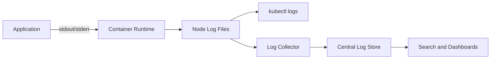
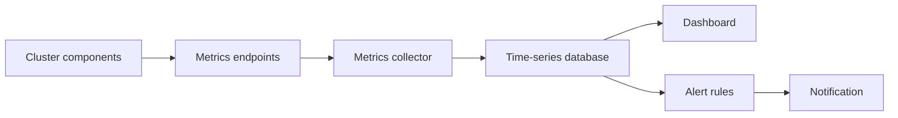
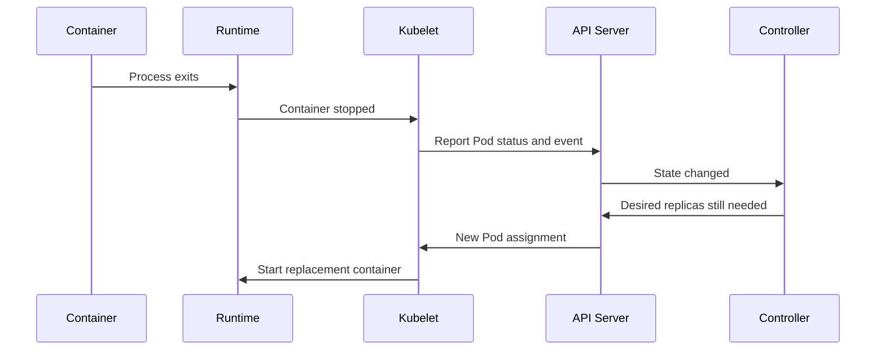
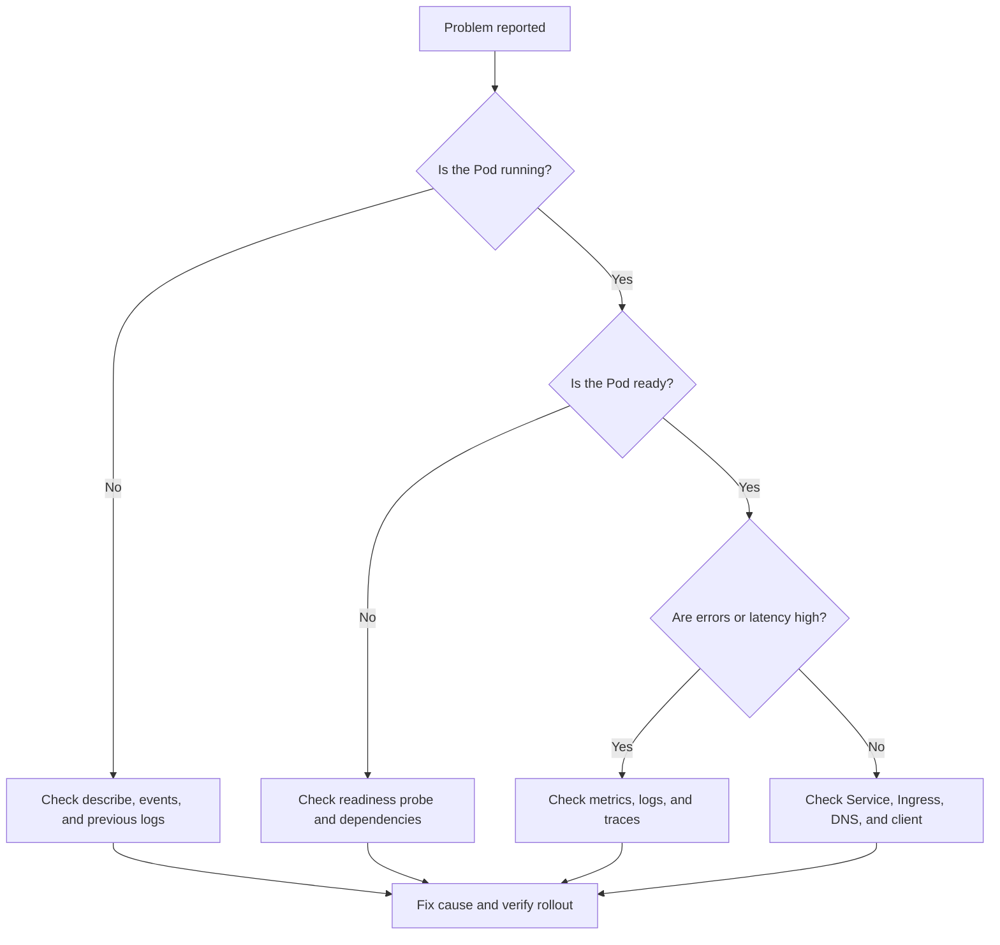

# Kubernetes Logging and Monitoring

## What this section covers

This guide explains the topics shown in the course screenshot:

1. Logging and monitoring introduction
2. Monitoring cluster components
3. Lab: monitor cluster components
4. Lab solution
5. Managing application logs
6. Lab: monitor application logs
7. Optional lab: logging

The goal is simple: **know what is happening inside a Kubernetes cluster, detect problems early, and find the reason when something fails.**

---

## 1. Logging vs. monitoring

### Logging

Logging means recording events as text. Applications and Kubernetes components write messages such as:

```text
User login succeeded
Database connection failed
Pod restarted
```

Logs help answer:

> What happened?

### Monitoring

Monitoring means collecting measurements over time, such as:

- CPU usage
- Memory usage
- Request count
- Error rate
- Pod restarts
- Disk usage
- API server response time

Monitoring helps answer:

> Is the system healthy right now, and is it becoming unhealthy?

### Easy real-world example

Think of a hospital:

- **Monitoring** is the heart-rate monitor showing the patient's current condition.
- **Logging** is the doctor's written record explaining what happened.
- **Alerting** is the alarm that rings when the heart rate becomes dangerous.

Kubernetes needs all three.

---

## 2. Real-world example: online shopping application

Assume an online store runs in Kubernetes with these components:

```text
Browser
   |
   v
Ingress / Load Balancer
   |
   v
Frontend Pods ---> Product API Pods ---> Database
                         |
                         v
                   Payment Service
```

A customer reports: **"Checkout is very slow."**

Monitoring may show:

- Payment service latency increased from 200 ms to 5 seconds.
- Payment pods are using 95% CPU.
- Several pods restarted.

Logs may show:

```text
ERROR payment provider request timed out
ERROR retry attempt 3 of 3
```

Together, monitoring and logging show both:

1. **The symptom:** checkout is slow.
2. **The cause:** calls to the payment provider are timing out.

---

## 3. Kubernetes components to monitor

### Control plane components

| Component | What to watch | Why it matters |
|---|---|---|
| API server | Request rate, errors, latency | All Kubernetes API operations pass through it |
| Scheduler | Scheduling failures, latency | Places Pods on suitable nodes |
| Controller manager | Work queue, reconciliation errors | Keeps the desired state running |
| etcd | Disk, latency, leader changes, database size | Stores Kubernetes cluster state |

### Worker node components

| Component | What to watch | Why it matters |
|---|---|---|
| Kubelet | Errors, Pod count, resource usage | Runs and reports on Pods on the node |
| Container runtime | Container failures, image errors | Starts and manages containers |
| kube-proxy | Network rules and errors | Helps route Service traffic |
| Node | CPU, memory, disk, network | A node resource problem affects its Pods |

### Application objects

Monitor these Kubernetes objects:

- Pods: phase, readiness, restarts, CPU, memory
- Deployments: available replicas and rollout status
- Services: endpoints and traffic
- Jobs and CronJobs: success, failure, duration
- PersistentVolumes: capacity and storage errors
- Ingress: HTTP status codes, latency, and traffic

---

## 4. Basic commands

```bash
# View nodes
kubectl get nodes

# View Pods in the current namespace
kubectl get pods

# View Pods in all namespaces
kubectl get pods -A

# See CPU and memory usage
kubectl top nodes
kubectl top pods -A

# Inspect a Pod
kubectl describe pod <pod-name>

# Read current container logs
kubectl logs <pod-name>

# Follow logs in real time
kubectl logs -f <pod-name>

# Read logs from the previous container instance
kubectl logs <pod-name> --previous

# Read logs from all Pods selected by a label
kubectl logs -l app=frontend --all-containers=true

# Check recent cluster events
kubectl get events --sort-by=.lastTimestamp
```

`kubectl top` requires the Metrics Server or another metrics provider. It is useful for quick inspection, but it is not a complete monitoring system.

---

## 5. Application logging

A good application should write logs to **standard output** and **standard error** instead of writing only to a file inside the container.

Example Deployment:

````yaml
apiVersion: apps/v1
kind: Deployment
metadata:
  name: web
spec:
  replicas: 2
  selector:
    matchLabels:
      app: web
  template:
    metadata:
      labels:
        app: web
    spec:
      containers:
        - name: web
          image: nginx:1.27
          resources:
            requests:
              cpu: "100m"
              memory: "128Mi"
            limits:
              cpu: "500m"
              memory: "256Mi"
````

Read the logs:

```bash
kubectl logs deployment/web
```

### Logging best practices

- Use structured JSON logs when possible.
- Include timestamp, severity, service name, request ID, and error details.
- Do not log passwords, tokens, or sensitive personal data.
- Use `INFO`, `WARN`, and `ERROR` consistently.
- Keep log messages useful and searchable.
- Add a correlation or trace ID to connect logs from multiple services.

Example structured log:

```json
{
  "time": "2026-09-08T12:00:00Z",
  "level": "ERROR",
  "service": "payment-api",
  "request_id": "req-123",
  "message": "payment provider timeout",
  "retry_count": 3
}
```

---

## 6. How Kubernetes handles container logs

The normal flow is:



By default, the container runtime stores container output on the node. `kubectl logs` reads those logs through the kubelet.

For production, logs should be sent to a central system. Common patterns include:

- Fluent Bit or Fluentd
- OpenTelemetry Collector
- Loki
- Elasticsearch or OpenSearch
- Cloud logging services

### Important limitation

Pod logs are normally stored on the node. If the Pod or node is deleted, local logs may be lost. A central log collector provides longer retention and search across the cluster.

---

## 7. Monitoring flow



A common open-source setup is:

```text
Kubernetes components
        |
        v
Prometheus ---> Grafana dashboards
     |
     v
Alertmanager ---> Email, Slack, PagerDuty
```

Monitoring answers questions such as:

- Are all desired replicas available?
- Is a node nearly out of memory?
- Are error rates increasing?
- Are Pods restarting repeatedly?
- Is a deployment rollout stuck?

---

## 8. Under the hood: what happens when a Pod fails?

Suppose a container exits unexpectedly.



The controller compares:

- **Desired state:** for example, 3 replicas
- **Actual state:** for example, 2 running replicas

It then tries to create a replacement Pod. You can investigate with:

```bash
kubectl get pods
kubectl describe pod <pod-name>
kubectl logs <pod-name> --previous
kubectl get events --sort-by=.lastTimestamp
```

Common causes include:

- Application crash
- Failed liveness probe
- Out-of-memory kill
- Image pull failure
- Missing configuration or Secret
- Node pressure
- Dependency failure

---

## 9. Health checks and alerts

### Readiness probe

Answers: **Can this Pod receive traffic?**

If readiness fails, the Service should stop sending traffic to the Pod.

### Liveness probe

Answers: **Is this container stuck or unhealthy enough to restart?**

If liveness fails repeatedly, kubelet restarts the container.

### Startup probe

Useful for slow-starting applications. It prevents liveness checks from restarting the application too early.

Example:

````yaml
livenessProbe:
  httpGet:
    path: /health
    port: 8080
  initialDelaySeconds: 20
  periodSeconds: 10

readinessProbe:
  httpGet:
    path: /ready
    port: 8080
  periodSeconds: 5
````

Good alerts should be actionable. Examples:

- High error rate for 5 minutes
- No ready replicas for a production Deployment
- Node disk usage above 85 percent
- Container restart count increasing rapidly
- PersistentVolume almost full
- API server latency above the agreed threshold

Avoid alerting on every single warning. Too many alerts cause alert fatigue.

---

## 10. Basic, intermediate, and advanced questions

### Basic questions

**Q1. What is the difference between logging and monitoring?**  
Logging records events and details. Monitoring measures system health over time.

**Q2. How do I view Pod logs?**  
Use `kubectl logs <pod-name>`.

**Q3. How do I see why a Pod is failing?**  
Use `kubectl describe pod <pod-name>`, then check events and container state.

**Q4. What does `CrashLoopBackOff` mean?**  
The container is crashing repeatedly, so Kubernetes waits longer between restart attempts.

**Q5. How do I check CPU and memory quickly?**  
Use `kubectl top nodes` and `kubectl top pods -A`, if a metrics provider is installed.

### Intermediate questions

**Q6. Why should applications log to stdout and stderr?**  
Kubernetes and node-level collectors can discover and collect these streams consistently.

**Q7. What is the difference between readiness and liveness?**  
Readiness controls traffic. Liveness controls restarting an unhealthy container.

**Q8. Why are central logs needed?**  
Local node logs can disappear when Pods or nodes are removed. Central logs support retention, search, and cross-service troubleshooting.

**Q9. Why can a Pod be Running but not Ready?**  
The process may be running, but its readiness probe may fail, a dependency may be unavailable, or the application may not be ready to serve traffic.

**Q10. What does a high restart count indicate?**  
It can indicate crashes, failed probes, out-of-memory kills, configuration errors, or unstable dependencies.

### Advanced questions

**Q11. What is the difference between metrics, logs, and traces?**  
Metrics are numeric measurements, logs are detailed events, and traces show a request's path across services.

**Q12. How do resource requests and limits affect monitoring?**  
Requests influence scheduling and expected capacity. Limits cap usage. A low memory limit can cause OOMKilled events, while a low request can lead to poor scheduling decisions.

**Q13. How would you investigate high latency?**  
Check latency and error metrics first, identify the affected service, inspect Pod and node resource usage, review logs using request IDs, and inspect traces if available.

**Q14. What is cardinality and why does it matter?**  
Cardinality is the number of unique label combinations in a metrics system. Labels such as `user_id` or full URLs can create millions of time series and make monitoring expensive or slow.

**Q15. How do you make logging reliable at scale?**  
Use node-level collectors, buffering, backpressure, centralized storage, retention policies, structured logs, access controls, and monitoring for the logging pipeline itself.

---

## 11. Troubleshooting checklist

Use this short sequence:



Recommended commands:

```bash
kubectl get pods -A -o wide
kubectl get deployments -A
kubectl describe pod <pod-name> -n <namespace>
kubectl logs <pod-name> -n <namespace> --all-containers=true
kubectl logs <pod-name> -n <namespace> --previous
kubectl get events -n <namespace> --sort-by=.lastTimestamp
kubectl top pods -n <namespace>
kubectl get endpoints <service-name> -n <namespace>
```

---

## Key takeaways

1. **Monitoring tells you that something is wrong.**
2. **Logs help explain why it is wrong.**
3. **Metrics, logs, and traces work best together.**
4. **Use readiness for traffic decisions and liveness for restart decisions.**
5. **Centralize production logs because node-local logs are temporary.**
6. **Always check events, Pod status, resource usage, and application logs together.**
7. **Create alerts that are actionable, not merely noisy.**
