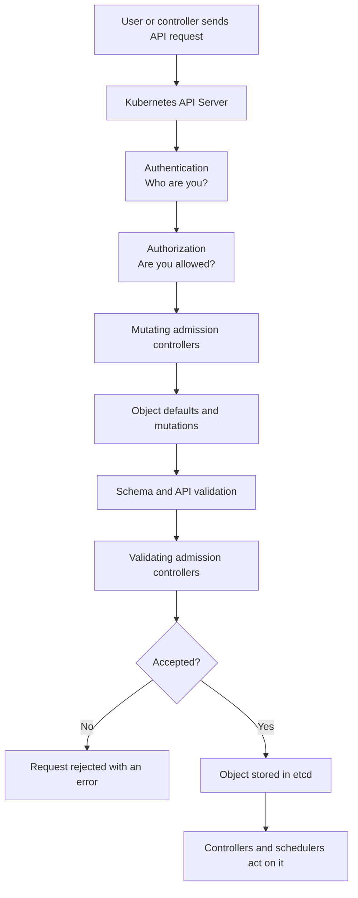
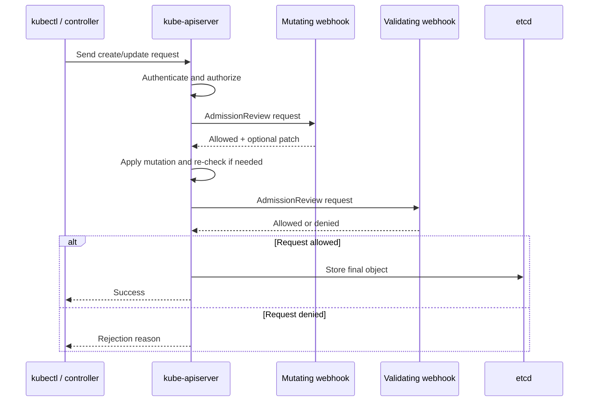

# Kubernetes Admission Controller

## 1. Simple meaning

An **admission controller** is a security and policy checkpoint inside the Kubernetes API server.

Whenever someone or something sends a request to Kubernetes, such as:

- Create a Pod
- Update a Deployment
- Delete a Service
- Create a Secret

admission control checks the request **before Kubernetes saves it**.

Think of it like a security guard at a building entrance:

- **Authentication:** Who are you?
- **Authorization:** Are you allowed to enter or perform this action?
- **Admission control:** Is this action safe and compliant with company rules?

## 2. Real-world example

Imagine a company rule:

> Every production Pod must have CPU and memory limits, and images must come only from the company registry.

A developer submits this Pod:

```yaml
apiVersion: v1
kind: Pod
metadata:
  name: payment-api
  namespace: production
spec:
  containers:
    - name: app
      image: docker.io/myuser/payment-api:latest
```

An admission controller can reject it because:

1. It has no CPU or memory limits.
2. The image comes from an unapproved registry.
3. The tag is `latest`, which may be disallowed.

The Pod is rejected before it reaches the cluster. This prevents a bad configuration from running.

## 3. Main types

### Mutating admission controller

A mutating controller can **change** a request.

Example: A Pod is submitted without a logging sidecar. The controller adds the logging sidecar automatically.

Other examples:

- Add default labels.
- Add security settings.
- Inject a service-mesh sidecar.
- Add a default resource request.
- Add an image-pull secret.

### Validating admission controller

A validating controller can **allow or reject** a request, but it should not change the object.

Example: Reject a Pod that uses a privileged container or an unapproved image.

### Built-in admission controllers

These are included with Kubernetes. Examples include controllers that help with:

- Defaulting resources
- Enforcing namespace rules
- Limiting object counts or resource usage
- Validating service accounts
- Enforcing Pod security standards

The exact enabled controllers depend on the Kubernetes version and cluster configuration.

### Dynamic admission webhooks

A webhook is an external HTTPS service called by the Kubernetes API server.

There are two common resources:

- `MutatingAdmissionWebhook`
- `ValidatingAdmissionWebhook`

Modern Kubernetes clusters commonly configure these using `MutatingWebhookConfiguration` and `ValidatingWebhookConfiguration` objects.

## 4. Request flow



### Easy summary

```text
Client
  |
  v
API Server
  |
  +--> Authenticate
  |
  +--> Authorize
  |
  +--> Mutate: change or add safe defaults
  |
  +--> Validate: allow or reject
  |
  +--> Store in etcd if accepted
```

## 5. Detailed webhook flow



## 6. What happens under the hood?

1. A client sends an API request to the Kubernetes API server.
2. The API server authenticates the caller.
3. The API server checks RBAC and other authorization rules.
4. The API server creates an `AdmissionReview` object containing information such as:
   - The requested operation, for example `CREATE` or `UPDATE`.
   - The resource and API version.
   - The namespace and object.
   - The user identity and some request metadata.
5. For a webhook, the API server sends this object over HTTPS.
6. The webhook returns a response containing:
   - `allowed: true` or `allowed: false`.
   - A denial message when rejected.
   - An optional JSON Patch for a mutating webhook.
7. The API server applies accepted mutations, performs validation, and calls validating controllers.
8. If all checks pass, the final object is written to `etcd`.
9. Only after storage do controllers, the scheduler, and kubelet begin their normal work.

Important: Admission controllers do not normally watch Pods after they are running. They mainly control API requests at the admission point.

## 7. Example: reject privileged containers

A validating policy might reject this configuration:

```yaml
securityContext:
  privileged: true
```

The response could be:

```text
admission webhook "security.company.example" denied the request:
privileged containers are not allowed in the production namespace
```

The Pod never gets stored in `etcd`.

## 8. Example: automatic sidecar injection

A developer submits one application container:

```yaml
containers:
  - name: app
    image: registry.company.com/orders:v1
```

A mutating webhook changes it to something like:

```yaml
containers:
  - name: app
    image: registry.company.com/orders:v1
  - name: proxy
    image: registry.company.com/mesh-proxy:v2
```

The developer did not manually add the proxy. The admission webhook added it before storage.

## 9. Important configuration concepts

### `failurePolicy`

Controls what happens if the webhook cannot be reached:

- `Fail`: reject the request. Safer for critical security policies, but an unavailable webhook can block deployments.
- `Ignore`: allow the request. More available, but the policy can be bypassed during an outage.

### `rules`

Define which operations and resources trigger the webhook, for example:

- `CREATE`, `UPDATE`
- `pods`, `deployments`
- Specific API groups or versions

Keep rules narrow. A webhook that intercepts everything can slow or break the cluster.

### `namespaceSelector`

Limits the webhook to selected namespaces, such as only `production`.

### `objectSelector`

Limits matching based on object labels.

### `sideEffects`

Tells Kubernetes whether calling the webhook has side effects outside the API request. For most safe webhooks, use `None` when appropriate.

### `timeoutSeconds`

Maximum time Kubernetes waits for the webhook response. Short timeouts reduce API delays, but the webhook must be fast enough to respond reliably.

### `reinvocationPolicy`

A mutating webhook can be called again when another mutation changes the object and the first webhook may need to reconsider it. This is usually configured as `IfNeeded` when required.

## 10. Admission controller versus related components

| Component | Main question |
|---|---|
| Authentication | Who is making the request? |
| Authorization / RBAC | Is this identity allowed to do it? |
| Admission control | Should this specific object be allowed or changed? |
| Scheduler | On which node should a Pod run? |
| Controller | How do we make actual cluster state match desired state? |
| Kubelet | How do we run containers on a node? |

## 11. Basic questions and answers

### Q1. Is an admission controller the same as RBAC?

No. RBAC checks whether a user can perform an action. Admission control checks whether the requested object follows policy.

### Q2. Can an admission controller modify a Pod?

A **mutating** admission controller can. A validating controller normally only accepts or rejects.

### Q3. Does admission control run after the Pod starts?

No. It runs before the object is stored and before the Pod starts.

### Q4. Where does admission control run?

Inside the Kubernetes API server request path. Webhooks run as external HTTPS services called by the API server.

### Q5. What happens when a request is rejected?

The API server returns an error to the client. The object is not stored in `etcd`.

### Q6. Can it stop a Deployment?

It can reject creation or updates to the Deployment object. It does not directly stop an already-running workload unless a later update is rejected or another controller acts.

## 12. Intermediate questions and answers

### Q7. What is the normal order, mutation or validation?

Mutation happens before validation. This allows a mutating webhook to add defaults, then validating policies can inspect the final object.

### Q8. What is an `AdmissionReview`?

It is the request and response format used between the API server and an admission webhook.

### Q9. What if the webhook is down?

The result depends on `failurePolicy`. With `Fail`, matching requests are rejected. With `Ignore`, matching requests continue.

### Q10. Can a webhook cause a cluster-wide outage?

Yes. A slow, broken, or overly broad webhook can delay or block API requests. This is why timeouts, narrow rules, monitoring, and carefully chosen failure policies are important.

### Q11. Can admission controllers validate existing objects?

Usually they act on new API requests. To check existing objects, use a separate audit, scanning, or policy-reporting process.

### Q12. Why should webhook logic be idempotent?

A mutating webhook may be called more than once. Applying the same mutation repeatedly should not keep changing the object or adding duplicate fields.

## 13. Advanced questions and answers

### Q13. What is a JSON Patch?

It is a standard list of changes that tells the API server how to modify an object, for example adding a label or container.

Example conceptually:

```json
[
  { "op": "add", "path": "/metadata/labels/team", "value": "payments" }
]
```

### Q14. Are webhook calls guaranteed to happen in a custom order?

Do not design policies around an assumed custom webhook order. Keep webhooks independent where possible. Kubernetes processes mutating and validating admission in defined phases, but multiple webhook interactions can be reinvoked as needed.

### Q15. What is the difference between a webhook and a policy engine?

A webhook is the Kubernetes integration mechanism. A policy engine is the software that evaluates the request. Examples of policy engines include Kyverno and Gatekeeper.

### Q16. What should happen during a webhook outage for a security policy?

For a critical security control, `Fail` is usually safer. For a non-critical enrichment or labeling function, `Ignore` may be more appropriate. This is a business and availability decision, not only a technical one.

### Q17. How do you secure a webhook?

Use TLS, validate the API server's client identity where configured, restrict network access, use least-privilege service accounts, keep the webhook highly available, and avoid logging secrets from AdmissionReview objects.

### Q18. Can admission webhooks inspect the caller?

Yes. The request includes user and group information. Policies can use this information, but they should be designed carefully because authorization should still be handled by RBAC.

## 14. Troubleshooting checklist

When a request is unexpectedly rejected or delayed:

1. Read the exact API error message.
2. Check the webhook configurations:

```bash
kubectl get mutatingwebhookconfiguration
kubectl get validatingwebhookconfiguration
```

3. Inspect a configuration:

```bash
kubectl describe validatingwebhookconfiguration <name>
```

4. Check the webhook Service and Pods:

```bash
kubectl get svc,pods -n <webhook-namespace>
kubectl logs -n <webhook-namespace> <webhook-pod>
```

5. Check for TLS or certificate errors.
6. Check `namespaceSelector`, `objectSelector`, and resource rules.
7. Check webhook latency and the configured timeout.
8. Verify whether `failurePolicy: Fail` is blocking requests.
9. Test with a harmless object in a non-production namespace.

## 15. Best practices

- Keep webhook code fast and stateless.
- Match only the resources that need policy checks.
- Make mutations idempotent.
- Use `failurePolicy` deliberately.
- Set a reasonable timeout.
- Run multiple webhook replicas.
- Monitor error rate and latency.
- Do not depend on a webhook for normal application runtime behavior.
- Avoid mutating fields that users or other controllers must control.
- Test upgrades because API versions and admission behavior can change.
- Protect webhook certificates and avoid exposing sensitive request data in logs.

## 16. One-minute summary

```text
Admission controller = policy checkpoint for Kubernetes API requests.

Mutating controller  = changes the object.
Validating controller = allows or rejects the object.

It runs after authentication and authorization,
but before the object is stored in etcd.

Example:
A developer creates a Pod without resource limits.
The admission policy rejects it before the Pod can run.
```
