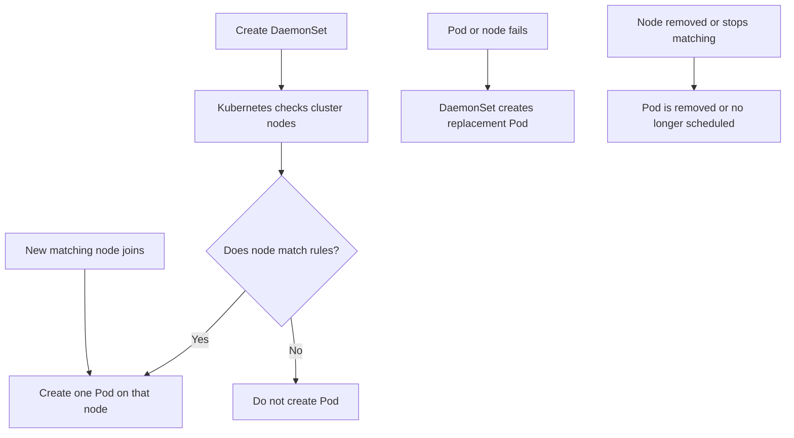

# Kubernetes DaemonSets, Easy Guide

## What is a DaemonSet?

A **DaemonSet** makes sure that one copy of a Pod runs on every Kubernetes node that matches its rules.

**Simple idea:**

> One worker, one helper Pod.

If a new node joins the cluster, Kubernetes starts the DaemonSet Pod on it automatically. If a node is removed, its Pod is removed too.

## Real-world example

Imagine a security guard assigned to every office building:

- Every building needs one guard.
- When a new building opens, a new guard is assigned.
- If a building closes, its guard leaves.

In Kubernetes, the building is a **Node**, and the guard is a **DaemonSet Pod**.

Common examples:

- Log collectors, such as Fluent Bit
- Monitoring agents, such as node exporters
- Networking agents, such as CNI Pods
- Storage or security agents

A DaemonSet is usually for **node-level work**, not for running a normal application.

## Easy flow chart



## Minimal example

````yaml
apiVersion: apps/v1
kind: DaemonSet
metadata:
  name: node-monitor
spec:
  selector:
    matchLabels:
      app: node-monitor
  template:
    metadata:
      labels:
        app: node-monitor
    spec:
      containers:
        - name: monitor
          image: prom/node-exporter:latest
          ports:
            - containerPort: 9100
````

This creates one `node-monitor` Pod on each eligible node.

Useful commands:

````bash
kubectl apply -f daemonset.yaml
kubectl get daemonset
kubectl get pods -l app=node-monitor -o wide
kubectl describe daemonset node-monitor
kubectl delete daemonset node-monitor
````

## Important fields

| Field | Meaning |
|---|---|
| `selector` | Identifies Pods owned by the DaemonSet |
| `template` | Blueprint for each Pod |
| `nodeSelector` | Runs Pods only on nodes with specific labels |
| `tolerations` | Allows Pods to run on tainted nodes |
| `updateStrategy` | Controls rolling updates |
| `hostNetwork` | Lets a Pod use the node's network namespace |
| `hostPath` | Mounts a directory from the node |

## DaemonSet versus Deployment

| Use a DaemonSet when... | Use a Deployment when... |
|---|---|
| You need a Pod on each node | You need a chosen number of replicas |
| The workload works with node data | The workload is a normal application |
| Example: log or security agent | Example: web server or API |

A Deployment might run 3 replicas on 10 nodes. A DaemonSet normally runs up to 10 Pods, one per matching node.

## Basic questions and answers

**1. Does a DaemonSet run exactly one Pod on every node?**  
Usually yes, but only on nodes that match selectors, affinity, taints, and tolerations. A node can also have special scheduling rules.

**2. What happens when a new node joins?**  
The DaemonSet controller notices it and creates a Pod there if the node is eligible.

**3. What happens if the Pod crashes?**  
The Pod is recreated on the same node by the DaemonSet and node control mechanisms.

**4. Can a DaemonSet run multiple Pods on one node?**  
Normally no. Its purpose is one Pod per eligible node.

**5. Can I run a DaemonSet only on worker nodes?**  
Yes. Label worker nodes and use `nodeSelector` or node affinity.

**6. How do I check DaemonSet health?**  
Check `DESIRED`, `CURRENT`, `READY`, `UP-TO-DATE`, and `AVAILABLE` with `kubectl get daemonset`.

## Intermediate questions and answers

**7. How can a DaemonSet run on control-plane nodes?**  
Control-plane nodes are often tainted. Add a matching `toleration` to the Pod template.

**8. What is the update strategy?**  
`RollingUpdate` replaces Pods gradually. `OnDelete` updates Pods only after you delete them manually.

**9. Can a DaemonSet use node affinity?**  
Yes. Use affinity when placement rules are more complex than a simple label match.

**10. How do rolling updates work?**  
The controller updates Pods node by node, respecting settings such as `maxUnavailable`.

**11. Can a DaemonSet use persistent storage?**  
Yes, but be careful. Storage may be tied to a particular node, and multiple Pods may not be allowed to mount the same volume.

**12. Why is my DaemonSet Pod not scheduled?**  
Check node labels, taints, tolerations, affinity, resource requests, Pod security rules, and events with `kubectl describe pod`.

## Advanced questions and answers

**13. What happens under the hood?**  
The DaemonSet controller watches Nodes and Pods. It calculates which nodes should run the Pod, creates missing Pods, removes unwanted Pods, and replaces failed Pods. The scheduler then assigns each DaemonSet Pod to its target node.

**14. How does it avoid two Pods on one node?**  
The controller creates a Pod for each eligible node and uses scheduling rules, ownership, and controller reconciliation to maintain the desired one-per-node state.

**15. What is `DaemonSetUpdateSurge`?**  
It allows a temporary extra Pod during an update. This can reduce service gaps, but it briefly increases resource usage.

**16. How do you make a DaemonSet highly reliable?**  
Set realistic resource requests, define liveness and readiness probes, use priority when appropriate, handle node taints intentionally, and monitor `numberReady` and `numberUnavailable`.

**17. What security risks are common?**  
Node agents often need `hostPath`, host networking, or elevated privileges. Use the minimum permissions required, restrict the image, and review the ServiceAccount and security context.

## Under the hood, in short

1. You submit the DaemonSet object to the API server.
2. The DaemonSet controller watches the object and current Nodes.
3. It selects eligible Nodes.
4. It creates or deletes Pods to reach one desired Pod per eligible Node.
5. The scheduler places each Pod on its target Node.
6. Kubelet on that Node pulls the image and starts the containers.
7. If the Pod, labels, or node state changes, the controller reconciles again.

## Remember this

> **Deployment = selected number of Pods.**  
> **DaemonSet = one Pod on every matching Node.**
