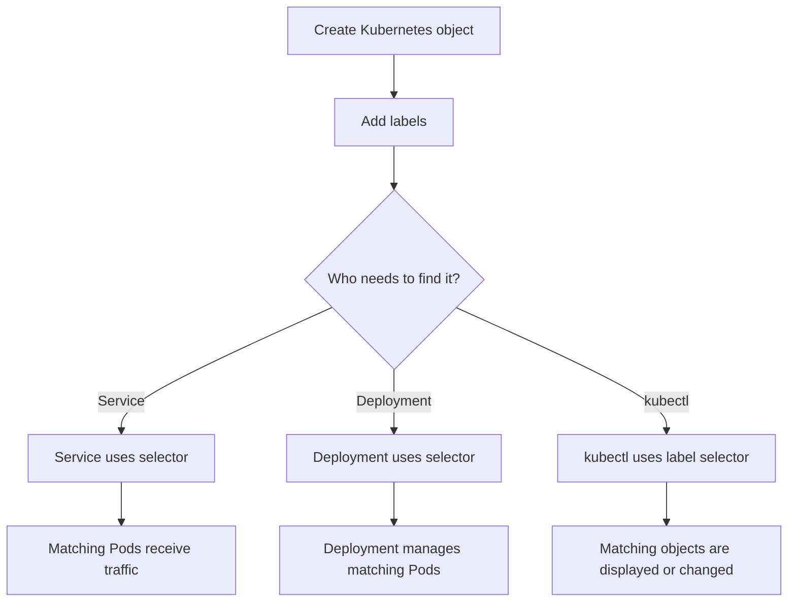
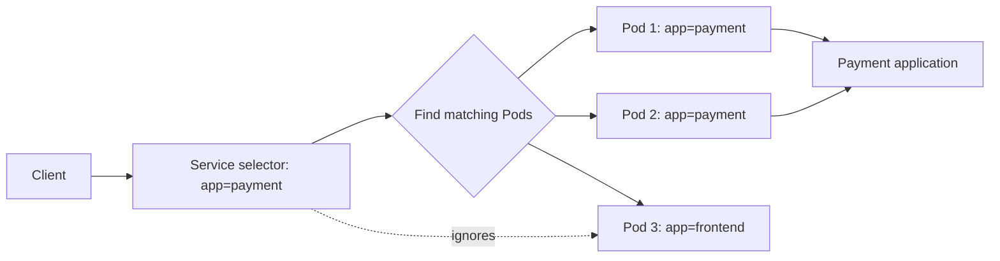

# Kubernetes Labels and Selectors

A simple guide from beginner to advanced, with real-world examples

## 1. The basic idea

Kubernetes manages many objects: Pods, Deployments, Services, Jobs, and more. Labels and selectors help Kubernetes identify the right objects.

### Labels

A **label** is a key-value tag attached to a Kubernetes object.

Examples:

```yaml
app: payment
version: v1
team: finance
environment: production
```

Think of labels like stickers on boxes in a warehouse. A box may have several stickers:

- `app=payment`
- `environment=production`
- `team=finance`

### Selectors

A **selector** is a filter that finds objects with particular labels.

For example:

```text
app=payment
```

means:

> Find every object whose label `app` has the value `payment`.

## 2. Real-world example

Imagine a food delivery company has three applications:

- `frontend`, the customer website
- `payment`, payment processing
- `delivery`, delivery tracking

Each application has multiple Pods. Kubernetes needs a way to know which Pods belong to which application.

```text
Pod A: app=frontend, environment=production
Pod B: app=payment, environment=production
Pod C: app=payment, environment=staging
Pod D: app=delivery, environment=production
```

A selector such as `app=payment` finds Pods B and C.

A selector such as `app=payment,environment=production` finds only Pod B.

## 3. Simple flow chart



### Service traffic flow



## 4. How to add labels

Labels can be added in YAML:

````yaml
apiVersion: v1
kind: Pod
metadata:
  name: payment-pod
  labels:
    app: payment
    environment: production
    version: v1
spec:
  containers:
    - name: payment
      image: payment:v1
````

They can also be added or changed with `kubectl`:

````bash
kubectl label pod payment-pod team=finance
kubectl label pod payment-pod version=v2 --overwrite
````

View labels:

````bash
kubectl get pods --show-labels
kubectl get pod payment-pod --show-labels
kubectl describe pod payment-pod
````

## 5. Equality-based selectors

The most basic selectors use equality.

### One label

````bash
kubectl get pods -l app=payment
````

This means: get Pods where `app` equals `payment`.

### Not equal

````bash
kubectl get pods -l 'environment!=production'
````

This finds objects whose `environment` is not `production`. Objects without that label may also be included, so use this carefully.

### Multiple labels

````bash
kubectl get pods -l 'app=payment,environment=production'
````

Multiple conditions are combined with **AND**. The Pod must satisfy every condition.

## 6. Set-based selectors

Set-based selectors support groups of values.

### In

````bash
kubectl get pods -l 'environment in (production,staging)'
````

Finds Pods with either `environment=production` or `environment=staging`.

### Not in

````bash
kubectl get pods -l 'environment notin (development)' 
````

Finds Pods whose environment is not development.

### Label exists

````bash
kubectl get pods -l app
````

Finds Pods that have an `app` label, regardless of its value.

### Label does not exist

````bash
kubectl get pods -l '!temporary'
````

Finds objects that do not have the `temporary` label.

## 7. Labels used by a Deployment and Service

A common application has a Deployment to create Pods and a Service to expose them.

````yaml
apiVersion: apps/v1
kind: Deployment
metadata:
  name: payment
  labels:
    app: payment
spec:
  replicas: 3
  selector:
    matchLabels:
      app: payment
  template:
    metadata:
      labels:
        app: payment
        version: v1
    spec:
      containers:
        - name: payment
          image: payment:v1
          ports:
            - containerPort: 8080
---
apiVersion: v1
kind: Service
metadata:
  name: payment-service
spec:
  selector:
    app: payment
  ports:
    - port: 80
      targetPort: 8080
````

### What happens?

1. The Deployment creates three Pods.
2. Every Pod gets the label `app=payment` from the Pod template.
3. The Service searches for Pods with `app=payment`.
4. The Service sends traffic to those matching Pods.
5. If a Pod is deleted and recreated, the new Pod gets the same template labels and is found again.

## 8. Important difference: labels versus selectors

| Item | Purpose | Example |
|---|---|---|
| Label | Describes or categorizes an object | `app=payment` |
| Selector | Finds objects with labels | `app=payment` |
| `metadata.labels` | Labels on the object itself | `team=finance` |
| `spec.selector` | Rule used to find objects | `matchLabels: app=payment` |
| `spec.template.metadata.labels` | Labels copied to newly created Pods | `app=payment` |

A label is the **identity tag**. A selector is the **search rule**.

## 9. Under the hood

### 9.1 Kubernetes stores labels as metadata

Labels are stored in an object's metadata. The Kubernetes API server stores the object in the cluster's backing data store.

Conceptually:

```text
Object metadata
  ├── name
  ├── namespace
  ├── labels
  └── annotations
```

Labels are intended for identifying and grouping objects. Annotations are for non-identifying information such as descriptions, configuration, or tool metadata.

### 9.2 The API server evaluates selectors

When a client, controller, or Service uses a selector, the request goes to the Kubernetes API server. The API server returns objects whose labels satisfy the selector.

```text
kubectl / controller / Service logic
                |
                v
          Kubernetes API server
                |
                v
       Objects whose labels match
```

### 9.3 Controllers continuously reconcile

Deployments, ReplicaSets, and other controllers continuously compare the desired state with the current state.

For example:

```text
Desired: 3 Pods with app=payment
Current: 2 matching Pods
Action: create 1 more Pod
```

The selector helps a controller decide which Pods belong to it.

### 9.4 Services and EndpointSlices

A Service does not normally send traffic directly by repeatedly querying Pods for every request. Kubernetes tracks matching backends through EndpointSlices. When matching Pods appear, disappear, or change readiness, the EndpointSlices are updated. The networking layer then uses those endpoints for routing.

### 9.5 Selectors are not always identical

Different Kubernetes resources support different selector formats:

- Services commonly use `spec.selector` with simple key-value matching.
- Deployments use `spec.selector.matchLabels` and optionally `matchExpressions`.
- `kubectl` supports equality-based and set-based label selectors.
- Some resources use selectors for ownership, while others use them for traffic routing.

## 10. `matchLabels` and `matchExpressions`

Deployment selector example:

````yaml
selector:
  matchLabels:
    app: payment
  matchExpressions:
    - key: environment
      operator: In
      values:
        - production
        - staging
````

The object must satisfy both sections:

- `app` must equal `payment`.
- `environment` must be either `production` or `staging`.

Supported operators include:

- `In`
- `NotIn`
- `Exists`
- `DoesNotExist`

`Exists` and `DoesNotExist` do not use a values list.

## 11. Common mistakes

### Mistake 1: Service selector does not match Pod labels

Service:

````yaml
selector:
  app: payments
````

Pod:

````yaml
labels:
  app: payment
````

There is a spelling difference, so the Service finds no Pods.

Check it with:

````bash
kubectl get pods --show-labels
kubectl get endpointslices -l kubernetes.io/service-name=payment-service
````

### Mistake 2: Deployment selector and template labels do not match

This is invalid or ineffective:

````yaml
spec:
  selector:
    matchLabels:
      app: payment
  template:
    metadata:
      labels:
        app: frontend
````

The Deployment selector should match the labels in its Pod template.

### Mistake 3: Changing a Deployment selector

For Deployments, the selector is generally immutable after creation. Plan the label scheme before creating the Deployment. If the selector must change, a controlled replacement may be required.

### Mistake 4: Using a broad selector

A Service with a selector such as `team=finance` might accidentally route traffic to unrelated Pods owned by different applications. Prefer application-specific labels such as:

```text
app=payment
component=api
```

### Mistake 5: Confusing labels and annotations

Use labels for selection. Use annotations for data that should not be used to select objects.

## 12. Recommended label design

Use stable, meaningful labels. A commonly used structure is:

````yaml
app.kubernetes.io/name: payment
app.kubernetes.io/instance: payment-prod
app.kubernetes.io/version: "1.4.2"
app.kubernetes.io/component: api
app.kubernetes.io/part-of: checkout
app.kubernetes.io/managed-by: helm
````

Good practices:

- Use a stable application name in `app.kubernetes.io/name`.
- Use an instance label when several installations of the same application exist.
- Keep selectors stable and narrow.
- Do not put frequently changing values in a controller selector.
- Use namespaces to separate environments or teams when appropriate, not labels alone.
- Quote version values that may be interpreted unexpectedly by YAML.

## 13. Useful commands

````bash
# List all Pods with labels
kubectl get pods --show-labels

# Select by one label
kubectl get pods -l app=payment

# Select by several labels
kubectl get pods -l 'app=payment,environment=production'

# Select using a set
kubectl get pods -l 'environment in (production,staging)'

# Show labels as columns
kubectl get pods -L app,environment,version

# Add a label
kubectl label pod payment-pod owner=platform

# Change an existing label
kubectl label pod payment-pod owner=security --overwrite

# Remove a label
kubectl label pod payment-pod owner-

# Check a Service and its selected backends
kubectl get service payment-service -o yaml
kubectl get endpointslices -l kubernetes.io/service-name=payment-service

# Test a selector across all namespaces
kubectl get pods --all-namespaces -l app=payment
````

## 14. Beginner questions and answers

### What is a label?

A key-value tag attached to a Kubernetes object, such as `app=payment`.

### What is a selector?

A filter that finds objects by their labels.

### Can one object have multiple labels?

Yes. An object can have labels such as `app`, `version`, `team`, and `environment`.

### Can one Pod match multiple selectors?

Yes. For example, the same Pod might match a Service selector and a monitoring selector.

### Are labels unique?

No. Many objects can have the same label. This is how a Service finds multiple Pods.

### What happens if a Service finds no matching Pods?

The Service still exists, but it has no usable backends, so traffic cannot reach an application through that Service.

## 15. Intermediate questions and answers

### What is the difference between `matchLabels` and `matchExpressions`?

`matchLabels` performs exact key-value matching. `matchExpressions` supports operators such as `In`, `NotIn`, `Exists`, and `DoesNotExist`.

### Why should a Deployment selector match the Pod template labels?

The selector tells the Deployment which Pods it owns. If the template labels do not satisfy the selector, the Deployment cannot correctly manage the Pods.

### Does changing a Pod label affect a Service?

Yes. If the changed labels no longer match the Service selector, the Pod can be removed from the Service's backend list. If the new labels match another Service, that Pod may be selected by that Service too.

### Are selectors scoped to a namespace?

Usually, yes. Pods and Services are namespaced, and a Service selects Pods in its own namespace. Cluster-scoped resources have different behavior.

### Why use more than one label?

Different labels answer different questions. For example, `app=payment` identifies the application, while `version=v1` identifies the release and `environment=production` identifies where it runs.

## 16. Advanced questions and answers

### How does a rolling update use labels?

A Deployment manages ReplicaSets. The Deployment's selector identifies its Pods, while the Pod template's labels identify the Pods created by each ReplicaSet. During a rollout, old and new ReplicaSets can coexist, so selectors and labels must be designed carefully.

### Can two Deployments select the same Pods?

They should not. Overlapping selectors can cause controllers to interfere with each other or produce unpredictable management behavior. Keep controller selectors unique within a namespace.

### Does a Service select only Ready Pods?

The label selector identifies candidate Pods. Kubernetes networking then considers Pod readiness and other endpoint conditions when deciding whether a Pod should receive normal traffic.

### What is the performance impact of labels?

Labels are indexed and designed for efficient grouping and selection, but extremely high-cardinality or constantly changing labels can increase control-plane and storage overhead. Avoid using labels for large arbitrary data or rapidly changing timestamps.

### Should a build number be part of a Deployment selector?

Usually no. A build number changes during deployments. Use stable labels in the selector, and put the version or build label on the Pod template if it is useful for inspection, monitoring, or release tracking.

### How are labels different from owner references?

Labels are flexible metadata used for grouping and selection. Owner references express an ownership relationship used by Kubernetes garbage collection and controller logic. A label saying `app=payment` does not by itself prove that a Deployment owns the Pod.

## 17. Final mental model

```text
Labels = stickers on Kubernetes objects
Selectors = filters that search for those stickers
Deployment = creates and manages matching Pods
Service = sends traffic to matching Pods
Controllers = continuously compare desired state with actual state
```

If something is not working, check these three things first:

1. What labels does the object actually have?
2. What selector is being used?
3. Do the selector and labels match exactly?

Useful first command:

````bash
kubectl get pods --show-labels
````
