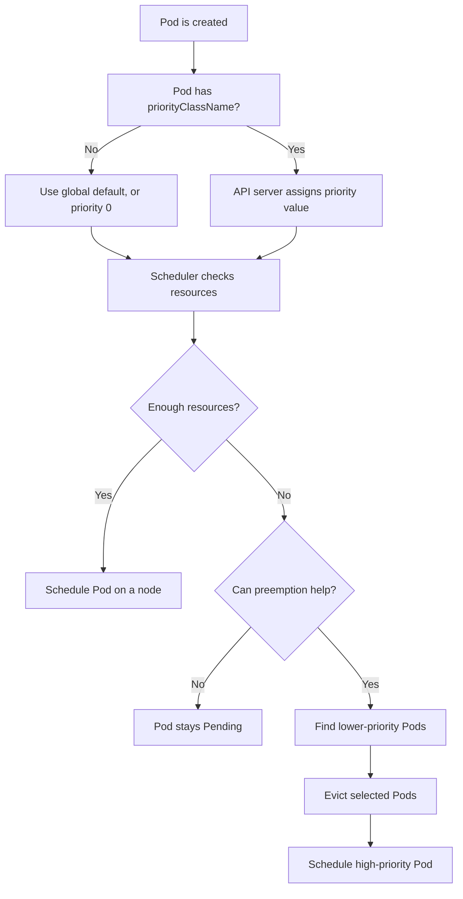

# Kubernetes PriorityClass, short guide

## 1. What is PriorityClass?

A `PriorityClass` tells Kubernetes how important a Pod is compared with other Pods.

- Higher value = more important Pod
- Lower value = less important Pod
- It mainly affects scheduling when cluster resources are limited
- It can allow an important Pod to replace a less important Pod. This is called **preemption**.

> PriorityClass is about **Pod scheduling priority**, not CPU or memory allocation.

## 2. Real-world example

Think of a hospital:

- Emergency patient = critical application
- Normal patient = regular application
- Waiting room is full = cluster has no free resources

If an emergency patient arrives, the hospital may move a normal patient to another room. Similarly, Kubernetes may stop a low-priority Pod so a high-priority Pod can run.

Example priorities:

| Application | PriorityClass | Value |
|---|---|---:|
| Payment API | `critical-app` | 100000 |
| Web frontend | `normal-app` | 1000 |
| Batch report | `low-batch` | 10 |

## 3. Basic YAML

```yaml
apiVersion: scheduling.k8s.io/v1
kind: PriorityClass
metadata:
  name: critical-app
value: 100000
globalDefault: false
description: "For critical production applications"
---
apiVersion: v1
kind: Pod
metadata:
  name: payment-api
spec:
  priorityClassName: critical-app
  containers:
    - name: app
      image: nginx
      resources:
        requests:
          cpu: "500m"
          memory: "256Mi"
```

Apply it:

```bash
kubectl apply -f priorityclass.yaml
kubectl get priorityclass
kubectl describe priorityclass critical-app
kubectl get pod payment-api -o jsonpath='{.spec.priority}'
echo
```

## 4. Easy flow chart



## 5. Important fields

- `value`: Integer priority. Larger values are more important.
- `globalDefault`: If `true`, Pods without a `priorityClassName` use this class. Only one PriorityClass should normally be the global default.
- `preemptionPolicy`:
  - `PreemptLowerPriority`: may evict lower-priority Pods. This is the default.
  - `Never`: high priority for queue ordering, but it cannot evict running Pods.
- `description`: Human-readable purpose.
- `priorityClassName`: Set this on the Pod or workload template.
- `system-cluster-critical` and `system-node-critical`: Built-in classes for important Kubernetes system Pods. Use carefully.

Example with no preemption:

```yaml
apiVersion: scheduling.k8s.io/v1
kind: PriorityClass
metadata:
  name: important-no-preemption
value: 50000
preemptionPolicy: Never
globalDefault: false
description: "Runs before normal work, but does not evict running Pods"
```

## 6. Under the hood

1. The API server validates the Pod's `priorityClassName`.
2. It copies the PriorityClass value into the Pod's internal `spec.priority` field.
3. The scheduler keeps unscheduled Pods in a scheduling queue.
4. Higher-priority Pods are generally considered before lower-priority Pods.
5. The scheduler filters nodes by CPU, memory, taints, affinity, and other rules.
6. If no node fits, the scheduler may simulate removing lower-priority Pods.
7. If that creates a valid placement, Kubernetes sends eviction requests to those Pods.
8. The high-priority Pod is then scheduled, subject to graceful termination and PodDisruptionBudget behavior.

Priority does **not** guarantee instant scheduling, and it does not override impossible constraints, taints, quotas, or missing resources.

## 7. Basic questions

**Q: Is a bigger number more important?**  
Yes.

**Q: Does PriorityClass reserve CPU or memory?**  
No. Use resource requests and limits for that.

**Q: What happens if a Pod has no PriorityClass?**  
It uses the global default PriorityClass, if one exists. Otherwise its priority is normally `0`.

**Q: Can I change a Pod's priority after creation?**  
Normally, no. Update the workload template and recreate the Pod.

**Q: Is PriorityClass namespaced?**  
No. PriorityClasses are cluster-scoped.

## 8. Intermediate questions

**Q: What is preemption?**  
The scheduler removes lower-priority Pods to make room for a higher-priority Pod.

**Q: What does `preemptionPolicy: Never` do?**  
The Pod can be placed ahead in the scheduling queue, but it cannot evict running Pods.

**Q: Does preemption always happen?**  
No. It happens only when removing lower-priority Pods can produce a valid placement.

**Q: What if the high-priority Pod has a strict node selector?**  
Preemption may not help if no node can ever satisfy that selector.

**Q: What is the difference between priority and QoS?**  
Priority controls scheduling order and possible preemption. QoS class, such as Guaranteed or BestEffort, affects resource handling under node pressure.

**Q: How do I assign it to a Deployment?**  
Put `priorityClassName` under `spec.template.spec`, not only under the Deployment's top-level `spec`.

## 9. Advanced questions

**Q: Can high-priority Pods cause a disruption loop?**  
Yes. Poorly designed priorities can repeatedly evict lower-priority workloads. Use sensible tiers and capacity planning.

**Q: Does a PodDisruptionBudget block preemption?**  
A PDB is considered during preemption, but it is not an absolute guarantee that preemption cannot disrupt the Pod.

**Q: Can ResourceQuota limit high-priority Pods?**  
Yes. Priority does not bypass namespace quotas or admission policies.

**Q: Can users create arbitrary high values?**  
Cluster administrators should control PriorityClass creation with RBAC and admission policies.

**Q: When should I use `Never`?**  
For important jobs that should jump ahead of queued work but must not terminate currently running applications.

**Q: What is the recommended design?**  
Create a small number of documented classes, for example `critical`, `standard`, and `batch`. Combine them with realistic resource requests, quotas, and autoscaling.

## 10. Good practices

- Use a few priority levels, not one class per application.
- Give production-critical workloads higher priority than batch jobs.
- Always define realistic CPU and memory requests.
- Test preemption in a non-production cluster.
- Monitor `Pending` Pods and evictions.
- Protect system workloads and do not casually reuse built-in system classes.
- Remember: priority is not a substitute for enough cluster capacity.
