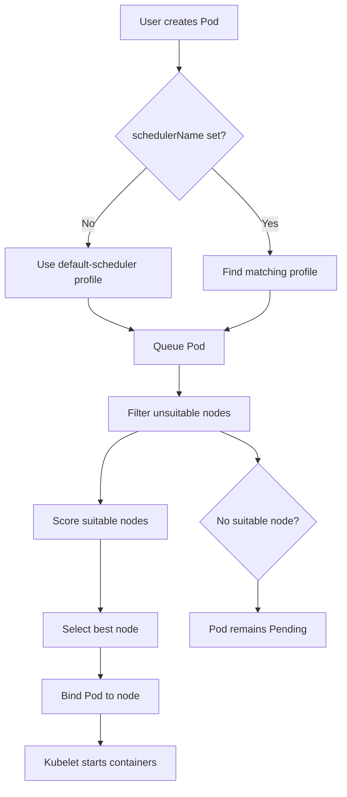

# Kubernetes Scheduler Profiles, Short Guide

## 1. What is a scheduler profile?

A **scheduler profile** is a named set of scheduling rules used by `kube-scheduler`.

Think of it like different delivery policies:

- `default-scheduler`: normal delivery to any suitable node.
- `critical-scheduler`: deliver only to nodes reserved for critical workloads.
- `batch-scheduler`: use a different scheduling strategy for batch jobs.

A Pod selects a profile with:

```yaml
spec:
  schedulerName: critical-scheduler
```

If `schedulerName` is omitted, Kubernetes uses `default-scheduler`.

---

## 2. Real-world example

Assume a company has two types of workloads:

- Payment services must run only on nodes labeled `workload=critical`.
- Normal applications can use the regular scheduler.

Label the dedicated nodes:

```bash
kubectl label node worker-1 workload=critical
kubectl label node worker-2 workload=critical
```

### Scheduler profile configuration

Save this as `/etc/kubernetes/scheduler-config.yaml` on the control-plane node:

```yaml
apiVersion: kubescheduler.config.k8s.io/v1
kind: KubeSchedulerConfiguration

profiles:
  - schedulerName: default-scheduler

  - schedulerName: critical-scheduler
    pluginConfig:
      - name: NodeAffinity
        args:
          addedAffinity:
            requiredDuringSchedulingIgnoredDuringExecution:
              nodeSelectorTerms:
                - matchExpressions:
                    - key: workload
                      operator: In
                      values:
                        - critical
```

The second profile adds a hidden rule: Pods using `critical-scheduler` must run on nodes labeled `workload=critical`.

### Tell kube-scheduler to use the file

For a kubeadm control plane, update the scheduler static Pod manifest:

```text
/etc/kubernetes/manifests/kube-scheduler.yaml
```

Add or update the scheduler command:

```yaml
spec:
  containers:
    - name: kube-scheduler
      command:
        - kube-scheduler
        - --config=/etc/kubernetes/scheduler-config.yaml
      volumeMounts:
        - name: scheduler-config
          mountPath: /etc/kubernetes/scheduler-config.yaml
          readOnly: true
  volumes:
    - name: scheduler-config
      hostPath:
        path: /etc/kubernetes/scheduler-config.yaml
        type: File
```

The kubelet notices the manifest change and restarts the scheduler Pod. In production, back up the manifest first and validate the configuration carefully.

> Managed Kubernetes services may not allow direct changes to the control-plane scheduler. Check the provider's supported configuration options.

### Use the profile in a Pod

```yaml
apiVersion: apps/v1
kind: Deployment
metadata:
  name: payment-api
spec:
  replicas: 2
  selector:
    matchLabels:
      app: payment-api
  template:
    metadata:
      labels:
        app: payment-api
    spec:
      schedulerName: critical-scheduler
      containers:
        - name: payment-api
          image: nginx:1.27
```

Apply and verify:

```bash
kubectl apply -f payment-api.yaml
kubectl get pods -o wide
kubectl describe pod <pod-name>
```

If no suitable critical node exists, the Pod stays `Pending`. Check the reason:

```bash
kubectl describe pod <pod-name>
```

---

## 3. Easy flow chart



### One-line flow

`Pod -> schedulerName -> profile -> filter nodes -> score nodes -> select node -> bind -> kubelet starts Pod`

---

## 4. What happens under the hood?

1. The API server stores the new Pod.
2. The scheduler watches for unscheduled Pods.
3. Kubernetes reads the Pod's `spec.schedulerName`.
4. The matching profile is selected.
5. Scheduling plugins run through stages such as:
   - **QueueSort**: decide which waiting Pod is considered first.
   - **PreFilter**: prepare scheduling information.
   - **Filter**: remove nodes that cannot run the Pod.
   - **PreScore**: prepare scoring data.
   - **Score**: rank the remaining nodes.
   - **Reserve / Permit**: optionally reserve or delay scheduling.
   - **Bind**: assign the Pod to the selected node.
6. The kubelet on that node notices the assignment and starts the containers.

A profile mainly changes which plugins are enabled, disabled, or configured. It does not create a separate Kubernetes cluster.

---

## 5. Basic, intermediate, and advanced questions

### Basic

**Q: What is the difference between a profile and a separate scheduler?**  
A: Profiles use one `kube-scheduler` process with different configurations. Separate schedulers are different processes and need additional deployment and RBAC configuration.

**Q: What happens if I omit `schedulerName`?**  
A: The Pod uses `default-scheduler`. That profile must exist.

**Q: Can two profiles have the same scheduler name?**  
A: No. Every profile needs a unique `schedulerName`.

**Q: Does changing a profile move already-running Pods?**  
A: No. Scheduling rules apply when a Pod is scheduled. Existing Pods are not automatically moved.

### Intermediate

**Q: What is a scheduling plugin?**  
A: A plugin provides one scheduling behavior, such as node affinity, resource filtering, topology spreading, or scoring.

**Q: What is the difference between Filter and Score?**  
A: **Filter** removes invalid nodes. **Score** ranks valid nodes and chooses the best one.

**Q: Can a Pod use a profile that does not exist?**  
A: It cannot be scheduled. The Pod normally remains `Pending`, and events show that no matching scheduler profile is available.

**Q: Can I configure different node rules per profile?**  
A: Yes. For built-in behavior, `pluginConfig`, such as `NodeAffinity` with `addedAffinity`, is commonly used.

### Advanced

**Q: What is `addedAffinity`?**  
A: It adds scheduler-side node affinity to every Pod using that profile. It is not visible in the Pod YAML, so document it clearly to avoid confusing scheduling failures.

**Q: What does `multiPoint` mean?**  
A: It enables or disables a plugin across multiple scheduling extension points. Use it when the plugin participates in several stages.

**Q: Can I write a custom plugin?**  
A: Yes, but it requires Go development, scheduler framework knowledge, a compatible scheduler image, testing, and operational ownership.

**Q: What is the biggest production risk?**  
A: A profile can make Pods unschedulable if labels, resources, taints, affinity, or plugin settings do not match. Always test with a non-critical workload first.

---

## 6. Useful checks and common mistakes

```bash
kubectl get pods -n kube-system | grep scheduler
kubectl logs -n kube-system <kube-scheduler-pod>
kubectl describe pod <pod-name>
kubectl get nodes --show-labels
```

Common mistakes:

- Typing a `schedulerName` that is not defined in the scheduler configuration.
- Forgetting to label nodes with the required key and value.
- Editing the configuration file but not mounting it into the scheduler container.
- Using `requiredDuringScheduling...` when the workload should be allowed to run elsewhere.
- Expecting profile changes to reschedule existing Pods.
- Removing or breaking the `default-scheduler` profile while ordinary Pods still depend on it.

## Key idea

A scheduler profile is simply a **named scheduling policy**. Configure the profile, reference its name in the Pod, then Kubernetes filters and scores nodes according to that profile.

## Official references

- [Kubernetes Scheduler Configuration](https://kubernetes.io/docs/reference/scheduling/config/)
- [Kube-scheduler Configuration API](https://kubernetes.io/docs/reference/config-api/kube-scheduler-config.v1/)
- [Kubernetes Scheduling Framework](https://kubernetes.io/docs/concepts/scheduling-eviction/scheduling-framework/)
