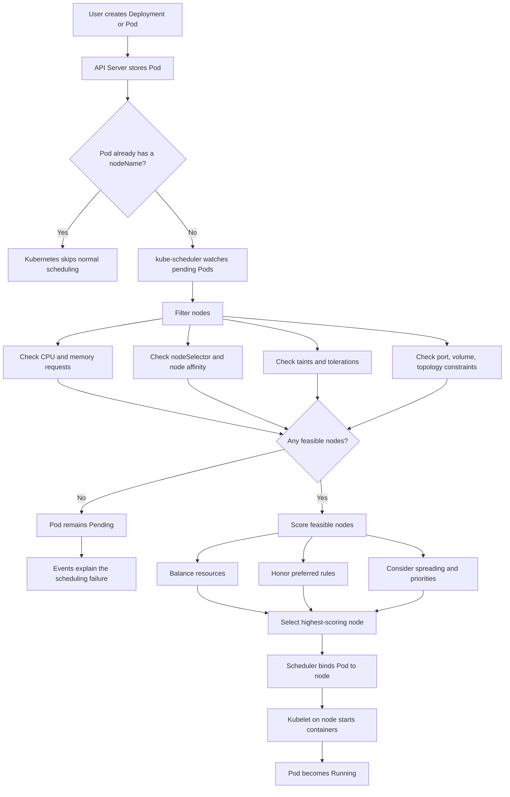

# Kubernetes Scheduling, Explained Simply

## 1. What is scheduling?

In Kubernetes, **scheduling means choosing the best worker node for a newly created Pod**.

A Pod is first created without a node assigned. The **kube-scheduler** checks the available nodes, removes nodes that cannot run the Pod, scores the remaining nodes, and assigns the Pod to the best one.

> Simple idea: Kubernetes scheduling is like assigning a delivery package to the best available delivery truck.

## 2. Real-world example

Imagine an online shopping application with three types of Pods:

- **Frontend Pods**: should run on general-purpose servers.
- **Payment Pods**: must run only on secure servers.
- **GPU recommendation Pods**: require a server with a GPU.

Kubernetes uses scheduling rules to make these decisions:

- Resource requests make sure the node has enough CPU and memory.
- Labels and `nodeSelector` choose suitable nodes.
- Affinity expresses preferences or relationships between Pods and nodes.
- Taints keep unsuitable Pods away.
- Tolerations allow selected Pods onto tainted nodes.
- Priority and preemption help important Pods get resources first.

## 3. Scheduling flow chart



## 4. Basic scheduling lifecycle

1. A Deployment creates a Pod.
2. The API Server stores the Pod.
3. The Pod has no assigned node, so its status is usually `Pending`.
4. The kube-scheduler notices it.
5. The scheduler filters out unsuitable nodes.
6. It scores the remaining nodes.
7. It assigns the Pod to one node by setting the binding.
8. The kubelet on that node pulls images and starts the containers.
9. The Pod becomes `Running` if startup succeeds.

## 5. How the scheduler chooses a node

### Step 1: Filtering

Filtering answers:

> Can this Pod run on this node at all?

A node can be rejected because:

- It does not have enough requested CPU or memory.
- It does not match `nodeSelector`.
- It does not match required node affinity.
- The Pod does not tolerate a node taint.
- A required volume is unavailable in that zone.
- A required host port is already in use.
- A topology rule would be violated.

### Step 2: Scoring

Scoring answers:

> Among the possible nodes, which one is the best choice?

The scheduler may prefer a node that:

- Has more suitable free capacity.
- Keeps Pods spread across zones or nodes.
- Matches preferred affinity rules.
- Avoids putting too many related Pods together.
- Follows configured scheduling profiles and plugins.

### Step 3: Binding

The scheduler writes a binding decision to the API Server. The Pod now has a `spec.nodeName` value. The kubelet on that node then takes responsibility for running it.

## 6. Important scheduling concepts

### 6.1 Resource requests and limits

A **request** is the amount of CPU or memory Kubernetes reserves for scheduling.

A **limit** is the maximum amount a container is allowed to use.

```yaml
resources:
  requests:
    cpu: "500m"
    memory: "512Mi"
  limits:
    cpu: "1"
    memory: "1Gi"
```

- `500m` means half a CPU core.
- The scheduler uses requests, not current usage, for normal placement.
- If a node has only 300m CPU available, this Pod will not fit there.
- Limits affect runtime behavior, not the initial scheduling decision.

### 6.2 `nodeSelector`

The simplest way to select nodes by label.

```yaml
spec:
  nodeSelector:
    workload: secure
```

The Pod can run only on nodes with this label:

```bash
kubectl label node node-1 workload=secure
```

Use it for simple, strict requirements.

### 6.3 Node affinity

Node affinity is more expressive than `nodeSelector`.

```yaml
affinity:
  nodeAffinity:
    requiredDuringSchedulingIgnoredDuringExecution:
      nodeSelectorTerms:
      - matchExpressions:
        - key: cloud.google.com/gke-nodepool
          operator: In
          values: [secure-pool]
```

Two common forms:

- `requiredDuringSchedulingIgnoredDuringExecution`: a hard rule. The Pod cannot be scheduled unless it matches.
- `preferredDuringSchedulingIgnoredDuringExecution`: a soft preference. The scheduler tries to match it but can choose another node.

`IgnoredDuringExecution` means that if the label later changes, Kubernetes normally does not evict the already-running Pod only because of that change.

### 6.4 Pod affinity and anti-affinity

Pod affinity places Pods near other Pods. Pod anti-affinity keeps them apart.

Example: keep frontend replicas on different nodes:

```yaml
affinity:
  podAntiAffinity:
    preferredDuringSchedulingIgnoredDuringExecution:
    - weight: 100
      podAffinityTerm:
        topologyKey: kubernetes.io/hostname
        labelSelector:
          matchLabels:
            app: frontend
```

This improves availability because one node failure is less likely to remove every replica.

### 6.5 Taints and tolerations

A **taint** is placed on a node to repel Pods.

```bash
kubectl taint nodes gpu-node dedicated=gpu:NoSchedule
```

A Pod needs a matching toleration to use that node:

```yaml
tolerations:
- key: dedicated
  operator: Equal
  value: gpu
  effect: NoSchedule
```

Important distinction:

- Taint: a rule on the node saying, "keep Pods away."
- Toleration: permission on the Pod saying, "this Pod may enter."
- A toleration alone does not force the Pod onto that node. Add a label and node affinity if exclusive placement is required.

Common taint effects:

- `NoSchedule`: new non-tolerating Pods are not scheduled there.
- `PreferNoSchedule`: the scheduler tries to avoid the node.
- `NoExecute`: non-tolerating running Pods can be evicted, depending on toleration settings.

### 6.6 Topology spread constraints

Topology spread constraints distribute replicas across failure domains such as nodes or zones.

```yaml
topologySpreadConstraints:
- maxSkew: 1
  topologyKey: topology.kubernetes.io/zone
  whenUnsatisfiable: DoNotSchedule
  labelSelector:
    matchLabels:
      app: api
```

This helps avoid placing all API replicas in one availability zone.

### 6.7 Priority and preemption

A high-priority Pod can be scheduled before a low-priority Pod.

If no node has enough capacity, Kubernetes may evict lower-priority Pods to make room for the higher-priority Pod. This is called **preemption**.

Use it carefully because preemption can cause disruption.

## 7. A practical Pod example

```yaml
apiVersion: v1
kind: Pod
metadata:
  name: payment-api
  labels:
    app: payment-api
spec:
  containers:
  - name: payment-api
    image: example/payment-api:2.1
    resources:
      requests:
        cpu: "500m"
        memory: "512Mi"
      limits:
        cpu: "1"
        memory: "1Gi"
  nodeSelector:
    workload: secure
  tolerations:
  - key: dedicated
    operator: Equal
    value: payments
    effect: NoSchedule
```

For this Pod to run, a node must:

1. Have label `workload=secure`.
2. Have enough requested CPU and memory.
3. Have a compatible taint, or no blocking taint.
4. Have all required storage and topology conditions satisfied.

## 8. Under the hood

The main components are:

- **API Server**: accepts the Pod definition and stores its state.
- **Scheduler**: watches unscheduled Pods and selects nodes.
- **Scheduler cache**: keeps a fast view of nodes, Pods, and resources.
- **Scheduling queue**: stores pending Pods waiting for scheduling.
- **Scheduling framework**: runs plugins for filtering, scoring, binding, and related phases.
- **Kubelet**: runs on each node and starts the assigned Pod.
- **Controller manager**: notices failures and creates replacement Pods when needed.

A simplified internal cycle is:

```text
Pending Pod
  -> scheduling queue
  -> pre-filter plugins
  -> filter plugins
  -> score plugins
  -> select node
  -> reserve and permit checks
  -> bind Pod through API Server
  -> kubelet starts containers
```

The scheduler does not run containers. It makes the placement decision. The kubelet performs the actual startup on the selected node.

## 9. Useful commands for troubleshooting

```bash
kubectl get pods -o wide
kubectl describe pod <pod-name>
kubectl get nodes --show-labels
kubectl describe node <node-name>
kubectl get events --sort-by=.lastTimestamp
kubectl get priorityclass
```

Look especially at the **Events** section of `kubectl describe pod`. It often explains messages such as:

- `Insufficient cpu`
- `Insufficient memory`
- ` didn't match node selector`
- `had untolerated taint`
- `pod has unbound immediate PersistentVolumeClaims`

## 10. Basic, intermediate, and advanced questions

### Basic questions

**What is the difference between a Pod and a node?**

A Pod is the smallest deployable Kubernetes unit. A node is a machine that runs Pods.

**What happens when a Pod has no node?**

It remains `Pending` until the scheduler finds a suitable node.

**Who selects the node?**

The kube-scheduler selects it. The kubelet then runs the Pod on that node.

**Does Kubernetes schedule based on current CPU usage?**

Normally, it schedules using declared resource requests and node allocatable capacity, not only live usage.

**What does `kubectl get pods -o wide` show?**

It shows the node where each Pod is running, along with additional network information.

### Intermediate questions

**Why is my Pod stuck in `Pending`?**

Common causes are insufficient resources, selectors or affinity that match no nodes, taints without tolerations, unavailable storage, or topology constraints.

**What is the difference between a request and a limit?**

The request influences placement and is reserved for scheduling. The limit caps runtime usage.

**When should I use node affinity instead of nodeSelector?**

Use `nodeSelector` for a simple exact match. Use affinity when you need multiple expressions, operators, or preferred rules.

**Do tolerations move a Pod to a tainted node?**

No. They only allow the Pod to be considered there. Use node labels and affinity to attract it to that node group.

**Why spread replicas across zones?**

To reduce the chance that a zone failure takes down all replicas.

**Can two Pods run on the same node?**

Yes, unless resource, affinity, anti-affinity, topology, port, or other constraints prevent it.

### Advanced questions

**What is preemption?**

It is the scheduler evicting lower-priority Pods so a higher-priority Pod can fit, when no suitable node has enough resources.

**What is the difference between filtering and scoring?**

Filtering removes nodes that cannot run the Pod. Scoring ranks nodes that can run it.

**What are scheduler plugins?**

They are extension points used by the scheduling framework for phases such as queue sorting, filtering, scoring, reserving, permitting, and binding.

**What is scheduler cache used for?**

It gives the scheduler a fast, mostly current view of cluster state so it does not need to recalculate everything from scratch for every Pod.

**What is a scheduling race?**

Two scheduler decisions or other cluster changes can make a previously valid placement invalid. Kubernetes validates the binding and retries when necessary.

**Can a Pod be scheduled onto a node manually?**

Yes, by setting `spec.nodeName`, but this bypasses the normal scheduler and should be used only for special cases. `nodeName` does not perform normal feasibility checks.

**What is the difference between `NoSchedule` and `NoExecute`?**

`NoSchedule` blocks new non-tolerating Pods. `NoExecute` can also evict already-running non-tolerating Pods.

**How does a DaemonSet differ from normal scheduling?**

A DaemonSet ensures one Pod, or one Pod per matching node, rather than balancing a replica count across the cluster. The scheduler can still participate in placement unless the controller uses a direct node assignment strategy.

**How do static Pods differ?**

Static Pods are created directly by the kubelet from local manifest files. They are not created by the API Server in the same way as normal Pods.

## 11. A simple troubleshooting method

When a Pod is `Pending`, ask these questions in order:

1. Does the Pod request more CPU or memory than any node can provide?
2. Do its `nodeSelector` or required affinity rules match at least one node?
3. Does a node taint require a missing toleration?
4. Are storage, ports, or topology rules blocking placement?
5. Is a higher-priority Pod causing preemption or queue delay?
6. What does `kubectl describe pod` show in Events?

## 12. One-minute summary

Kubernetes scheduling is the process of assigning a pending Pod to a suitable node. The scheduler first filters out nodes that cannot run it, then scores the remaining nodes and binds the Pod to the best candidate. Resource requests, labels, affinity, taints, tolerations, topology rules, and priorities control the decision. After binding, the kubelet starts the containers.
