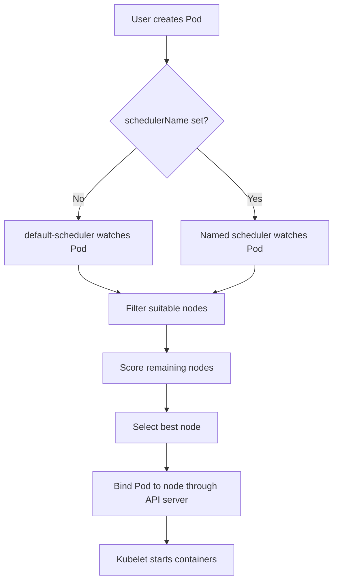

# Multiple Schedulers in Kubernetes

## 1. Simple explanation

A **scheduler** decides **which worker node should run a new Pod**.

Kubernetes normally uses one scheduler:

```text
New Pod -> kube-scheduler -> Best worker node -> Pod runs
```

With **multiple schedulers**, Kubernetes can use different schedulers for different Pods. Each Pod declares which scheduler should handle it using `spec.schedulerName`.

Think of it like a company with multiple delivery teams:

- Normal delivery team: regular packages
- Cold-chain team: medicines and frozen goods
- Heavy-load team: large equipment

Each package is sent to the correct team based on its requirements.

---

## 2. Real-world example

Suppose an online shopping company has these workloads:

- Web applications need normal scheduling.
- GPU-based recommendation services need GPU nodes.
- Batch jobs should use cheap, low-priority nodes.

The company runs:

- `default-scheduler` for normal Pods
- `gpu-scheduler` for GPU workloads
- `batch-scheduler` for batch jobs

A GPU Pod can select the custom scheduler:

````yaml
apiVersion: v1
kind: Pod
metadata:
  name: recommendation-service
spec:
  schedulerName: gpu-scheduler
  containers:
    - name: recommender
      image: my-recommender:v1
      resources:
        limits:
          nvidia.com/gpu: "1"
````

Only the scheduler named `gpu-scheduler` should schedule this Pod.

If `schedulerName` is omitted, the Pod normally uses `default-scheduler`.

---

## 3. Flow chart



### Important point

Schedulers usually watch the API server for **Pending Pods**. A scheduler only processes Pods whose `schedulerName` matches its own name.

---

## 4. Under the hood

1. The API server stores the new Pod with status `Pending`.
2. The selected scheduler watches the API server.
3. It finds an unscheduled Pod with its matching `schedulerName`.
4. It filters nodes using requirements such as:
   - CPU and memory
   - Node selectors and affinity
   - Taints and tolerations
   - Volumes and topology
   - GPU or other resources
5. It scores the remaining nodes.
6. It selects a node.
7. It writes a binding, or updates the Pod's `spec.nodeName`.
8. The kubelet on that node notices the Pod and starts it.

Schedulers do not normally start containers. They only decide placement.

---

## 5. Basic configuration idea

A custom scheduler is commonly deployed as another Kubernetes Deployment. Its scheduler name must be configured, for example:

````yaml
args:
  - --scheduler-name=gpu-scheduler
````

The exact argument depends on the scheduler implementation. The name must match the Pod's `spec.schedulerName`.

For modern `kube-scheduler`, scheduling profiles can also provide different behaviors in one scheduler process. This is often simpler than running many separate scheduler processes.

---

## 6. Basic questions

### What is a scheduler?
It selects a suitable node for a Pod that has not been assigned to any node.

### What is the default scheduler name?
Usually `default-scheduler`.

### How does a Pod select a scheduler?
By setting `spec.schedulerName`.

### What happens if `schedulerName` is missing?
The default scheduler normally handles the Pod.

### Can two schedulers process the same Pod?
They should not. A scheduler processes Pods assigned to its own scheduler name.

### Does a scheduler create containers?
No. The kubelet creates and runs containers after the Pod is assigned to a node.

### What happens if the selected scheduler is down?
The Pod remains `Pending` until that scheduler becomes available or the Pod is changed to another scheduler name.

---

## 7. Intermediate questions

### Can multiple schedulers run in one cluster?
Yes. They can run independently and use different names.

### Can they schedule onto the same nodes?
Yes, unless rules such as labels, taints, affinity, or custom logic separate the workloads.

### How do you debug a Pod that is still Pending?
Check:

````bash
kubectl get pod <pod-name> -o yaml
kubectl describe pod <pod-name>
kubectl get pods -A | grep scheduler
kubectl logs deployment/<scheduler-deployment>
````

Look for:

- Incorrect `schedulerName`
- Scheduler not running
- No node satisfies the requirements
- RBAC or API server access errors

### Is a custom scheduler required for GPU workloads?
Usually no. Node labels, taints, tolerations, affinity, and resource requests are often enough. Use a custom scheduler only when special placement logic is needed.

### Can scheduler names be changed after Pod creation?
The safest approach is to delete and recreate the Pod. A Pod's scheduling decision is made before it gets a node assignment.

### What is the difference between scheduler profiles and multiple schedulers?
Profiles provide different scheduling plugins or rules in one scheduler process. Multiple schedulers are separate processes with separate identities.

---

## 8. Advanced questions

### How do two schedulers avoid conflicts?
They use different scheduler identities and watch different `schedulerName` values. A Pod should have only one intended scheduler.

### What permissions does a scheduler need?
It needs RBAC permissions to watch and read Pods and nodes, and to create or update binding-related resources and events. Missing permissions can leave Pods pending.

### What is scheduler preemption?
If enabled, a scheduler may evict lower-priority Pods to make room for a higher-priority Pod. Custom schedulers must implement or correctly configure this behavior if they need it.

### Can a custom scheduler use Kubernetes scheduling plugins?
Yes, depending on its implementation. It may use the scheduler framework, custom plugins, or completely different placement logic.

### What is the main production risk?
A typo or unavailable scheduler can leave workloads pending. Always monitor scheduler health and alert on Pods pending for too long.

### When should you avoid multiple schedulers?
Avoid them when standard Kubernetes scheduling features are sufficient. Multiple schedulers add deployment, RBAC, monitoring, upgrade, and troubleshooting complexity.

---

## 9. Quick decision guide

Use the **default scheduler** when normal Kubernetes placement rules are enough.

Use **scheduler profiles** when you need a few different scheduling policies inside one scheduler deployment.

Use **multiple schedulers** when workloads need clearly separate scheduling engines, ownership, or specialized placement algorithms.

## One-line summary

`spec.schedulerName` tells Kubernetes **which scheduler is responsible for choosing the node for that Pod**.
