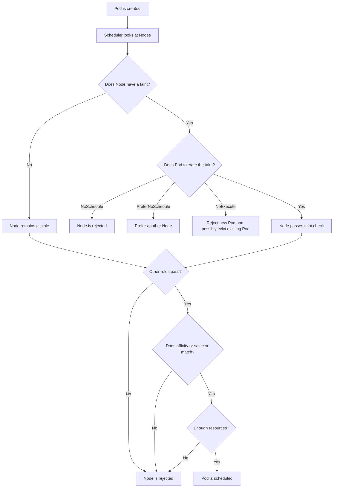

# Taints and Tolerations in Kubernetes

## 1. Simple idea

Taints and tolerations control **which Pods are allowed to run on which Nodes**.

- A **taint** is placed on a Node. It says: **“Keep Pods away unless they have permission.”**
- A **toleration** is added to a Pod. It says: **“This Pod can accept that taint.”**
- A toleration does **not** force a Pod onto a Node. It only makes the Pod eligible to run there.

### Easy analogy

Imagine a hospital:

- A special ICU room has a sign: **“ICU patients only.”** This is the taint.
- An ICU patient has the required authorization. This is the toleration.
- Having authorization allows the patient to enter, but does not guarantee that a bed is available. Other scheduling rules still apply.

## 2. Why use them?

Common uses include:

- Reserving GPU Nodes for machine-learning workloads
- Keeping system or database workloads on dedicated Nodes
- Separating production and development workloads
- Protecting specialized hardware
- Evicting Pods from unhealthy or unscheduled Nodes

## 3. Basic syntax

A taint has three parts:

```text
key=value:effect
```

Example:

```text
workload=gpu:NoSchedule
```

A matching toleration in a Pod looks like this:

```yaml
tolerations:
  - key: "workload"
    operator: "Equal"
    value: "gpu"
    effect: "NoSchedule"
```

## 4. Taint effects

### `NoSchedule`

New Pods that do not tolerate the taint will not be scheduled onto the Node.
Existing Pods usually remain running.

```text
Node: workload=gpu:NoSchedule
```

### `PreferNoSchedule`

Kubernetes tries not to place non-tolerating Pods on the Node, but it may do so if necessary.

This is a soft preference, not a strict rule.

### `NoExecute`

Two things happen:

1. New non-tolerating Pods are not scheduled there.
2. Existing non-tolerating Pods may be evicted from the Node.

A Pod can specify `tolerationSeconds` to remain temporarily:

```yaml
tolerations:
  - key: "maintenance"
    operator: "Exists"
    effect: "NoExecute"
    tolerationSeconds: 300
```

This allows the Pod to stay for 300 seconds after the taint is added.

## 5. Real-world example: GPU Node

Suppose a company has three Nodes:

```text
node-1: normal application workloads
node-2: normal application workloads
node-3: expensive GPU hardware
```

The administrator taints the GPU Node:

```bash
kubectl taint nodes node-3 workload=gpu:NoSchedule
```

Now normal Pods cannot be scheduled on `node-3` unless they tolerate the taint.

A machine-learning Pod can tolerate it:

```yaml
apiVersion: v1
kind: Pod
metadata:
  name: ml-training
spec:
  tolerations:
    - key: "workload"
      operator: "Equal"
      value: "gpu"
      effect: "NoSchedule"
  nodeSelector:
    accelerator: "nvidia"
  containers:
    - name: trainer
      image: my-ml-image:1.0
```

Important: the toleration alone does not select `node-3`. The `nodeSelector` or node affinity is used to attract the Pod to GPU Nodes.

## 6. Flow chart



### In one sentence

**Taint repels, toleration permits, and affinity or selectors attract.**

## 7. Toleration fields explained

```yaml
tolerations:
  - key: "environment"
    operator: "Equal"
    value: "production"
    effect: "NoSchedule"
    tolerationSeconds: 600
```

- `key`: Taint key to match
- `operator`: Usually `Equal` or `Exists`
- `value`: Required with `Equal`
- `effect`: Taint effect to tolerate
- `tolerationSeconds`: Used with `NoExecute`; how long the Pod may remain

### `Equal` versus `Exists`

`Equal` requires key, value, and effect to match:

```yaml
operator: Equal
key: team
value: payments
effect: NoSchedule
```

`Exists` matches the key regardless of its value:

```yaml
operator: Exists
key: team
effect: NoSchedule
```

A toleration with an empty key and `Exists` can match all taints of the specified effect. Use this carefully.

## 8. Taints do not work alone

This Pod tolerates a GPU taint:

```yaml
tolerations:
  - key: workload
    operator: Equal
    value: gpu
    effect: NoSchedule
```

It may run on **any** Node without a blocking taint, and on any matching GPU-tainted Node. To target GPU Nodes, combine the toleration with one of these:

### Node selector

```yaml
nodeSelector:
  accelerator: nvidia
```

### Node affinity

```yaml
affinity:
  nodeAffinity:
    requiredDuringSchedulingIgnoredDuringExecution:
      nodeSelectorTerms:
        - matchExpressions:
            - key: accelerator
              operator: In
              values:
                - nvidia
```

## 9. Useful commands

Add a taint:

```bash
kubectl taint nodes NODE_NAME key=value:NoSchedule
```

Remove a taint. Add a minus sign to the taint expression:

```bash
kubectl taint nodes NODE_NAME key=value:NoSchedule-
```

View Node taints:

```bash
kubectl describe node NODE_NAME
kubectl get node NODE_NAME -o json | jq '.spec.taints'
```

View Pod tolerations:

```bash
kubectl get pod POD_NAME -o yaml
```

Check why a Pod is pending:

```bash
kubectl describe pod POD_NAME
kubectl get events --sort-by=.lastTimestamp
```

## 10. What happens under the hood?

1. The API server stores the Node taint and the Pod toleration in their specifications.
2. The scheduler watches for unscheduled Pods.
3. The scheduler evaluates each Node.
4. The taint and toleration filter removes Nodes with taints that the Pod does not tolerate.
5. The scheduler also checks resources, node selectors, affinity, topology rules, and other constraints.
6. A suitable Node is selected and the Pod is bound to it.
7. The kubelet on that Node starts the Pod.
8. For `NoExecute`, the node lifecycle and eviction logic can remove existing Pods that do not tolerate the taint.

The scheduler does not simply ask, “Does the Pod have a toleration?” It asks whether the Pod satisfies **all scheduling constraints**.

## 11. Built-in taints you may see

Kubernetes may add taints for Node conditions, for example:

```text
node.kubernetes.io/not-ready:NoSchedule
node.kubernetes.io/unreachable:NoExecute
node.kubernetes.io/memory-pressure:NoSchedule
node.kubernetes.io/disk-pressure:NoSchedule
node.kubernetes.io/pid-pressure:NoSchedule
node.kubernetes.io/network-unavailable:NoSchedule
```

These help prevent new workloads from going to unhealthy Nodes. Some default tolerations are automatically added to Pods by Kubernetes components, depending on the condition and cluster configuration.

## 12. Important differences

| Feature | Main purpose | Direction |
|---|---|---|
| Taint | Repel Pods from a Node | Node to Pod |
| Toleration | Permit a Pod to ignore a taint | Pod to Node |
| `nodeSelector` | Require a Node label | Pod to Node |
| Node affinity | Attract or require certain Nodes | Pod to Node |
| Pod affinity | Place Pods near other Pods | Pod to Pod |
| Pod anti-affinity | Keep Pods apart | Pod to Pod |

## 13. Basic questions and answers

### Q1. What is a taint?

A rule on a Node that repels Pods unless they have a matching toleration.

### Q2. What is a toleration?

A Pod setting that allows the Pod to be scheduled onto a Node with a matching taint.

### Q3. Does a toleration force placement on that Node?

No. It only removes the taint-based restriction. Use labels, `nodeSelector`, or node affinity to attract the Pod.

### Q4. Which effect evicts existing Pods?

`NoExecute` can evict existing Pods that do not tolerate the taint. `NoSchedule` does not normally evict them.

### Q5. What happens if a Pod has no toleration?

It cannot be scheduled onto a Node with a blocking `NoSchedule` taint.

### Q6. Can one Node have multiple taints?

Yes. A Pod must tolerate every relevant blocking taint to be eligible.

## 14. Intermediate questions and answers

### Q7. What if the Pod tolerates only one of two taints?

The other taint can still reject the Node. All applicable taints must be tolerated.

### Q8. What is the difference between `NoSchedule` and `NoExecute`?

`NoSchedule` affects new scheduling. `NoExecute` affects new scheduling and can remove existing Pods.

### Q9. What does `tolerationSeconds` do?

It gives a Pod temporary permission to remain on a `NoExecute`-tainted Node.

### Q10. Why is my GPU Pod scheduled on a non-GPU Node?

It probably has a toleration but no selector or affinity. Add a GPU label requirement and request the GPU resource if needed.

### Q11. Can a toleration match every taint?

A toleration with `operator: Exists` and an empty key can match all taint keys for the specified effect. This can weaken isolation, so avoid it unless intentional.

### Q12. Does `PreferNoSchedule` guarantee separation?

No. It is a preference. Kubernetes may still schedule a Pod there if other Nodes are unsuitable.

## 15. Advanced questions and answers

### Q13. What does “tolerationSeconds” count from?

For a `NoExecute` taint, the timer starts when the taint is observed as applicable to the Pod. If the taint is removed before the timer expires, the Pod is not evicted because of that taint.

### Q14. What if a taint has no value?

Use `operator: Exists` in the toleration:

```yaml
tolerations:
  - key: dedicated
    operator: Exists
    effect: NoSchedule
```

### Q15. What if the toleration has no effect?

A toleration with no effect can match taints with either `NoSchedule`, `PreferNoSchedule`, or `NoExecute`, subject to the other fields. Specify the effect when you want precise behavior.

### Q16. What happens when multiple taints exist?

Kubernetes conceptually filters out taints the Pod tolerates. If any remaining taint has `NoSchedule` or `NoExecute`, the Node is not a normal scheduling target. `PreferNoSchedule` creates a preference against the Node.

### Q17. Can a DaemonSet use taints and tolerations?

Yes. DaemonSets commonly tolerate control-plane or special-purpose Node taints so their agents can run on those Nodes.

### Q18. Can a Pod tolerate a taint but still remain Pending?

Yes. Other reasons may include insufficient CPU or memory, unmatched node affinity, missing volume zone compatibility, unbound PersistentVolumeClaims, image issues, or an incompatible Pod topology rule.

### Q19. What is the difference between a taint and a cordon?

A cordon marks a Node unschedulable for new Pods. A taint can apply more selective rules based on Pod tolerations. A cordon does not automatically evict existing Pods.

### Q20. What is the safest design for dedicated Nodes?

Use both:

1. A Node label plus required node affinity or `nodeSelector` to attract the intended workload.
2. A taint plus matching toleration to repel unintended workloads.

Example:

```text
Label: workload=gpu
Taint: workload=gpu:NoSchedule
```

Then add both the toleration and node selection to the workload.

## 16. Common mistakes

### Mistake 1: Adding only a toleration

This allows the Pod to run on the dedicated Node but does not require it to do so.

### Mistake 2: Using the wrong effect

The taint and toleration should normally use the same effect when matching a specific rule.

### Mistake 3: Forgetting existing Pods

Changing a taint to `NoExecute` can evict running workloads. Test carefully, especially in production.

### Mistake 4: Overusing broad tolerations

A wildcard toleration may allow workloads onto Nodes that should remain isolated.

### Mistake 5: Ignoring requests and limits

A Pod may tolerate a GPU Node but still fail to schedule because it requests more CPU, memory, or GPU resources than are available.

## 17. Troubleshooting checklist

When a Pod is Pending:

1. Run `kubectl describe pod POD_NAME`.
2. Read the scheduler events at the bottom.
3. Check Node taints with `kubectl describe node NODE_NAME`.
4. Compare taint keys, values, and effects with the Pod tolerations.
5. Check labels and node affinity.
6. Check available CPU, memory, and special resources.
7. Check PersistentVolume and zone constraints.
8. Confirm that the Pod is allowed by namespace, admission policy, and security rules.

## 18. Final memory trick

```text
Taint = “Do not come here.”
Toleration = “I am allowed to come here.”
Node affinity = “I want to come here.”
Resources = “There must be enough space.”
```

A Pod runs on a Node only when the taint rules, scheduling preferences, labels, affinity, resources, and other requirements all work together.
